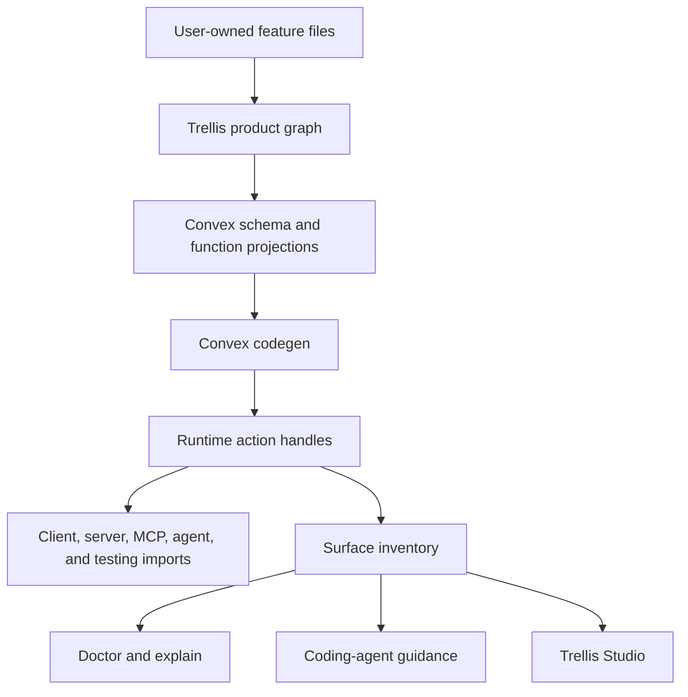

# Trellis Dream Spec

Status: north-star concept, not a one-shot 1.0 implementation contract
Audience: product owner, maintainers, app developers, coding agents
Goal: define the best possible version of Trellis before deciding whether and how to build it

## How To Read This Document

This document is intentionally ambitious. It describes the product Trellis should
become if we build the best version, not the amount of work that should ship in
one release.

Read it in three layers:

1. **North star:** the long-term product shape and design laws.
2. **1.0 release contract:** the smallest vertical slice that proves the thesis.
3. **Later roadmap:** valuable pieces that should not block the first stable proof.

The core decision from the review feedback is:

```text
Accepted as north star.
Rejected as "build all of this for 1.0."
```

The spec should inspire the product, but the implementation must be staged. The
winning 1.0 is not all of this shallowly. It is one excellent vertical slice:

```text
one feature file
membership-native workspace model
scoped DB for common resource operations
generated schema, projections, and runtime handles
client and testing usage through handles
destructive preview without token plumbing
doctor and explain
generated baseline invariant tests
optional MCP exposure after the normal browser path works
optional Trellis AI after the normal action path works
```

## Executive Summary

Trellis should become a compiler-backed app framework for serious Nuxt + Convex
workspace applications.

The dream version is not "more framework objects" and not "cleaner names for the
same abstraction stack." The dream version changes what app developers feel like
they are doing.

They should feel like they are defining product features:

```text
This app has workspaces.
This feature owns projects.
These fields live on a project.
These roles can create, read, update, archive, and delete projects.
This archive action is destructive and needs preview plus confirmation.
This action is available in the browser.
This action is also available to MCP agents.
This workspace assistant may use this action as a tool.
This route verifies a webhook, then runs this backend action.
```

Trellis should compile that product definition into the boring but important
technical pieces:

```text
Convex schema
Convex query/mutation/action exports
Nuxt client handles and composables
server-route adapters
optional MCP tools
optional Trellis AI action tools
permission matrix
record-level _can projections
tenant-isolation tests
role-denial tests
destructive confirmation tests
doctor and explain inventory
coding-agent guidance
generated docs and later local dev visualization
```

The public product law is:

```text
The secure path is the shortest path.
The generated path is inspectable.
Every exposed action can explain itself.
```

## One-Sentence Product Definition

Trellis is the Nuxt + Convex app compiler for workspace apps, where developers
author features and product actions once, and Trellis generates safe browser,
server, test, and optional AI surfaces from the same backend-owned rules.

## What Trellis Is

Trellis is:

- a product-feature authoring model for Nuxt + Convex apps
- a safety compiler that generates runtime surfaces from one product definition
- a workspace app foundation with auth, tenant isolation, roles, policies, and tests
- a destructive-action system with preview, confirmation, replay protection, and audit
- an optional MCP surface generator where agent tools share the same backend rules
- an optional Trellis AI layer where Convex Agent tools share the same backend rules
- an explanation and diagnostics layer for developers and coding agents

Trellis is not:

- a generic CRUD helper
- a replacement for Convex
- a replacement for Convex Agent
- a model provider abstraction
- a no-code app builder
- an MCP-first framework
- a generic autonomous agent runtime
- a server-route abstraction that hides HTTP
- a workflow engine
- a policy database product
- a giant compatibility layer for every possible app shape

## Target Users

### Primary User

A developer or team building a serious Nuxt + Convex app with:

- signed-in users
- workspaces or teams
- roles and permissions
- protected workspace data
- destructive actions
- tests for authorization and tenant isolation
- optional MCP, Trellis AI, or server-to-server surfaces

### Secondary User

A coding agent modifying a Trellis app. The agent must be able to discover:

- which files are user-owned
- which files are generated
- where product policy lives
- how to add fields and actions
- how to expose actions to UI, server, tests, MCP, and internal agents
- what commands validate the change

### Not The Target User

Trellis should honestly tell users to skip it when they are building:

- a tiny public-only app
- a throwaway internal tool
- a prototype with no shared auth or permission model
- a raw Convex app where direct functions are intentionally enough
- an app that will immediately reject the canonical Trellis shape

## Core Product Thesis

Serious app teams keep rebuilding the same infrastructure:

- auth resolution
- workspace isolation
- role checks
- record ownership checks
- destructive preview and confirmation
- UI permission hints
- backend permission enforcement
- server-route identity forwarding
- MCP tool authorization
- internal agent tool authorization
- tenant isolation tests
- role denial tests
- drift checks

Plain Nuxt + Convex is excellent for local simplicity. But once the same
business rule must be shared across browser UI, server routes, tests, MCP tools,
and in-app AI assistants, plain code tends to duplicate policy and drift.

Trellis wins when it makes the shared, secure path shorter than handwritten
Convex conventions.

## Product Principles

### 1. Product Concepts First

Users should think in:

```text
App lane
Feature
Resource or table
Action
Policy
Exposure
```

They should not have to think in:

```text
projection refs
handler maps
operation registries
replay modes
transport envelopes
function-ref translation maps
manual MCP preview/execute binding
manual agent tool plumbing
```

Those lower-level concepts can exist internally. They should not be the normal
authoring model.

### 2. One Source Of Truth

Every important concept has exactly one owner:

| Concept | Source of truth |
| --- | --- |
| table fields | feature file |
| workspace scope | table/resource declaration |
| roles | app workspace configuration |
| coarse role permission | feature role policy |
| record authorization | action `authorize` block |
| current-state blockers | action availability block |
| domain invariants | action handler and product tests |
| service or webhook caller rules | server route plus service policy |
| destructive preview | destructive action definition |
| UI availability | generated from policy and record checks |
| MCP exposure | explicit action exposure |
| Trellis AI agent definition | user-owned agent file |
| internal agent tools | agent definition using generated agent handles |
| agent threads and messages | Convex Agent component |
| generated handles | compiler output |
| diagnostics | generated graph |

Derived artifacts are allowed only when they are:

- generated
- clearly marked
- rebuildable
- checked for drift

### 3. Safe Defaults, Loud Escapes

Normal workspace actions should not manually remember tenant checks.

Safe:

```ts
await db.projects.get(projectId)
```

Inside a workspace-scoped project action, this means:

```text
load the project
reject if missing
reject if it belongs to another workspace
return a typed project record
```

Unsafe access still exists, but it must be explicit:

```ts
await unsafe.crossWorkspace(
  {
    reason: 'Resolve public share token before workspace identity exists.',
    tables: ['shareTokens', 'projects'],
  },
  async ({ db }) => {
    // explicit exception
  },
)
```

Every unsafe escape appears in:

- `trellis doctor`
- `trellis explain`
- Trellis Studio when installed
- generated coding-agent guidance when configured
- CI reports

### 4. Generated, But Inspectable

Generated code is not magic. It must be easy to inspect and explain.

Trellis can generate:

- Convex projections
- runtime action handles
- permission matrix
- optional MCP tools
- Nuxt composables
- test scaffolds
- coding-agent guidance

But developers must be able to ask:

```bash
trellis explain action projects.archive
trellis explain feature projects
trellis explain file convex/features/projects.feature.ts
```

The answer must be concrete and actionable.

### 5. Server Routes Stay Honest

Server routes have real HTTP responsibilities:

- body parsing
- headers
- status codes
- downloads
- streaming
- HMAC verification
- provider-specific payload validation
- route-level idempotency

Trellis should not pretend those disappear. Routes verify HTTP. Trellis runs
backend actions after the route has established the caller or service context.

### 6. MCP Is Explicit

MCP is a strong differentiator, but not the default mental model.

Trellis should not auto-expose every action to agents.

MCP exposure is opt-in:

```ts
expose: {
  mcp: ['list', 'create', 'archive'],
}
```

For record references, MCP tools need resolvers so agents do not guess raw IDs.

### 7. Trellis AI Follows Convex Agent

Trellis AI should not reimplement the Convex Agent component.

Convex Agent owns:

- agent construction
- threads
- messages
- UIMessage shape
- tool call persistence
- streaming deltas
- conversation context
- files
- tool approval pause/resume mechanics
- usage hooks
- playground and debugging integration

Trellis owns the app boundary around those primitives:

- generated action-backed tools
- actor/workspace/agent principal resolution
- permission and tenant enforcement
- destructive preview and confirmation
- ID resolution and disambiguation
- result redaction
- audit
- Nuxt composables and app UI wrappers
- doctor and explain output

The model may propose. Convex Agent may run the conversation. Trellis decides
whether a product action is available, permitted, scoped, approved, redacted, and
audited.

### 8. Tests Prove Invariants

Trellis should generate tests for the boring dangerous cases:

- cross-workspace read denial
- cross-workspace write denial
- role denial
- record ownership denial
- destructive execute without confirmation
- confirmation reuse denial
- confirmation from another actor/workspace denial
- MCP resolver does not resolve records outside the workspace
- internal agent tool cannot write outside its workspace
- internal agent tool requiring approval cannot execute silently

Tests should use product language, not raw Convex function refs.

### 9. Strict Compiler, Not Arbitrary TypeScript Analysis

Trellis should compile a strict authoring subset. It should not try to understand
arbitrary TypeScript.

Feature files are executable TypeScript, but the compiler only supports a stable
top-level builder grammar. Unsupported dynamic shapes fail with clear errors.

This is a design law, not an implementation detail:

```text
No arbitrary TypeScript analysis.
No custom ORM over all Convex capabilities.
No hidden magic that doctor can only guess after the fact.
```

The best doctor is not a detective. It is a compiler consistency checker.

## Public Mental Model

### App Lane

An app lane is the starting product shape.

| Lane | Meaning | Good for |
| --- | --- | --- |
| `public` | no sign-in required | public demo, public read-only app, first tutorial |
| `personal` | signed-in user owns data | personal notes, private todo, individual dashboards |
| `workspace` | teams, roles, tenant data | serious SaaS and internal apps |
| `workspace-mcp` | workspace app with external MCP tools | apps where external AI clients are a product surface |
| `workspace-ai` | workspace app with in-app AI assistants | apps where users chat with or trigger assistants inside the app |

The dream version should make `workspace` the serious default. `public` and
`personal` still exist, but the flagship path is workspace.

### Feature

A feature is one product slice.

Examples:

- projects
- tasks
- comments
- articles
- runbooks
- uploads
- billing

A feature owns:

- resources or tables
- actions
- policy
- exposure choices
- feature tests
- optional UI

### Resource Or Table

A resource is a table-like product object.

Examples:

- Project
- Task
- Comment
- Article
- Runbook

A resource declaration says:

- what fields exist
- whether the resource belongs to a workspace
- what indexes exist
- whether it has ownership fields
- which fields are searchable
- what lifecycle states exist

### Action

A Trellis action is something the product can do.

Examples:

- list projects
- create project
- archive project
- delete task
- export CSV
- sync webhook delivery

Internally, actions compile into backend functions and generated handles.
Publicly, developers author actions.
In API examples, the low-level builder may be named `op` to avoid confusion with
Convex's own runtime function kind called an "action." In prose, "action" means
product behavior.

Action kinds:

| Kind | Meaning |
| --- | --- |
| `query` | read data |
| `mutation` | bounded write |
| `destructive` | dangerous write requiring preview and confirmation |
| `internal` | backend-only app work |
| `service` | verified server-to-server work |

### Policy, Availability, And Invariants

These terms are separate on purpose:

| Term | Answers | Example |
| --- | --- | --- |
| role policy | who may attempt this action? | owner/admin may archive |
| record authorization | does this actor pass the loaded-record rule? | member may update only own task |
| availability | is the action currently possible? | project is already archived |
| domain invariant | what product rule must always hold? | archived projects cannot accept tasks |
| transport policy | may this service/agent route call it? | Stripe webhook may sync billing |

Do not put the same rule in several places. Role policy handles coarse
permissions. Action `authorize` handles record-specific decisions. Availability
returns blockers for current state. Handler code enforces domain invariants.
Generated `_can` fields are derived hints, not a separate policy source.

### Policy

Policy says who can run an action.

Examples:

```ts
policy.roles({
  read: ['owner', 'admin', 'member', 'viewer'],
  create: ['owner', 'admin'],
  archive: ['owner', 'admin'],
})
```

Record-level policy can depend on the loaded record:

```ts
update: ({ actor, record }) =>
  actor.role.in('owner', 'admin') || record.ownerId === actor.userId
```

Policy is backend-owned. UI permission hints are generated from it, never the
source of security.

### Exposure

Exposure says where an action is callable.

Possible surfaces:

- client
- server
- mcp
- agent
- testing
- internal

Example:

```ts
expose: {
  client: ['list', 'create', 'archive'],
  server: ['exportCsv'],
  mcp: ['list', 'create', 'archive'],
  agent: ['list', 'create', 'archive'],
  testing: 'all',
}
```

Exposure does not change permission. It only says which runtime can call the
action through generated handles. For Trellis AI, exposure only makes the action
available to agent definitions; each agent still has its own explicit tool
allowlist.

## Dream First-Run Experience

### Create A Workspace App

```bash
pnpm create trellis acme --workspace
cd acme
pnpm dev
```

The app opens with:

- sign up
- create workspace
- create first project
- basic project list
- doctor status in the terminal or dev overlay

The first 30 minutes should prove feature authoring, not every membership edge
case. Member invites, workspace switching, MCP, Studio, and advanced service
flows are important, but they should be introduced after the first workspace
resource works.

A later local Trellis Studio can show:

- current actor
- current workspace
- role
- features
- actions
- policy matrix
- generated surfaces
- doctor status

### Add A Resource

```bash
trellis add resource Project \
  name:string \
  summary?:text \
  status:enum(active,archived)=active \
  --crud \
  --ui
```

Before writing files, Trellis prints the plan:

```text
Trellis will create Project.

User-owned files:
  convex/features/projects.feature.ts
  app/features/projects/ProjectList.vue
  app/pages/projects/index.vue
  tests/features/projects.test.ts

Generated files:
  convex/_trellis/projects.ts
  convex/_trellis/schema.ts
  .trellis/generated/actions/client.ts
  .trellis/generated/actions/server.ts
  .trellis/generated/actions/testing.ts
  .trellis/generated/surface-inventory.json

Safety checks:
  workspace isolation
  role denial
  destructive confirmation

Next commands:
  trellis prepare
  trellis check
  trellis explain feature projects
```

The generated app should pass before the user edits anything.

MCP is added explicitly:

```bash
trellis add mcp
trellis expose projects.list --mcp
trellis expose projects.create --mcp
trellis expose projects.archive --mcp
```

Or start directly in the `workspace-mcp` lane when agent tools are part of the
product from day one:

```bash
pnpm create trellis acme --workspace-mcp
```

Trellis AI is added explicitly after the normal action path works:

```bash
trellis add ai
trellis add agent project.assistant --workspace
trellis agent tool project.assistant projects.list
trellis agent tool project.assistant projects.create
trellis agent tool project.assistant projects.archive
```

Or start directly in the `workspace-ai` lane when an in-app assistant is a first
viewport product surface:

```bash
pnpm create trellis acme --workspace-ai
```

## Canonical File Shape

### User-Owned Files

The user mostly edits:

```text
convex/
  app.ts
  agents/
    project.assistant.ts
  features/
    projects.feature.ts
    tasks.feature.ts

app/
  features/
    projects/
      ProjectList.vue
      ProjectDetail.vue
  pages/
    projects/
      index.vue
      [id].vue

server/
  api/
    projects/export.get.ts
    webhooks/stripe.post.ts

tests/
  features/
    projects.test.ts
    tasks.test.ts
```

### Generated Files

Generated files are rebuildable:

```text
convex/
  _trellis/
    schema.ts
    functions.ts
    projects.ts
    tasks.ts
    registry.ts

.trellis/
  generated/
    graph.json
    permissions.ts
    surface-inventory.json
```

Importable generated TypeScript can live in the Nuxt build directory or another
stable generated-module directory, as long as these aliases resolve consistently
in dev, Nitro, Vitest, CI, and package consumers:

```text
#trellis/actions/client
#trellis/actions/server
#trellis/actions/mcp
#trellis/actions/agent
#trellis/actions/testing
```

`.trellis/generated` is best for JSON graph, inventory, and context artifacts
that humans and tools inspect. Runtime imports need stronger module-resolution
guarantees than a casual committed folder.

Generated files must start with a clear header:

```ts
// Generated by Trellis. Do not edit.
// Source: convex/features/projects.feature.ts
// Regenerate with: trellis prepare
```

### Advanced Split

One feature file is the default. When a feature grows, a developer can run:

```bash
trellis split feature projects
```

This can split:

```text
convex/features/projects.feature.ts
```

into:

```text
convex/features/projects/
  feature.ts
  table.ts
  policy.ts
  actions.ts
  access.ts
```

Splitting is an optimization for complexity. It is not the starting point.

## App Kernel

Most apps should have one small app file:

```ts
// convex/app.ts
import { app } from '@trellis/convex'

export default app({
  auth: {
    provider: 'better-auth',
    emailPassword: true,
  },

  workspace: {
    roles: ['owner', 'admin', 'member', 'viewer'],
    defaultRole: 'member',
  },
})
```

Trellis generates:

- caller resolution
- app identity resolution
- workspace membership helpers
- permission context
- system tables
- root schema assembly
- runtime glue

Advanced apps can eject specific areas:

```bash
trellis eject auth
trellis eject workspace
trellis eject feature projects
```

Ejection should be explicit, rare, and clear about what is lost.

## Workspace Model

The dream version should use memberships internally:

```text
users
workspaces
memberships
workspaceInvites
```

This supports:

- one user in multiple workspaces
- different roles per workspace
- invites before signup
- workspace switching
- owner transfer
- service or agent acting inside a workspace

The developer-facing API stays simple:

```ts
actor.userId
workspace.id
membership.role
```

The starter can still behave like a single-workspace app until switching is
needed.

### Workspace Topologies

The dream version should support multiple workspace shapes through one model:

```text
workspaces
memberships
workspaceRelations
```

Do not create separate systems like:

```text
businessMembers
teamMembers
agencyMembers
clientMembers
```

That would create several sources of truth. Instead, use one membership table
and one relationship table.

Example workspace fields:

```ts
workspaces: {
  name: string
  kind: 'business' | 'team' | 'agency' | 'client'
}
```

Example relation fields:

```ts
workspaceRelations: {
  fromWorkspaceId: Id<'workspaces'>
  toWorkspaceId: Id<'workspaces'>
  kind: 'owns' | 'manages' | 'client_of' | 'vendor_of'
  status: 'active' | 'suspended'
}
```

### Business Workspace With Team Workspaces

Example:

```text
Acme Business
  Marketing Team
  Engineering Team
  Finance Team
```

Model:

```text
workspace: Acme Business, kind: business
workspace: Marketing Team, kind: team
workspace: Engineering Team, kind: team
relation: Acme Business owns Marketing Team
relation: Acme Business owns Engineering Team
```

Users can have different roles per workspace:

```text
Alice: owner in Acme Business
Alice: admin in Engineering Team
Bob: member in Engineering Team
Bob: no access to Finance Team
```

Team data stays isolated in the team workspace. Business-level actions such as
billing, legal ownership, or global settings belong to the parent business
workspace.

### Agency With Client Workspaces

Example:

```text
Bright Agency
  manages Acme Client
  manages Globex Client
```

Model:

```text
workspace: Bright Agency, kind: agency
workspace: Acme Client, kind: client
workspace: Globex Client, kind: client
relation: Bright Agency manages Acme Client
relation: Bright Agency manages Globex Client
```

Client users are members of their client workspace:

```text
Acme CEO: owner in Acme Client
Acme PM: member in Acme Client
```

Agency users are members of the agency workspace. They can receive either real
memberships in client workspaces or relationship-based access through the
`manages` relation. The strict version is real client-workspace memberships. The
more scalable version is relation-based policy.

Example relation-aware policy:

```ts
policy.roles({
  read: ['owner', 'admin', 'member'],
}).orRelatedWorkspace({
  relation: 'manages',
  roles: ['owner', 'admin', 'manager'],
})
```

This means:

```text
A user can read Acme client data if they are directly in Acme, or if they belong
to an agency workspace that actively manages Acme with a qualifying role.
```

### Workspace Or Resource?

Use a separate workspace when:

- the group has its own users
- roles differ for that group
- data must be isolated
- audit should show which workspace acted
- billing, ownership, or agency access may be revoked independently

Use a normal resource when:

- it is only a label, folder, department, or category
- it has no separate members
- permissions are inherited from the same workspace
- isolation is not required

Examples:

```text
Agency has clients with their own users:
  clients should be workspaces.

Business has teams with different members and data:
  teams should be workspaces under the business.

Business has departments only as labels:
  departments can be resources inside one workspace.
```

### 1.0 Workspace Decision

For a greenfield dream version, Trellis should be membership-native internally.
That avoids teaching `users.workspaceId` as the foundation and migrating away
from it later.

To keep first-run simple:

- hide workspace switching until needed
- start users in one workspace
- expose `actor`, `workspace`, and `membership` in handlers
- introduce invites and related workspaces in later tutorials

This means we pay some implementation complexity early, but we avoid a data model
that serious SaaS apps usually outgrow.

## Feature Definition Example

This is the kind of code junior and mid-level developers should be able to
understand and modify.

```ts
// convex/features/projects.feature.ts
import { feature, op, policy, ref, table, v } from '@trellis/convex'

export default feature('projects', {
  table: table.workspace({
    name: v.string().label('Name').examples(['Website redesign', 'Q3 launch']),
    slug: v.string().label('Slug').uniqueInWorkspace(),
    summary: v.optional(v.text()).label('Summary'),
    status: v.enum(['active', 'archived']).default('active'),
    ownerId: v.userId(),
    createdAt: v.createdAt(),
    updatedAt: v.updatedAt(),
  })
    .index('by_status', ['workspaceId', 'status', 'createdAt'])
    .labelFields(['name', 'summary']),

  dependsOn: ['tasks'],

  policy: policy.roles({
    read: ['owner', 'admin', 'member', 'viewer'],
    create: ['owner', 'admin'],
    archive: ['owner', 'admin'],
  }),

  actions: {
    list: op.query({
      description: 'List projects in the current workspace.',
      policy: 'read',
      args: {},
      reads: ['projects'],
      run: async ({ db }) => {
        return await db.projects.query.byWorkspace({ order: ['createdAt', 'desc'] }).collect()
      },
    }),

    create: op.mutation({
      description: 'Create a project in the current workspace.',
      policy: 'create',
      args: {
        name: v.string().label('Name'),
        slug: v.string().label('Slug'),
        summary: v.optional(v.text()).label('Summary'),
      },
      writes: ['projects'],
      run: async ({ db, actor, now }, args) => {
        return await db.projects.insert({
          name: args.name,
          slug: args.slug,
          summary: args.summary,
          status: 'active',
          ownerId: actor.userId,
          createdAt: now,
          updatedAt: now,
        })
      },
    }),

    archive: op.destructive({
      description: 'Archive a project and prevent new work from being added.',
      policy: 'archive',
      args: {
        project: ref('projects')
          .resolveByUnique('slug')
          .searchBy('name'),
      },
      reads: ['projects', 'tasks'],
      writes: ['projects', 'auditEvents'],
      load: async ({ db }, args) => {
        const project = await db.projects.require(args.project)
        return { project }
      },
      preview: async ({ db }, _args, { project }) => {
        const taskCount = await db.tasks.countByProject(project._id)

        return {
          summary: `Archive "${project.name}"`,
          body: 'Archived projects stop accepting new tasks.',
          effects: [
            { resource: 'projects', count: 1, action: 'archive' },
            { resource: 'tasks', count: taskCount, action: 'freeze' },
          ],
          confirmation: {
            projectId: project._id,
            projectUpdatedAt: project.updatedAt,
            taskCount,
          },
        }
      },
      run: async ({ db, audit, now }, _args, { project, confirmation }) => {
        if (project.status === 'archived') {
          throw op.blocked('Project is already archived.')
        }

        if (project.updatedAt !== confirmation.projectUpdatedAt) {
          throw op.stale('Project changed since preview.')
        }

        await db.projects.patch(project._id, {
          status: 'archived',
          updatedAt: now,
        })

        await audit.record('project.archived', {
          projectId: project._id,
          name: project.name,
        })
      },
    }),
  },

  expose: {
    client: ['list', 'create', 'archive'],
    mcp: ['list', 'create', 'archive'],
    testing: 'all',
  },
})
```

### Why This Is Understandable

The file reads like product behavior:

- the table has fields
- roles define who can do what
- actions say what happens
- archive says what the preview shows
- exposure says where the action is callable

The file does not ask the developer to maintain:

- Convex projection wrappers
- function-ref strings
- preview refs
- execute refs
- operation registries
- MCP binding maps
- test transport maps

## Feature Source Grammar

Compiler-backed does not mean Trellis understands every possible TypeScript
program. For v1, feature files should use a strict, documented authoring subset.

Allowed v1 shape:

```ts
export default feature('projects', {
  table: table.workspace({ ... }),
  dependsOn: ['tasks'],
  policy: policy.roles({ ... }),
  actions: {
    list: op.query({ ... }),
    create: op.mutation({ ... }),
    archive: op.destructive({ ... }),
  },
  expose: { ... },
})
```

Allowed:

- static feature name
- static table declaration
- static role policy keys
- static action keys
- explicit `reads` and `writes` metadata for non-trivial actions
- explicit `dependsOn` for cross-feature resource usage
- local pure helper functions for handler implementation

Rejected in the normal compiler path:

- dynamic feature names
- conditional action definitions
- environment-dependent exposure lists
- computed table names
- action definitions assembled through arbitrary loops
- hidden re-exports of feature definitions
- broad helper wrappers that hide table, policy, or exposure declarations
- runtime imports inside feature metadata

Unsupported shapes should fail with targeted errors:

```text
Could not compile projects.feature.ts.

Reason:
  expose.mcp uses a computed array.

Supported:
  expose: { mcp: ['list', 'archive'] }

Why:
  Trellis needs static exposure metadata to generate runtime-safe handles and MCP checks.
```

Advanced package authors can get explicit escape hatches later, but normal app
code should stay boring and statically compilable.

## Compiler Pipeline

Trellis should behave like a compiler.



Pipeline steps:

1. Read canonical app and feature files.
2. Build a normalized product graph.
3. Generate Convex schema fragments.
4. Generate Convex function projections.
5. Run Convex codegen.
6. Generate runtime-filtered handles.
7. Scan client, server, MCP, agent, and tests for handle usage.
8. Generate surface inventory.
9. Run doctor, typecheck, tests, and drift checks.

The product graph is a derived snapshot. Source files remain the source of truth.
App developers do not edit the graph.

## Product Graph

The graph is a generated structured representation of the app.

It contains:

```json
{
  "app": {
    "lane": "workspace",
    "auth": "better-auth",
    "workspaceModel": "memberships"
  },
  "features": {},
  "resources": {},
  "actions": {},
  "agents": {},
  "agentTools": {},
  "policies": {},
  "exposures": {},
  "unsafeEscapes": {},
  "generatedFiles": {}
}
```

The graph powers:

- generated code
- doctor
- explain
- optional coding-agent context
- Trellis Studio
- Trellis AI diagnostics
- generated tests
- release validation

The graph must never become a handwritten app manifest. If it is stale, Trellis
should tell the developer to run `trellis prepare` or fail the build.

## Feature Dependencies

Feature dependencies must be explicit when one feature reads or writes another
feature's resource.

Example:

```ts
export default feature('projects', {
  dependsOn: ['tasks'],
  actions: {
    archive: op.destructive({
      reads: ['projects', 'tasks'],
      writes: ['projects', 'auditEvents'],
      ...
    }),
  },
})
```

This is needed for:

- codegen order
- explain output
- generated test fixtures
- MCP descriptions
- agent tool descriptions
- ejection plans
- schema dependency checks

Do not rely only on static analysis of `db.tasks`. The action should declare its
cross-feature reads and writes so doctor can verify them.

## Schema Changes And Versioning

Trellis should not ship a generic migration framework before the core feature
compiler is excellent. But generated schema still needs a minimal safety policy.

When feature fields change, `trellis prepare` should emit a schema diff:

```text
projects.status changed:
  before: enum(active, archived)
  after:  enum(active, paused, archived)

Risk:
  additive enum value, safe for schema generation
```

Dangerous diffs require explicit acknowledgement:

- deleting a field
- renaming a field
- making an optional field required
- changing a field type
- moving a field between resources
- changing workspace scope
- changing uniqueness

Data migrations remain app-owned Convex functions. Trellis can scaffold TODOs
and explain the diff, but it should not silently migrate production data.

## Result Views And Redaction

The core 1.0 path can return simple resource documents for simple workspace
apps. Generic redaction should not block 1.0.

However, the API must reserve space for views because real apps often need to
hide fields:

- internal notes
- service metadata
- billing details
- webhook payloads
- private file fields
- secret token hashes

Future shape:

```ts
returns: Project.view('list')
```

or:

```ts
views: {
  list: Project.pick(['name', 'summary', 'status', '_can']),
  admin: Project.all().omit(['secretTokenHash']),
}
```

The important rule: do not normalize generated actions around returning raw docs
forever. Simple docs are fine for v1; reserve the concept of named views.

## Runtime Handles

Normal runtime code imports generated handles:

```ts
import { actions } from '#trellis/actions/client'
import { actions } from '#trellis/actions/server'
import { actions } from '#trellis/actions/mcp'
import { actions } from '#trellis/actions/agent'
import { actions } from '#trellis/actions/testing'
```

The root alias should not be documented:

```ts
// Avoid this in docs:
import { actions } from '#trellis/actions'
```

Different runtimes see different handles.

Client handles do not include:

- backend-only actions
- internal actions
- service-only actions
- MCP-only actions
- unsafe actions unless explicitly exposed
- handler closures
- raw DB helpers
- secrets

MCP handles include external-agent-safe metadata:

- descriptions
- labels
- examples
- resolver hints
- destructive confirmation requirements

Agent handles include tool-safe metadata:

- descriptions
- input schemas
- ID-resolution hints
- result redaction hints
- approval defaults
- safety category
- callable Convex refs without handler closures

Testing handles include enough metadata for product-level tests.

## UI API

### Basic Query

```ts
import { actions } from '#trellis/actions/client'

const projects = await useQuery(actions.projects.list)
```

### Paginated Query

```ts
const projects = await usePaginatedQuery(actions.projects.list, {
  status: 'active',
})
```

### Basic Mutation

```ts
const createProject = useMutation(actions.projects.create)

await createProject.run({
  name: 'Q3 launch',
  summary: 'Launch planning workspace',
})
```

### Destructive Action

```ts
const archiveProject = useDestructiveAction(actions.projects.archive)

const preview = await archiveProject.preview({
  project: projectId,
})

await archiveProject.run(
  { project: projectId },
  { confirmation: preview.confirmation },
)
```

The UI never sees `_confirmationToken`.

The Trellis UI layer should keep Convex strengths visible:

- live queries
- pagination
- optimistic updates where safe
- SSR and hydration behavior
- structured permission errors
- stale-preview errors

If generated handles are less useful than raw Convex composables, developers will
bypass Trellis. The wrapper API must stay close to Convex while adding policy,
preview, and runtime-safety metadata.

### Generated Destructive Component

For common cases:

```vue
<TrellisDestructiveButton
  :action="actions.projects.archive"
  :args="{ project: project._id }"
  label="Archive"
  @done="refresh"
/>
```

For larger workflows:

```vue
<TrellisDestructiveDialog
  :action="actions.projects.archive"
  :args="{ project: project._id }"
  @executed="refresh"
/>
```

The component renders:

- summary
- effects
- warnings
- blockers
- required typed phrase if configured
- stale preview state
- execution result

## Destructive Actions

Destructive actions are one of Trellis's signature features.

Examples:

- archive project
- delete task
- revoke token
- publish to public
- remove member
- delete workspace
- purge data

### Required Shape

A destructive action must define:

- description
- policy
- args
- load
- preview
- run

Preview must explain:

- what will happen
- what records or resources are affected
- whether the action is reversible
- what warnings or blockers exist
- what confirmation payload binds to

### State Machine

```text
idle
  -> previewing
  -> previewReady
  -> confirming
  -> executing
  -> done

previewReady
  -> stalePreview
  -> rePreviewRequired
```

### Confirmation Binding

The confirmation receipt is opaque to app code. Internally it binds:

- action id
- preview function ref
- execute function ref
- projection kind
- registry fingerprint
- caller subject
- actor identity
- workspace scope
- args hash
- confirmation payload hash
- expiry
- JTI
- replay or idempotency key

If a preview was issued before generated projections changed, execute fails with
a stale confirmation error.

The receipt prevents tampering, but it does not by itself prove the world is
unchanged. Every destructive action whose preview depends on mutable state must
bind a state fingerprint and recheck it before execute.

Example:

```ts
confirmation: {
  bind: ({ project, taskCount }) => ({
    projectUpdatedAt: project.updatedAt,
    taskCount,
  }),
  staleWhen: async ({ db, project }, bound) => {
    const currentTaskCount = await db.tasks.countByProject(project._id)

    return (
      project.updatedAt !== bound.projectUpdatedAt ||
      currentTaskCount !== bound.taskCount
    )
  },
}
```

Without this, a preview can be cryptographically valid while the business effect
has changed.

### Later Confirmation Levels

Trellis can eventually support multiple confirmation levels:

| Level | Use for | UX |
| --- | --- | --- |
| low | archive small item | confirm button |
| medium | delete important record | confirmation dialog |
| high | bulk delete, revoke access | typed phrase |
| critical | workspace deletion | typed phrase plus cooldown or second actor |

Example:

```ts
confirmation: {
  level: 'high',
  typedPhrase: ({ project }) => project.name,
}
```

For the 1.0 release contract, basic preview plus confirmation is enough. Typed
phrases, cooldowns, and second-actor approvals belong in later releases.

## Policy And Permissions

Policy is the only source of truth for coarse authorization. It should not become
a kitchen sink for every product rule.

From:

```ts
policy.roles({
  read: ['owner', 'admin', 'member', 'viewer'],
  create: ['owner', 'admin'],
})
```

Trellis generates:

- backend permission checks
- role matrix
- `#trellis/permissions`
- `useAccess()`
- record `_can` fields
- MCP safety metadata
- test matrix cases
- explain output

Record-specific rules live on the action:

```ts
update: op.mutation({
  policy: 'update',
  load: async ({ db }, args) => ({
    project: await db.projects.require(args.project),
  }),
  authorize: ({ actor, project }) =>
    actor.role.in('owner', 'admin') || project.ownerId === actor.userId,
  availability: ({ project }) =>
    project.status === 'archived'
      ? op.blocked('Archived projects cannot be changed.')
      : op.available(),
  run: async ({ db }, args, { project }) => {
    await db.projects.patch(project._id, args.patch)
  },
})
```

The split is:

- `policy`: role or membership-based permission
- `authorize`: loaded-record decision
- `availability`: current-state blockers for UI and preview
- `run`: product invariant enforcement

Generated `_can` fields should be derived from explicit action capabilities. They
must not become another place to write policy.

### UI Permission Example

```ts
const access = useAccess()

if (access.can(actions.projects.create)) {
  // show create button
}
```

Record-specific:

```vue
<button v-if="project._can.archive">
  Archive
</button>
```

The UI hint is derived from backend policy. It is not security.

## Scoped DB Capability

Workspace resources use a scoped DB capability. This is not a full ORM over
Convex. It is a narrow safety layer for common resource operations.

```ts
await db.projects.get(id)       // returns null when missing or invisible
await db.projects.require(id)   // throws tenant-safe not found when missing or invisible
await db.projects.insert(data)
await db.projects.patch(id, patch)
await db.projects.delete(id)
await db.projects.query.byWorkspace({ order: ['createdAt', 'desc'] }).collect()
await db.projects.query.byIndex('by_status', (q) => q.eq('status', 'active')).collect()
```

For workspace tables, these operations automatically use the active workspace.
By default, cross-workspace records should look like not found to avoid leaking
existence. Dev and test tooling can show the more specific denial reason.

Cross-resource checks are explicit:

```ts
const task = await db.tasks.require(args.task)
const project = await db.projects.require(task.projectId)
```

If `task` belongs to another workspace, `db.tasks.get` denies before returning.

### Raw Convex

Raw Convex is still available for:

- internal jobs
- storage URLs
- migrations
- specialized queries
- component integrations
- performance tuning

But normal product actions should not use `ctx.db` directly.

Normal handler types should not expose raw `ctx.db` at all. Prefer making unsafe
access unavailable by type, then let doctor explain explicit unsafe escapes.

V1 scoped DB should stay deliberately small:

- `get`
- `require`
- `insert`
- `patch`
- `delete`
- `query.byWorkspace`
- `query.byIndex`
- pagination for declared indexes

Avoid copying every Convex query feature. If a real feature needs advanced query
planning, use an explicit advanced or unsafe path with a reason and tests.

## Server Route API

Server routes stay explicit.

### CSV Export

```ts
// server/api/projects/export.get.ts
import { actions } from '#trellis/actions/server'
import { serverAction } from '#trellis/server'

export default defineEventHandler(async (event) => {
  const rows = await serverAction(event, actions.projects.exportCsv).query({})

  setResponseHeader(event, 'content-type', 'text/csv')
  return toCsv(rows)
})
```

The route owns:

- query parsing
- response headers
- CSV formatting

Trellis owns:

- caller resolution
- backend policy
- workspace scope
- action execution

### Webhook

```ts
// server/api/webhooks/stripe.post.ts
import { actions } from '#trellis/actions/server'
import { serverAction, serviceCaller } from '#trellis/server'

export default defineEventHandler(async (event) => {
  const delivery = await verifyStripeWebhook(event)

  await serverAction(event, actions.billing.syncSubscription).execute(
    delivery.body,
    {
      auth: serviceCaller('stripe-webhook'),
      idempotency: delivery.id,
    },
  )

  return { ok: true }
})
```

The route verifies Stripe. Trellis does not pretend to know Stripe.

## MCP Surface

When the optional MCP lane is enabled, MCP tools are generated from actions that
are explicitly exposed to MCP.

MCP means "Model Context Protocol." In practical terms, it lets an AI agent call
tools exposed by the app. In Trellis, those tools must use the same backend
rules as the UI.

### Opt-In Exposure

```ts
expose: {
  mcp: ['list', 'create', 'archive'],
}
```

Generated tool module:

```ts
import { actions } from '#trellis/actions/mcp'
import { mcp } from '#trellis/mcp'

export default mcp.tools({
  listProjects: mcp.action(actions.projects.list),
  createProject: mcp.action(actions.projects.create),
  archiveProject: mcp.action(actions.projects.archive),
})
```

### ID Resolution

Agents should not guess raw Convex IDs.

Good:

```ts
project: ref('projects')
  .resolveByUnique('slug')
  .searchBy('name')
```

Generated tool accepts:

```json
{ "project": "Q3 launch" }
```

Trellis resolves that safely inside the current workspace.
If `name` matches several projects, Trellis must not guess. It returns a
disambiguation response with safe labels and asks the agent or user to choose.
Only fields declared unique in the workspace may be used for direct resolution.

If an MCP-exposed action accepts a record reference without a resolver:

```text
FAIL projects.archive exposes a Project reference to MCP but has no resolver.

Fix:
  Add ref('projects').resolveByUnique('slug').searchBy('name')

Or explicitly waive:
  agentUnsafe({ reason: 'Only used by deterministic internal workflow.' })
```

### Destructive MCP Flow

Destructive MCP tools should use a preview/confirm split.

Preview result:

```json
{
  "requiresConfirmation": true,
  "summary": "Archive \"Q3 launch\"",
  "effects": [
    { "resource": "projects", "count": 1, "action": "archive" }
  ],
  "confirmation": {
    "id": "opaque-confirmation-receipt",
    "expiresAt": "2026-06-18T12:00:00Z"
  }
}
```

Execute requires the confirmation receipt.

The agent never receives secrets. The receipt is only useful for:

- the same action
- the same actor
- the same workspace
- the same args
- the same preview payload
- before expiry

### MCP Capabilities Resource

Every MCP app should expose caller-scoped safe app context:

```text
trellis://app/capabilities
trellis://app/actions
trellis://app/current-workspace
trellis://app/safety-rules
```

This helps agents understand:

- what tools exist
- which tools are destructive
- how to resolve records
- what requires confirmation
- what workspace they are acting in

The capabilities resource is not a static public map. It is derived per:

- MCP key
- caller principal
- current workspace
- key scope
- role policy
- relation policy

It must not reveal actions, features, or internal names that the current MCP
principal is not allowed to know exist. Capability disclosure is part of the
security model, not just documentation.

Production MCP surfaces also need:

- key revocation
- audit
- rate limiting
- session scoping
- destructive confirmation receipts
- resolver isolation

## Trellis AI Surface

Trellis AI is the internal assistant lane for apps that want AI inside the
product. It is different from MCP.

```text
MCP:
  External AI clients connect to the app as tools.

Trellis AI:
  The app itself contains assistants built on Convex Agent.
```

Both surfaces must use the same Trellis product actions. Neither surface should
receive raw database access as the normal write path.

### Product Stance

Trellis AI should be a thin, opinionated safety layer over Convex Agent.

User promise:

```text
The assistant can help inside the app, but it cannot bypass the app's action
model.
```

Developer promise:

```text
Define product actions once. Use them from UI, server routes, MCP, tests, and
internal agents without duplicating permission logic.
```

Agent promise:

```text
Agents receive a curated set of typed tools with descriptions, record
resolution, approval policy, redaction, and audit. They do not receive broad
app credentials by default.
```

### Follow Convex Here

Convex Agent and the Convex platform should own the runtime primitives.

`trellis add ai` should install and configure the `@convex-dev/agent` component
through `convex/convex.config.ts`; it should not create Trellis-owned thread or
message tables.

| Area | Owner | Why |
| --- | --- | --- |
| agent class, model call defaults, stop conditions | Convex Agent | existing API and AI SDK integration |
| threads and messages | Convex Agent | canonical conversation store |
| UIMessage shape | Convex Agent | clients can render tool calls, parts, status, and messages consistently |
| tool call/result persistence | Convex Agent | tool history belongs with the conversation |
| streaming deltas | Convex Agent | database-backed streaming survives reconnects and is inspectable |
| conversation context and message search | Convex Agent | built-in recent/search context and optional vector search |
| files in messages | Convex Agent plus Convex File Storage | file references already fit the message model |
| tool approval pause/resume mechanics | Convex Agent | approval states belong in the message/tool flow |
| model provider abstraction | AI SDK | avoid a Trellis-specific provider layer |
| scheduling and crons | Convex Scheduler/Cron | time is infrastructure, not an agent skill |
| durable multi-step flows | Convex Workflow | retry, idempotency, and resume semantics are platform concerns |
| high-concurrency background work | Convex Workpool | queue limits and retries are infrastructure |
| rate limiting | Convex Rate Limiter | message and token budgets are runtime limits |
| RAG storage/search | Convex RAG component | document chunks, namespaces, embeddings, and filters are specialized primitives |
| usage tracking hooks | Convex Agent | token/provider metadata is emitted by the agent runtime |

Trellis should not duplicate Convex Agent tables, message protocols, streaming
state, approval message states, file tracking, or playground/debugging
capabilities.

### Draw The Trellis Border Here

Trellis adds value where app safety and product semantics cross the AI runtime.

| Area | Trellis responsibility |
| --- | --- |
| generated agent action handles | expose only actions safe to reference from Convex Agent code |
| `defineTrellisAgent` | wrap Convex Agent with Trellis defaults and metadata |
| `actionTool` | convert a generated Trellis action handle into a Convex Agent / AI SDK tool |
| agent principal | model who the agent is and whether it acts for a user |
| workspace scope | bind every agent run to the allowed workspace or relation scope |
| policy enforcement | run through the same backend policy as UI/server/MCP |
| destructive actions | require Trellis preview and confirmation before execution |
| record resolution | resolve names/slugs safely and disambiguate instead of guessing |
| redaction | control what tool results are visible to the model and UI |
| audit | record agent id, trigger, acting-for grant, tool, input, approval, and result summary |
| Nuxt DX | provide Vue composables and components around Convex Agent queries/mutations |
| diagnostics | `trellis doctor --ai` and `trellis explain agent ...` |

The border is simple:

```text
Convex Agent runs the conversation.
Trellis controls what app actions the conversation may perform.
```

### Agent Definition

App-owned agent definitions live in user-owned files.

```ts
// convex/agents/project.assistant.ts
import { openai } from '@ai-sdk/openai'
import { defineTrellisAgent, actionTool } from '@lupinum/trellis/ai'
import { actions } from '#trellis/actions/agent'

export default defineTrellisAgent({
  id: 'project.assistant',
  name: 'Project Assistant',
  scope: 'workspace',
  languageModel: openai.chat('gpt-4o-mini'),
  instructions: `
    Help users organize projects.
    Search before writing.
    Do not archive anything unless the user explicitly asks.
  `,
  tools: [
    actionTool(actions.projects.list),
    actionTool(actions.projects.create, {
      approval: 'auto-for-bounded-write',
    }),
    actionTool(actions.projects.archive, {
      approval: 'destructive-preview',
      resolveIds: { project: actions.projects.list },
    }),
  ],
})
```

This wrapper should not hide Convex Agent. Advanced users should still be able
to access the underlying Agent instance or pass through supported Convex Agent
configuration.

### `actionTool`

`actionTool` converts a generated Trellis action handle into a tool that Convex
Agent can give to the LLM.

Conceptual options:

```ts
type ActionToolOptions = {
  name?: string
  description?: string
  approval?:
    | 'never'
    | 'auto-for-read'
    | 'auto-for-bounded-write'
    | 'required'
    | 'destructive-preview'
    | ((ctx: TrellisAgentToolCtx, args: unknown) => Promise<ApprovalDecision>)
  resolveIds?: Record<string, ActionHandle>
  redactResult?: RedactionPolicy
  resultMode?: 'model-visible' | 'summary-only' | 'hidden-from-model'
  maxResultBytes?: number
  unsafe?: false | { reason: string }
}
```

It should derive:

- tool name from action id unless overridden
- tool description from action contract metadata
- input schema from action args
- ID-resolution metadata from action refs and tool options
- default approval from action safety
- model-visible result shape from return metadata and redaction policy

Unsafe custom Convex tools are allowed only when they are explicit:

```ts
customTool({
  unsafe: {
    reason: 'Read-only vendor status check; no app data writes.',
  },
  ...
})
```

Doctor should report every unsafe custom tool.

### Generated Agent Handles

`#trellis/actions/agent` is server-side and tool-safe. It must not import:

- backend handler implementations
- raw DB helpers
- service secrets
- permission implementation closures
- Nuxt client code

Conceptual handle:

```ts
type AgentActionHandle<TArgs, TResult> = {
  id: string
  feature: string | null
  kind: 'query' | 'mutation' | 'destructive' | 'internal'
  scope: 'public' | 'session' | 'authenticated' | 'workspace'
  safety: 'read' | 'bounded-write' | 'destructive-write' | 'external-side-effect'
  executeRef: unknown
  previewRef?: unknown
  contract: ClientSafeContractMetadata
  idResolution?: Record<string, IdResolutionHint>
  resultRedaction?: RedactionHint
}
```

If an action is not exposed to `agent`, it should not appear in this module.

### Agent Principal And Acting For

Agent runs need explicit identity. Scheduled and background actions usually do
not have a browser session, so Trellis must not rely on `ctx.auth` alone.

Conceptual principal:

```ts
type TrellisAgentPrincipal = {
  kind: 'agent'
  agentId: string
  subject: `agent:${string}`
  workspaceId?: string
  actingFor?: {
    userId: string
    reason: string
    grantSource: 'user-request' | 'schedule' | 'workflow' | 'admin-policy'
    expiresAt?: number
  }
  trigger: AgentTrigger
  allowedActions: string[]
  approvalPolicy: AgentApprovalPolicy
}
```

The principal flows into the same caller model as server routes and MCP:

```text
actor
workspace
membership
agent principal
acting-for grant
trigger
```

Backend actions remain authoritative. The LLM does not become the authority just
because it selected a tool.

### Agent Run Flow

A user-started assistant command should follow this path:

```text
1. User sends a natural-language request.
2. App mutation authorizes the thread and saves a user message.
3. Mutation schedules an internal action or workflow step.
4. Convex action creates or continues a Convex Agent thread.
5. Trellis builds tool set from generated agent action handles.
6. LLM selects tools.
7. actionTool resolves IDs, checks approval policy, and calls Trellis action path.
8. Trellis enforces auth, workspace scope, policy, validation, preview,
   confirmation, redaction, and audit.
9. Convex Agent saves tool calls, results, messages, and stream state.
10. Nuxt clients subscribe to messages and stream deltas.
```

The critical detail is step 2: saving the user message in a mutation gives the
UI a transactional, optimistic source of truth. Long-running generation happens
afterward in a Convex action or workflow.

### Trigger Types

The trigger changes admission, idempotency, audit, and approval defaults. It
should not change the tool safety model.

```ts
type AgentTrigger =
  | { kind: 'user-message'; threadId: string; messageId: string }
  | { kind: 'button'; actionId: string }
  | { kind: 'schedule'; scheduleId: string; dueAt: number }
  | { kind: 'webhook'; deliveryId: string; source: string }
  | { kind: 'upload'; fileId: string }
  | { kind: 'workflow'; workflowId: string; stepId: string }
  | { kind: 'mcp'; sessionId: string }
```

### Approval And Destructive Actions

Agent approval has two layers:

```text
Convex Agent:
  represents tool approval states and pauses/resumes the tool flow.

Trellis:
  decides whether a tool needs approval and whether a destructive preview is
  still valid at execution time.
```

Default approval policy:

| Tool safety | Default |
| --- | --- |
| read | auto-run if permitted |
| bounded write | auto-run only when explicitly allowed by action/tool policy |
| sensitive bounded write | approval required |
| external side effect | approval required unless explicitly allowed |
| destructive write | Trellis preview plus confirmation required |
| unsafe custom tool | doctor failure unless waived with reason |

The approval UI can render Convex Agent tool approval parts, but the destructive
receipt still comes from Trellis and still binds actor, workspace, args, preview
payload, action fingerprint, and expiry.

### Nuxt UI

Trellis should wrap Convex Agent UI patterns, not replace them.

Possible composables:

```ts
const thread = useTrellisAgentThread({
  agent: 'project.assistant',
  scope: 'workspace',
})

await thread.send('Create a project for the Q3 launch.')

const messages = useTrellisAgentMessages(thread.id, {
  stream: true,
})

const approvals = useTrellisAgentApprovals(thread.id)
await approvals.approve(approval.id)
```

Possible components:

```text
<TrellisAgentChat />
<TrellisAgentMessage />
<TrellisToolCallCard />
<TrellisApprovalCard />
<TrellisAgentRunPanel />
<TrellisAgentUsageBadge />
```

These components should render the Convex Agent UIMessage model. Trellis may add
product-specific labels, approval cards, redaction summaries, and action links,
but it should not invent a second message format.

### Serverless Deployment Shape

For serious apps, the default should be database-backed async streaming:

```text
Browser / Nuxt UI
  -> Convex mutation saves message and schedules work
  -> Convex action or workflow runs the LLM/tool loop
  -> Convex Agent stores messages and stream deltas
  -> Browser subscribes through Convex queries
```

Nuxt/Nitro should usually:

- authenticate the browser session
- render UI
- start an agent run by calling Convex
- subscribe to messages through the Convex client
- verify webhooks before calling Convex

Nuxt/Nitro should usually not:

- own the durable agent loop
- hold long-running model streams open as the only source of truth
- keep in-memory queues for agent work
- put provider secrets in client-facing code
- bypass Trellis actions for app writes

HTTP streaming can exist for simple demos. It should not be the durable source
of truth for workspace assistants.

### Scheduled And Workflow Agents

Scheduling is a trigger, not an agent skill.

For "every hour, draft an email about schedule changes":

```text
User request
  -> assistant proposes schedule
  -> user confirms
  -> emailSchedules.create action writes schedule
  -> Convex cron/workflow finds due schedules
  -> internal action runs email writer agent
  -> emails.createDraft action writes draft
  -> UI subscribers see result
```

Every scheduled run needs an idempotency key:

```text
emailSchedule:<scheduleId>:<dueAt>
```

Use Convex Workflow when:

- the run has several durable steps
- it may survive restarts or provider outages
- individual steps need retries
- there are delays or human approvals
- a step must not be duplicated
- the flow spans multiple agents or tools

Use Workpool when:

- many agent jobs may run concurrently
- RAG ingestion is spiky
- file processing is expensive
- provider calls need concurrency limits
- queue backpressure matters

Do not use Workflow for every simple chat message. Use it for long-running or
business-critical flows.

### RAG, Files, Usage, And Rate Limits

Trellis should integrate with existing Convex components instead of replacing
them.

RAG:

- use Convex Agent message search for conversation memory
- use Convex RAG component for app documents and knowledge bases
- namespace RAG content by workspace, user, or relation scope
- expose RAG search to agents only through approved tools

Files:

- use Convex File Storage and Convex Agent file references
- keep file authorization in Trellis actions or thread access queries
- avoid exposing raw storage IDs to the model unless the action contract allows it

Usage:

- use Convex Agent usage handlers for token/provider metadata
- attribute usage to workspace, user, agent, trigger, and acting-for grant
- let apps decide billing rules

Rate limits:

- use Convex Rate Limiter for message frequency and token budgets
- check limits before starting expensive generation
- consume actual token usage through the usage handler
- expose rate-limit state to Nuxt UI as a product-friendly error

### Sandbox Boundary

Most business assistants do not need a sandbox.

Good default:

```text
Add a note to Sarah at Acme.
Create a draft page from these notes.
Summarize this ticket and draft a reply.
Find stale tasks and suggest next actions.
```

These need Trellis actions, not shell access.

Sandbox adapters are advanced and explicit. They are for:

- repository work
- code execution
- file transformations
- package installs
- untrusted scripts
- isolated command execution

If a sandbox exists, Trellis should treat it like an unsafe external tool with
clear approval, audit, timeout, file access, network, and secret boundaries.

### Doctor And Explain For AI

Add:

```bash
trellis explain agent project.assistant
trellis explain agent-run <id>
trellis explain tool project.assistant.projects.archive
trellis doctor --ai
```

`trellis doctor --ai` should inspect:

- agent definitions
- generated action-backed tools
- raw Convex or AI SDK tools
- approval policies
- destructive action exposure
- external side-effect exposure
- missing ID resolution
- missing tool descriptions
- missing redaction hints
- thread authorization queries
- workspace principal resolution
- rate limits
- usage handlers
- streaming throttle or cleanup config
- sandbox configuration
- secrets in unsafe places
- stale generated agent handles

Explain output should answer:

```text
Which actions can this agent call?
What workspace does it act in?
Can it act for a user?
Which tools require approval?
Which tools can write?
Which results are hidden from the model?
Where are messages stored?
How is usage attributed?
What rate limits apply?
```

## Testing

Tests should use product language.

```ts
import { trellisTest } from '@trellis/testing'
import { actions } from '#trellis/actions/testing'

test('admins can archive projects', async () => {
  const app = await trellisTest()

  const acme = await app.workspace('Acme').withUsers({
    owner: 'owner',
    admin: 'admin',
    viewer: 'viewer',
  })

  const project = await acme.owner.action(actions.projects.create).run({
    name: 'Q3 launch',
  })

  const preview = await acme.admin.action(actions.projects.archive).preview({
    project,
  })

  await acme.admin.action(actions.projects.archive).run(
    { project },
    { confirmation: preview.confirmation },
  )

  await expect(
    acme.viewer.action(actions.projects.archive).preview({ project }),
  ).rejects.toDenyPermission('projects.archive')
})
```

### Generated Test Matrix

Full matrix automation is a later milestone. The first useful version should
only generate derived invariant cases that Trellis can prove from the feature
graph, and it should suggest product-specific cases for the app team to own.

```bash
trellis test matrix projects
```

Example output:

```text
projects.list
  owner yes
  admin yes
  member yes
  viewer yes
  anonymous no
  cross-tenant no

projects.create
  owner yes
  admin yes
  member no
  viewer no
  anonymous no
  cross-tenant no

projects.archive
  owner preview+confirm
  admin preview+confirm
  member no
  viewer no
  replay token no
  wrong workspace token no
  stale args token no
```

### Generated Baseline Tests

Generated tests are useful, but they must not create false confidence. They
prove framework invariants and obvious resource-policy cases. App-specific
business rules still need user-owned tests.

Use three categories:

| Category | Owner | Regenerated? | Purpose |
| --- | --- | --- | --- |
| derived invariant tests | Trellis | yes | tenant, role, confirmation, resolver safety |
| scaffolded product tests | app | no, user-owned after creation | product behavior examples |
| framework conformance tests | Trellis package | yes | Trellis runtime correctness |

For simple workspace resources, Trellis can create derived invariant tests for:

- owner/admin access
- viewer denial for writes
- cross-workspace by-ID denial
- destructive confirmation required
- destructive confirmation cannot be reused
- destructive confirmation cannot cross workspace
- MCP resolver cannot resolve cross-workspace records
- Trellis AI action tool cannot cross workspace
- Trellis AI destructive tool cannot execute without preview/approval

For complex actions, Trellis should generate test matrix suggestions unless the
feature declares fixtures. Example:

```ts
testFixtures: {
  project: async ({ owner }) =>
    await owner.action(actions.projects.create).run({
      name: 'Seed',
      slug: 'seed',
    }),
}
```

Without fixtures, Trellis can report missing coverage, but it should not pretend
it can generate meaningful tests for arbitrary domain logic.

## Doctor

`trellis doctor` is the build-trust command.

It should fail on:

- generated graph is stale
- generated handles are stale
- duplicate action IDs
- missing generated projection
- destructive action without preview
- destructive action exposed to MCP without confirmation flow
- MCP record reference without resolver or waiver
- agent action exposed without approval/redaction metadata where required
- internal agent tool without workspace principal resolution
- raw Convex or AI SDK tool in a Trellis agent without unsafe reason
- raw DB usage inside workspace action without unsafe permit
- UI importing Convex handler implementation directly
- server, MCP, or agent code importing backend handler closures
- generated files manually edited

Doctor output must include fixes:

```text
FAIL projects.archive is destructive but has no preview.

Source:
  convex/features/projects.feature.ts:42

Fix:
  Add preview: ({ project }) => ({ summary, effects, confirmation })

Agent-safe fix:
  no, product copy is required.
```

### Failure Categories

Compiler-backed Trellis should use stable failure categories:

| Category | Meaning | Typical fix |
| --- | --- | --- |
| compile error | unsupported feature grammar | simplify feature declaration |
| drift error | generated artifact is stale | run `trellis prepare` |
| safety error | tenant, destructive, MCP, or agent invariant broken | edit feature metadata or policy |
| exposure error | runtime imports an action not exposed there | change `expose` or import path |
| policy error | unknown or inconsistent policy key | edit feature policy |
| runtime denial | actor is not allowed | expected product behavior |
| stale confirmation | preview no longer matches state | rerun preview |
| unsafe escape | explicit bypass exists | review reason and tests |

These categories matter because coding agents and junior developers need to know
whether they should edit product code, regenerate artifacts, change exposure,
add a resolver, or rerun the action flow.

## Explain

`explain` is the human and coding-agent trust interface.

Commands:

```bash
trellis explain app
trellis explain feature projects
trellis explain action projects.archive
trellis explain tool project_archive
trellis explain agent project.assistant
trellis explain file convex/features/projects.feature.ts
```

Example:

```text
projects.archive

Source:
  convex/features/projects.feature.ts:42

Kind:
  destructive workspace mutation

Policy:
  projects.archive
  roles: owner, admin

Reads:
  projects by ref, workspace-checked
  tasks count by project, workspace-checked

Writes:
  projects.status
  audit log

Exposed to:
  client yes
  server no
  mcp yes
  testing yes

MCP resolver:
  project resolves by name, slug, id inside current workspace

Confirmation:
  required
  binds actor, workspace, args, preview payload, registry fingerprint

Tests:
  tests/features/projects.test.ts

Status:
  ok
```

## Trellis Studio

Trellis Studio is a later product layer over the generated graph. It should not
block the first stable compiler slice.

Trellis Studio is a local dev UI at:

```text
/__trellis
```

It should show:

- app lane
- current actor
- current workspace
- role
- features
- resources
- actions
- agents
- policies
- exposure matrix
- MCP tools
- Trellis AI tools
- generated files
- unsafe escapes
- doctor findings
- recent action traces

### Policy Explanation

Example:

```text
Why can Alice archive this project?

Alice is admin in workspace Acme.
projects.archive allows owner and admin.
The project belongs to workspace Acme.
Preview is available.
Confirmation is required before execute.
```

Denial:

```text
Why can Bob not archive this project?

Bob is viewer in workspace Acme.
projects.archive allows owner and admin.
viewer is not allowed.
```

Studio should make Trellis understandable without reading generated code.

Studio must follow the same privacy rules as coding-agent context. Action traces can
contain sensitive args, IDs, PII, or business data. Studio needs redaction
defaults and explicit developer-mode controls before showing raw payloads.

## Coding-Agent Context

The first coding-agent-facing artifact should be a short generated `AGENTS.md`
plus machine-readable `trellis explain --json`. A committed JSON coding-agent
context is useful, but it should come after doctor and explain are stable.

Later, apps can get a generated coding-agent context:

```text
.trellis/generated/coding-agent-context.json
```

It should include:

- app lane
- feature map
- user-owned files
- generated files
- actions
- policies
- exposures
- ID resolvers
- unsafe escapes
- safe commands
- editing rules

It must not include:

- secrets
- bearer tokens
- HMAC keys
- raw auth cookies
- full source dumps
- provider credentials
- signing keys
- internal token material

Coding-agent context should support privacy modes:

| Mode | Use |
| --- | --- |
| public | safe for open source examples and docs |
| developer | useful for local coding agents in a private repo |
| internal | full local project context, still without secrets |

Private apps should not commit developer or internal coding-agent context by default.

Example:

```json
{
  "app": {
    "lane": "workspace",
    "auth": "better-auth",
    "workspaceModel": "memberships"
  },
  "features": {
    "projects": {
      "userOwned": [
        "convex/features/projects.feature.ts",
        "app/features/projects/ProjectList.vue",
        "tests/features/projects.test.ts"
      ],
      "generated": [
        "convex/_trellis/projects.ts",
        ".trellis/generated/actions/client.ts"
      ],
      "actions": {
        "projects.archive": {
          "kind": "destructive",
          "scope": "workspace",
          "policy": "projects.archive",
          "surfaces": ["client", "mcp", "testing"],
          "requiresPreview": true,
          "resolvers": ["project.byName", "project.bySlug", "project.byId"]
        }
      }
    }
  },
  "rules": [
    "Do not edit generated files.",
    "Use resource actions for product behavior.",
    "Do not use raw ctx.db in workspace actions without unsafe.crossWorkspace.",
    "Do not expose MCP actions with record references unless a resolver exists."
  ]
}
```

## AGENTS.md

Generated apps should include a short `AGENTS.md`.

Example:

```text
For product behavior, edit:
- convex/features/*.feature.ts
- app/features/*
- app/pages/*
- server/api/*
- tests/*

Do not edit:
- convex/_trellis/*
- .trellis/generated/*
- generated action handles

Rules:
- Use generated action handles in UI, server, MCP, and tests.
- Use generated agent action handles in Trellis AI definitions.
- Use scoped db.<resource> inside workspace actions.
- Do not use ctx.db directly in workspace actions.
- Do not create MCP tools by hand for normal actions.
- Do not give Trellis agents raw Convex or AI SDK tools unless an unsafe reason is documented.
- Do not expose destructive actions without preview metadata.
- Run trellis check after changing feature files.
```

## Eject Path

Trellis should eventually offer a real eject path. It is an important trust
feature, but a robust eject implementation is expensive and should not block the
first stable compiler release.

The first release can provide an eject plan:

```bash
trellis explain feature projects --eject-plan
```

The plan should show what plain Convex code would be needed and what Trellis
features would be lost.

Later, Trellis can offer:

```bash
trellis eject feature projects
```

It generates plain Convex files:

```text
convex/projects.ts
convex/schema.projects.ts
tests/projects.test.ts
```

Report:

```text
Ejected projects.

Kept:
  schema
  query/mutation exports
  permission checks as inline functions
  destructive preview/confirmation logic as explicit code

Lost:
  generated MCP bindings
  generated action handles
  useQuery/useMutation/useDestructiveAction wrappers
  doctor/explain graph
  generated coding-agent guidance/context
```

This reduces lock-in fear and keeps Trellis honest. If ejection is impossible,
the abstraction is probably too magical.

## Package And Import Shape

The public API should be strict and boring.

Possible package shape:

```text
@trellis/nuxt
@trellis/convex
@trellis/server
@trellis/testing
@trellis/mcp
@trellis/ai
@trellis/cli
```

Or one package with strict subpaths:

```text
@lupinum/trellis/convex
@lupinum/trellis/server
@lupinum/trellis/testing
@lupinum/trellis/mcp
@lupinum/trellis/ai
```

Runtime aliases:

```text
#trellis/actions/client
#trellis/actions/server
#trellis/actions/mcp
#trellis/actions/agent
#trellis/actions/testing
#trellis/permissions
```

Internal imports should not be part of beginner docs.

## Commands

Everyday loop:

```bash
pnpm dev
pnpm check
```

Direct Trellis commands:

```bash
trellis prepare
trellis check
trellis doctor
trellis doctor --agent
trellis doctor --ai
trellis explain app
trellis explain feature projects
trellis explain action projects.archive
trellis explain agent project.assistant
```

Later power commands:

```bash
trellis test matrix projects
```

### `trellis prepare`

Runs:

- product graph generation
- Convex schema generation
- Convex projection generation
- Convex codegen
- runtime handle generation
- surface inventory generation
- generated `AGENTS.md` update or richer coding-agent guidance when configured

### `trellis check`

Runs:

- prepare check
- doctor
- typecheck
- lint
- focused generated tests
- drift checks

### `trellis doctor --agent`

Adds coding-agent-specific checks:

- generated context stale
- MCP record refs without resolvers
- missing descriptions for MCP args
- unsafe edits to generated files
- UI importing backend files
- ambiguous ownership of a file

### `trellis doctor --ai`

Adds in-app assistant checks:

- Trellis agents using raw tools without unsafe reasons
- missing workspace principal resolution
- missing approval policy for write tools
- destructive tools without preview/confirmation
- missing ID resolution for record refs
- missing result redaction hints for sensitive tools
- missing usage or rate-limit integration when AI is enabled
- long-running agent work started only from a Nitro request

### Performance Targets

The generated path only wins if it is fast enough to use.

Targets for small apps:

| Command | Target |
| --- | --- |
| `trellis prepare` after one feature edit | under 2 seconds |
| `trellis doctor` from existing graph | under 1 second |
| `trellis explain action ...` | under 1 second |
| `trellis check` | slower is acceptable; CI-grade gate |

Nuxt and Convex hooks should run `prepare` automatically where practical. Users
should not need to think about codegen during normal `pnpm dev` unless something
failed.

## Non-Goals Before 1.0

Do not build before the core path is excellent:

- YAML DSL
- visual app builder
- generic workflow engine
- permission grants table
- deny table
- role overlays
- record sharing framework
- generic migration framework
- generic provider adapter registry
- automatic MCP exposure
- automatic agent exposure
- Convex Agent replacement
- AI SDK provider abstraction
- generic autonomous agent runtime
- default sandbox runtime
- raw database tools as the normal agent write path
- magic server-route projection
- business-level `trellis.config.ts`
- broad backward compatibility shims
- CMS abstractions
- billing abstractions
- arbitrary TypeScript analysis
- custom ORM over all Convex capabilities
- rich Studio traces as a 1.0 blocker
- full feature eject as a 1.0 blocker
- full coding-agent context privacy modes as a 1.0 blocker

Trellis should not become:

```text
Firebase + Rails + Retool + LangChain + Auth0 + Zapier
```

It should stay narrower:

```text
Nuxt + Convex app features with safe workspace, backend, and optional agent surfaces.
```

## Risks And Tradeoffs

### Risk: Too Magical

If users cannot understand what Trellis generated, they will not trust it.

Mitigation:

- generated files are inspectable
- `explain` is first-class
- Studio visualizes the graph
- eject path exists

### Risk: Compiler Complexity

A compiler-backed model is harder to build than simple runtime helpers.

Mitigation:

- build vertical slices
- keep the source grammar strict
- avoid arbitrary TypeScript inference
- generate one resource well before adding breadth

### Risk: Resource Model Too Narrow

Some apps need complex behavior not covered by resource actions.

Mitigation:

- advanced actions exist
- raw Convex remains available
- unsafe escapes are explicit
- ejection is possible

### Risk: MCP Dominates The Product

MCP is valuable but can distract from core app DX.

Mitigation:

- workspace is the main lane
- workspace-mcp is a separate lane
- MCP exposure is opt-in

### Risk: AI Runtime Scope Creep

Convex Agent already owns the agent runtime. If Trellis starts building threads,
messages, streaming, model provider abstractions, or workflow engines, it will
become a worse version of tools that already exist.

Mitigation:

- use Convex Agent for conversation primitives
- use AI SDK for provider abstraction
- use Convex Scheduler, Workflow, Workpool, Rate Limiter, RAG, and File Storage
- keep Trellis AI focused on action-backed tools, workspace policy, approvals,
  redaction, audit, Nuxt DX, doctor, and explain

### Risk: Membership Model Adds Complexity

Memberships are more complex than `users.workspaceId`.

Mitigation:

- expose a simple single-workspace UX by default
- hide switching until needed
- keep API simple: `actor`, `workspace`, `membership`

## Acceptance Criteria

### 1.0 Alpha

Alpha proves the compiler seam.

- one strict feature file can define `projects`
- Trellis builds a product graph from that feature file
- Trellis generates Convex schema and projections
- Trellis generates runtime-filtered client and testing handles
- normal UI/test code imports generated handles, not Convex handler files
- scoped DB supports common resource operations
- one destructive action previews and executes without exposing `_confirmationToken`
- generated baseline tests prove tenant isolation and role denial for the resource
- `trellis prepare` regenerates derived artifacts
- `trellis doctor` catches stale generated files and missing destructive preview
- `trellis explain action projects.archive` is useful without reading source code

### 1.0 Beta

Beta proves app usability.

- `pnpm create trellis acme --workspace` creates a working app
- the starter is membership-native internally but shows a simple one-workspace UX
- app opens with signup, workspace creation, and one Project feature
- `trellis add resource Project --crud --ui` creates a passing browser slice
- UI uses generated action handles
- product-level tests use generated testing handles
- server action adapter works for one explicit route
- schema diffs are reported during `prepare`
- raw DB usage in normal workspace actions is unavailable or flagged
- generated files are ownership-marked and drift-checked

### 1.0 Stable

Stable proves the product is trustworthy.

- `pnpm check` is the normal validation gate
- `trellis explain feature`, `action`, and `file` work
- `trellis doctor --agent` catches common coding-agent mistakes
- generated and scaffolded tests are clearly separated
- unsafe escapes are visible and reviewed
- server routes keep HTTP verification route-owned
- optional `workspace-mcp` lane exposes selected actions through generated MCP handles
- MCP record references require unique resolvers, search/disambiguation, or waivers
- destructive MCP requires preview and confirmation
- generated `AGENTS.md` exists

### Later Dream Milestones

These are important, but not stable-1.0 blockers:

- Trellis Studio with action traces
- Trellis AI lane built on Convex Agent
- generated agent action handles and `actionTool`
- `trellis doctor --ai` and `trellis explain agent`
- full feature eject
- rich generated coding-agent context with privacy modes
- confirmation levels beyond basic preview/confirm
- generated destructive Vue components
- generic redaction/view generation
- full test matrix automation for complex domain actions

## Implementation Roadmap

The roadmap should prove the foundation before adding product spectacle. The
first release should not start with Studio, full eject, broad MCP, broad Trellis
AI, or a large starter surface. It should start with the smallest vertical slice
that proves the compiler can produce safer app code than hand-written glue.

### Slice 0: Source Grammar Contract

Build:

- documented feature authoring grammar
- unsupported-shape diagnostics
- static fixture features used by tests
- no arbitrary TypeScript analysis

Success:

- developers know what syntax Trellis accepts
- unsupported feature files fail with useful messages
- the compiler never guesses from dynamic TypeScript

### Slice 1: Minimal Feature Compiler

Build:

- one `projects` feature file
- table definition
- role policy
- list/create/archive actions
- destructive preview metadata
- explicit exposure metadata
- derived product graph

Success:

- the feature file is the source of truth
- product graph is rebuildable and drift-checked
- `trellis explain feature projects` shows the compiled model

### Slice 2: Generated Backend Artifacts

Build:

- generated Convex schema fragment
- generated Convex projection module
- generated runtime action handles
- generated ownership headers
- prepare-time schema diff report

Success:

- normal UI/test/server code imports generated handles
- generated files are not edited by hand
- stale generated files fail `trellis check`

### Slice 3: Scoped Runtime And Policy Enforcement

Build:

- scoped DB for workspace resources
- actor/workspace/membership context
- coarse role policy enforcement
- per-record `authorize`
- availability blockers
- explicit unsafe escape reporting

Success:

- cross-workspace records look missing by default
- raw `ctx.db` in normal workspace actions is unavailable or flagged
- policy, authorization, availability, and invariants have separate owners

### Slice 4: Client And Test Handles

Build:

- `useQuery`
- `usePaginatedQuery`
- `useMutation`
- `useDestructiveAction`
- generated testing client
- generated derived invariant tests
- scaffolded product test template

Success:

- UI calls product actions without importing backend function refs
- tests use product language
- destructive preview/execute works without application-managed token plumbing

### Slice 5: Trust Layer

Build:

- `trellis doctor`
- `trellis doctor --agent`
- `trellis explain app`
- `trellis explain feature`
- `trellis explain action`
- generated `AGENTS.md`
- optional `trellis explain --json`

Success:

- developers can ask why an action exists, where it is exposed, and why it is denied
- coding agents get a safe edit map without needing a full generated context file
- doctor catches stale generation, missing preview, unsafe escapes, and bad MCP refs

### Slice 6: Workspace Starter

Build:

- Better Auth integration
- membership-native workspace model
- single-workspace first UX
- workspace creation
- one Project UI slice
- focused validation gate

Success:

- `pnpm create trellis acme --workspace` creates a working app
- the app hides switching until multiple workspaces exist
- internal model can later support business, team, agency, and client workspaces

### Slice 7: Server Adapter

Build:

- route-owned HTTP verification
- explicit service caller context
- generated server action handles
- one webhook/import/export example

Success:

- routes keep HMAC/body/status/idempotency logic
- Trellis executes product actions after caller verification
- server actions share policy and scoped DB rules where applicable

### Slice 8: Optional MCP Lane

Build:

- `trellis add mcp`
- `trellis expose ... --mcp`
- generated MCP action handles
- resolver graph with unique resolution and search/disambiguation
- caller-scoped capabilities resource
- destructive preview/confirm split

Success:

- no action is exposed to MCP by default
- agents do not guess raw IDs
- MCP shares backend policy and workspace scope
- missing resolvers fail doctor unless explicitly waived

### Slice 9: Optional Trellis AI Lane

Build:

- `trellis add ai`
- Convex Agent component installation guidance
- generated `#trellis/actions/agent` handles
- `defineTrellisAgent`
- `actionTool`
- agent principal and acting-for grant model
- Nuxt agent thread/messages/approval composables
- `trellis doctor --ai`
- `trellis explain agent`

Success:

- Trellis agents use Convex Agent for threads, messages, streaming, files, usage, and approvals
- agent tools call generated Trellis action handles
- write tools have approval policy
- destructive tools use Trellis preview and confirmation
- scheduled or workflow-triggered agents have explicit idempotency and principal metadata
- raw Convex or AI SDK tools are visible unsafe escapes

### Slice 10: Later Trust And Power Tools

Build later:

- Trellis Studio
- action traces with redaction
- full feature eject
- rich generated coding-agent context with privacy modes
- generated destructive Vue components
- wider test matrix automation
- advanced bridge/package-authoring docs

Success:

- Trellis becomes easier to inspect and leave
- advanced power does not pollute the beginner path

## Glossary

### Action

A product behavior such as create project, archive task, or export CSV. Actions
compile into backend functions and runtime handles.

### Coding-Agent Context

A generated coding-agent-facing guide. In the first release this should be a short
`AGENTS.md` plus `trellis explain --json`; a committed JSON context file can
come later after privacy modes are mature.

### Agent Principal

The explicit backend identity for an in-app AI run. It records the agent id,
workspace, trigger, allowed actions, approval policy, and optional acting-for
user grant.

### App Lane

The broad app shape: public, personal, workspace, workspace-mcp, or
workspace-ai.

### Destructive Action

An action that can cause irreversible or risky change. It requires preview and
confirmation.

### Exposure

The list of runtime surfaces where an action is callable: client, server, MCP,
agent, testing, or internal.

### Feature

A product slice owning resources, actions, policy, tests, and optional UI.

### MCP

Model Context Protocol. A way for AI agents to use app-provided tools. In
Trellis, MCP tools must use the same backend policy as normal app actions.

### Trellis AI

The optional in-app assistant lane. Trellis AI uses Convex Agent for threads,
messages, streaming, tools, approval mechanics, files, context, and usage hooks,
while Trellis controls action-backed tools, workspace scope, approval policy,
redaction, audit, Nuxt DX, doctor, and explain.

### Policy

The backend-owned authorization rule for an action.

### Product Graph

The derived structured model of the app. Feature files remain the source of
truth. The graph powers codegen, diagnostics, explain output, coding-agent
context, Trellis AI diagnostics, and Studio.

### Scoped DB

A database capability that automatically applies workspace and resource rules.

### Trellis Studio

A later local development UI for inspecting actions, policies, exposures,
generated files, unsafe escapes, and action traces.

### Unsafe Escape

An explicit, reviewed bypass for cases where normal scoped behavior is not
enough.

## Final Vision

The best Trellis is not a bigger pile of framework files.

The best Trellis is a small product authoring model backed by a strict compiler
and an explainable safety graph.

Developers write:

```text
features
schema
actions
policy
destructive previews
exposure
assistant definitions
```

Trellis generates:

```text
Convex schema and projections
runtime-filtered Nuxt handles
server action handles
optional MCP tools
optional Convex Agent action tools
derived invariant tests
permission hints
diagnostics and explain output
coding-agent guidance
```

The user does not maintain projection refs, handler maps, confirmation tokens,
MCP glue, or custom agent tool plumbing for normal product actions.

That is the dream:

```text
Define the feature once.
Use generated handles everywhere.
Run prepare.
Run check.
Ask explain when unsure.
Ship with confidence.
```
