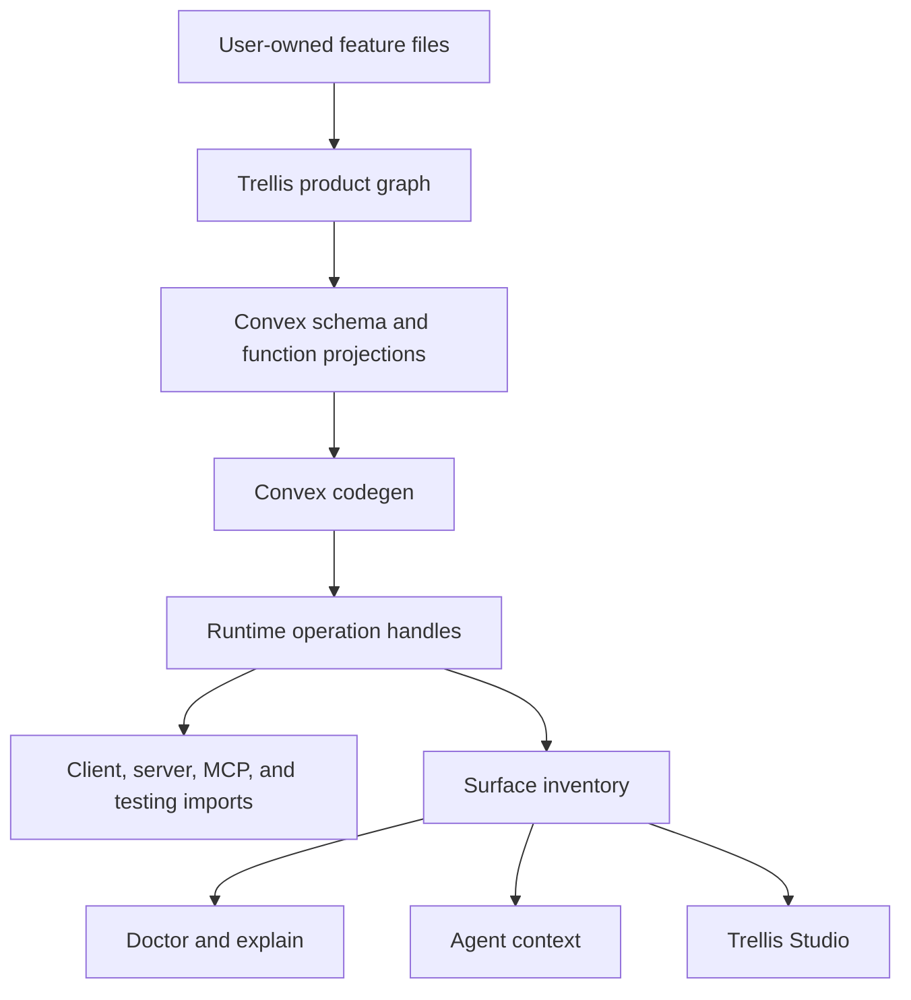

# Trellis Dream Spec

Status: concept proposal
Audience: product owner, maintainers, app developers, coding agents
Goal: define the best possible version of Trellis before deciding whether and how to build it

## Executive Summary

Trellis should become a compiler-backed app framework for serious Nuxt + Convex
workspace applications.

The dream version is not "more framework objects" and not "cleaner names for the
same abstraction stack." The dream version changes what app developers feel like
they are doing.

They should feel like they are defining product features:

```text
This app has workspaces.
This feature owns projects.
These fields live on a project.
These roles can create, read, update, archive, and delete projects.
This archive action is destructive and needs preview plus confirmation.
This action is available in the browser.
This action is also available to MCP agents.
This route verifies a webhook, then runs this backend action.
```

Trellis should compile that product definition into the boring but important
technical pieces:

```text
Convex schema
Convex query/mutation/action exports
Nuxt client handles and composables
server-route adapters
MCP tools
permission matrix
record-level _can projections
tenant-isolation tests
role-denial tests
destructive confirmation tests
doctor and explain inventory
agent context
generated docs and local dev visualization
```

The public product law is:

```text
The secure path is the shortest path.
The generated path is inspectable.
Every exposed action can explain itself.
```

## One-Sentence Product Definition

Trellis is the Nuxt + Convex app compiler for workspace apps, where developers
author features and actions once, and Trellis generates safe browser, server,
test, and optional agent surfaces from the same backend-owned rules.

## What Trellis Is

Trellis is:

- a product-feature authoring model for Nuxt + Convex apps
- a safety compiler that generates runtime surfaces from one product definition
- a workspace app foundation with auth, tenant isolation, roles, policies, and tests
- a destructive-action system with preview, confirmation, replay protection, and audit
- an optional MCP surface generator where agent tools share the same backend rules
- an explanation and diagnostics layer for developers and coding agents

Trellis is not:

- a generic CRUD helper
- a replacement for Convex
- a no-code app builder
- an MCP-first framework
- a server-route abstraction that hides HTTP
- a workflow engine
- a policy database product
- a giant compatibility layer for every possible app shape

## Target Users

### Primary User

A developer or team building a serious Nuxt + Convex app with:

- signed-in users
- workspaces or teams
- roles and permissions
- protected workspace data
- destructive actions
- tests for authorization and tenant isolation
- optional MCP or server-to-server surfaces

### Secondary User

A coding agent modifying a Trellis app. The agent must be able to discover:

- which files are user-owned
- which files are generated
- where product policy lives
- how to add fields and actions
- how to expose actions to UI, server, tests, and MCP
- what commands validate the change

### Not The Target User

Trellis should honestly tell users to skip it when they are building:

- a tiny public-only app
- a throwaway internal tool
- a prototype with no shared auth or permission model
- a raw Convex app where direct functions are intentionally enough
- an app that will immediately reject the canonical Trellis shape

## Core Product Thesis

Serious app teams keep rebuilding the same infrastructure:

- auth resolution
- workspace isolation
- role checks
- record ownership checks
- destructive preview and confirmation
- UI permission hints
- backend permission enforcement
- server-route identity forwarding
- MCP tool authorization
- tenant isolation tests
- role denial tests
- drift checks

Plain Nuxt + Convex is excellent for local simplicity. But once the same
business rule must be shared across browser UI, server routes, tests, and agent
tools, plain code tends to duplicate policy and drift.

Trellis wins when it makes the shared, secure path shorter than handwritten
Convex conventions.

## Product Principles

### 1. Product Concepts First

Users should think in:

```text
App lane
Feature
Resource or table
Action
Policy
Exposure
```

They should not have to think in:

```text
projection refs
handler maps
operation registries
replay modes
transport envelopes
function-ref translation maps
manual MCP preview/execute binding
```

Those lower-level concepts can exist internally. They should not be the normal
authoring model.

### 2. One Source Of Truth

Every important concept has exactly one owner:

| Concept | Source of truth |
| --- | --- |
| table fields | feature file |
| workspace scope | table/resource declaration |
| roles | app workspace configuration |
| business permission | feature policy |
| record authorization | action policy or action load/authorize block |
| destructive preview | destructive action definition |
| UI availability | generated from policy and record checks |
| MCP exposure | explicit action exposure |
| generated handles | compiler output |
| diagnostics | generated graph |

Derived artifacts are allowed only when they are:

- generated
- clearly marked
- rebuildable
- checked for drift

### 3. Safe Defaults, Loud Escapes

Normal workspace actions should not manually remember tenant checks.

Safe:

```ts
await db.projects.get(projectId)
```

Inside a workspace-scoped project action, this means:

```text
load the project
reject if missing
reject if it belongs to another workspace
return a typed project record
```

Unsafe access still exists, but it must be explicit:

```ts
await unsafe.crossWorkspace(
  {
    reason: 'Resolve public share token before workspace identity exists.',
    tables: ['shareTokens', 'projects'],
  },
  async ({ db }) => {
    // explicit exception
  },
)
```

Every unsafe escape appears in:

- `trellis doctor`
- `trellis explain`
- Trellis Studio
- generated agent context
- CI reports

### 4. Generated, But Inspectable

Generated code is not magic. It must be easy to inspect and explain.

Trellis can generate:

- Convex projections
- operation handles
- permission matrix
- MCP tools
- Nuxt composables
- test scaffolds
- agent context

But developers must be able to ask:

```bash
trellis explain action projects.archive
trellis explain feature projects
trellis explain file convex/features/projects.feature.ts
```

The answer must be concrete and actionable.

### 5. Server Routes Stay Honest

Server routes have real HTTP responsibilities:

- body parsing
- headers
- status codes
- downloads
- streaming
- HMAC verification
- provider-specific payload validation
- route-level idempotency

Trellis should not pretend those disappear. Routes verify HTTP. Trellis runs
backend actions after the route has established the caller or service context.

### 6. MCP Is Explicit

MCP is a strong differentiator, but not the default mental model.

Trellis should not auto-expose every action to agents.

MCP exposure is opt-in:

```ts
expose: {
  mcp: ['list', 'create', 'archive'],
}
```

For record references, MCP tools need resolvers so agents do not guess raw IDs.

### 7. Tests Prove Invariants

Trellis should generate tests for the boring dangerous cases:

- cross-workspace read denial
- cross-workspace write denial
- role denial
- record ownership denial
- destructive execute without confirmation
- confirmation reuse denial
- confirmation from another actor/workspace denial
- MCP resolver does not resolve records outside the workspace

Tests should use product language, not raw Convex function refs.

## Public Mental Model

### App Lane

An app lane is the starting product shape.

| Lane | Meaning | Good for |
| --- | --- | --- |
| `public` | no sign-in required | public demo, public read-only app, first tutorial |
| `personal` | signed-in user owns data | personal notes, private todo, individual dashboards |
| `workspace` | teams, roles, tenant data | serious SaaS and internal apps |
| `workspace-mcp` | workspace app with agent tools | apps where MCP is a product surface |

The dream version should make `workspace` the serious default. `public` and
`personal` still exist, but the flagship path is workspace.

### Feature

A feature is one product slice.

Examples:

- projects
- tasks
- comments
- articles
- runbooks
- uploads
- billing

A feature owns:

- resources or tables
- actions
- policy
- exposure choices
- feature tests
- optional UI

### Resource Or Table

A resource is a table-like product object.

Examples:

- Project
- Task
- Comment
- Article
- Runbook

A resource declaration says:

- what fields exist
- whether the resource belongs to a workspace
- what indexes exist
- whether it has ownership fields
- which fields are searchable
- what lifecycle states exist

### Action

An action is something the product can do.

Examples:

- list projects
- create project
- archive project
- delete task
- export CSV
- sync webhook delivery

Internally, actions compile into operations. Publicly, developers author actions.

Action kinds:

| Kind | Meaning |
| --- | --- |
| `query` | read data |
| `mutation` | bounded write |
| `destructive` | dangerous write requiring preview and confirmation |
| `internal` | backend-only app work |
| `service` | verified server-to-server work |

### Policy

Policy says who can run an action.

Examples:

```ts
policy.roles({
  read: ['owner', 'admin', 'member', 'viewer'],
  create: ['owner', 'admin'],
  archive: ['owner', 'admin'],
})
```

Record-level policy can depend on the loaded record:

```ts
update: ({ actor, record }) =>
  actor.role.in('owner', 'admin') || record.ownerId === actor.userId
```

Policy is backend-owned. UI permission hints are generated from it, never the
source of security.

### Exposure

Exposure says where an action is callable.

Possible surfaces:

- client
- server
- mcp
- testing
- internal

Example:

```ts
expose: {
  client: ['list', 'create', 'archive'],
  server: ['exportCsv'],
  mcp: ['list', 'create', 'archive'],
  testing: 'all',
}
```

Exposure does not change permission. It only says which runtime can call the
action through generated handles.

## Dream First-Run Experience

### Create A Workspace App

```bash
pnpm create trellis acme --workspace
cd acme
pnpm dev
```

The app opens with:

- sign up
- create workspace
- invite member
- create first project
- basic project list
- local Trellis Studio at `/__trellis`

The local Trellis Studio shows:

- current actor
- current workspace
- role
- features
- actions
- policy matrix
- generated surfaces
- doctor status

### Add A Resource

```bash
trellis add resource Project \
  name:string \
  summary?:text \
  status:enum(active,archived)=active \
  --crud \
  --ui \
  --mcp
```

Before writing files, Trellis prints the plan:

```text
Trellis will create Project.

User-owned files:
  convex/features/projects.feature.ts
  app/features/projects/ProjectList.vue
  app/pages/projects/index.vue
  tests/features/projects.test.ts

Generated files:
  convex/_trellis/projects.ts
  convex/_trellis/schema.ts
  .trellis/generated/operations/client.ts
  .trellis/generated/operations/server.ts
  .trellis/generated/operations/mcp.ts
  .trellis/generated/operations/testing.ts
  .trellis/generated/surface-inventory.json
  .trellis/generated/agent-context.json

Safety checks:
  workspace isolation
  role denial
  destructive confirmation
  MCP ID resolution

Next commands:
  trellis prepare
  trellis check
  trellis explain feature projects
```

The generated app should pass before the user edits anything.

## Canonical File Shape

### User-Owned Files

The user mostly edits:

```text
convex/
  app.ts
  features/
    projects.feature.ts
    tasks.feature.ts

app/
  features/
    projects/
      ProjectList.vue
      ProjectDetail.vue
  pages/
    projects/
      index.vue
      [id].vue

server/
  api/
    projects/export.get.ts
    webhooks/stripe.post.ts

tests/
  features/
    projects.test.ts
    tasks.test.ts
```

### Generated Files

Generated files are rebuildable:

```text
convex/
  _trellis/
    schema.ts
    functions.ts
    projects.ts
    tasks.ts
    registry.ts

.trellis/
  generated/
    graph.json
    operations/
      client.ts
      server.ts
      mcp.ts
      testing.ts
    permissions.ts
    surface-inventory.json
    agent-context.json
```

Generated files must start with a clear header:

```ts
// Generated by Trellis. Do not edit.
// Source: convex/features/projects.feature.ts
// Regenerate with: trellis prepare
```

### Advanced Split

One feature file is the default. When a feature grows, a developer can run:

```bash
trellis split feature projects
```

This can split:

```text
convex/features/projects.feature.ts
```

into:

```text
convex/features/projects/
  feature.ts
  table.ts
  policy.ts
  actions.ts
  access.ts
```

Splitting is an optimization for complexity. It is not the starting point.

## App Kernel

Most apps should have one small app file:

```ts
// convex/app.ts
import { app } from '@trellis/convex'

export default app({
  auth: {
    provider: 'better-auth',
    emailPassword: true,
  },

  workspace: {
    roles: ['owner', 'admin', 'member', 'viewer'],
    defaultRole: 'member',
  },
})
```

Trellis generates:

- caller resolution
- app identity resolution
- workspace membership helpers
- permission context
- system tables
- root schema assembly
- runtime glue

Advanced apps can eject specific areas:

```bash
trellis eject auth
trellis eject workspace
trellis eject feature projects
```

Ejection should be explicit, rare, and clear about what is lost.

## Workspace Model

The dream version should use memberships internally:

```text
users
workspaces
memberships
workspaceInvites
```

This supports:

- one user in multiple workspaces
- different roles per workspace
- invites before signup
- workspace switching
- owner transfer
- service or agent acting inside a workspace

The developer-facing API stays simple:

```ts
actor.userId
workspace.id
membership.role
```

The starter can still behave like a single-workspace app until switching is
needed.

## Feature Definition Example

This is the kind of code junior and mid-level developers should be able to
understand and modify.

```ts
// convex/features/projects.feature.ts
import { action, feature, policy, ref, table, v } from '@trellis/convex'

export default feature('projects', {
  table: table.workspace({
    name: v.string().label('Name').examples(['Website redesign', 'Q3 launch']),
    summary: v.optional(v.text()).label('Summary'),
    status: v.enum(['active', 'archived']).default('active'),
  })
    .ownedBy('creator')
    .index('by_status', ['workspaceId', 'status'])
    .search(['name', 'summary']),

  policy: policy.roles({
    read: ['owner', 'admin', 'member', 'viewer'],
    create: ['owner', 'admin'],
    archive: ['owner', 'admin'],
    delete: ['owner'],
  }),

  actions: {
    list: action.query({
      description: 'List projects in the current workspace.',
      policy: 'read',
      args: {},
      run: async ({ db }) => {
        return await db.projects.order('createdAt', 'desc').collect()
      },
    }),

    create: action.mutation({
      description: 'Create a project in the current workspace.',
      policy: 'create',
      args: {
        name: v.string().label('Name'),
        summary: v.optional(v.text()).label('Summary'),
      },
      run: async ({ db, actor, now }, args) => {
        return await db.projects.insert({
          name: args.name,
          summary: args.summary,
          status: 'active',
          ownerId: actor.userId,
          createdAt: now,
          updatedAt: now,
        })
      },
    }),

    archive: action.destructive({
      description: 'Archive a project and prevent new work from being added.',
      policy: 'archive',
      args: {
        project: ref('projects').resolveBy('name', 'slug', 'id'),
      },
      load: async ({ db }, args) => {
        const project = await db.projects.get(args.project)
        return { project }
      },
      preview: async ({ db }, _args, { project }) => {
        const taskCount = await db.tasks.countByProject(project._id)

        return {
          summary: `Archive "${project.name}"`,
          body: 'Archived projects stop accepting new tasks.',
          effects: [
            { resource: 'projects', count: 1, action: 'archive' },
            { resource: 'tasks', count: taskCount, action: 'freeze' },
          ],
          confirmation: {
            projectId: project._id,
            projectUpdatedAt: project.updatedAt,
            taskCount,
          },
        }
      },
      run: async ({ db, audit, now }, _args, { project }) => {
        if (project.status === 'archived') {
          throw action.deny('Project is already archived.')
        }

        await db.projects.patch(project._id, {
          status: 'archived',
          updatedAt: now,
        })

        await audit.record('project.archived', {
          projectId: project._id,
          name: project.name,
        })
      },
    }),
  },

  expose: {
    client: ['list', 'create', 'archive'],
    mcp: ['list', 'create', 'archive'],
    testing: 'all',
  },
})
```

### Why This Is Understandable

The file reads like product behavior:

- the table has fields
- roles define who can do what
- actions say what happens
- archive says what the preview shows
- exposure says where the action is callable

The file does not ask the developer to maintain:

- Convex projection wrappers
- function-ref strings
- preview refs
- execute refs
- operation registries
- MCP binding maps
- test transport maps

## Compiler Pipeline

Trellis should behave like a compiler.



Pipeline steps:

1. Read canonical app and feature files.
2. Build a normalized product graph.
3. Generate Convex schema fragments.
4. Generate Convex function projections.
5. Run Convex codegen.
6. Generate runtime-filtered handles.
7. Scan client, server, MCP, and tests for handle usage.
8. Generate surface inventory and agent context.
9. Run doctor, typecheck, tests, and drift checks.

The product graph is the compiler's internal truth. App developers do not edit it.

## Product Graph

The graph is a generated structured representation of the app.

It contains:

```json
{
  "app": {
    "lane": "workspace",
    "auth": "better-auth",
    "workspaceModel": "memberships"
  },
  "features": {},
  "resources": {},
  "actions": {},
  "policies": {},
  "exposures": {},
  "unsafeEscapes": {},
  "generatedFiles": {}
}
```

The graph powers:

- generated code
- doctor
- explain
- agent context
- Trellis Studio
- generated tests
- release validation

## Runtime Handles

Normal runtime code imports generated handles:

```ts
import { actions } from '#trellis/actions/client'
import { actions } from '#trellis/actions/server'
import { actions } from '#trellis/actions/mcp'
import { actions } from '#trellis/actions/testing'
```

The root alias should not be documented:

```ts
// Avoid this in docs:
import { actions } from '#trellis/actions'
```

Different runtimes see different handles.

Client handles do not include:

- backend-only actions
- internal actions
- service-only actions
- MCP-only actions
- unsafe actions unless explicitly exposed
- handler closures
- raw DB helpers
- secrets

MCP handles include agent-safe metadata:

- descriptions
- labels
- examples
- resolver hints
- destructive confirmation requirements

Testing handles include enough metadata for product-level tests.

## UI API

### Basic Query

```ts
import { actions } from '#trellis/actions/client'

const projects = await useLive(actions.projects.list)
```

### Basic Mutation

```ts
const createProject = useAction(actions.projects.create)

await createProject.run({
  name: 'Q3 launch',
  summary: 'Launch planning workspace',
})
```

### Destructive Action

```ts
const archiveProject = useAction(actions.projects.archive)

const preview = await archiveProject.preview({
  project: projectId,
})

await archiveProject.run(
  { project: projectId },
  { confirmation: preview.confirmation },
)
```

The UI never sees `_confirmationToken`.

### Generated Destructive Component

For common cases:

```vue
<TrellisDestructiveButton
  :action="actions.projects.archive"
  :args="{ project: project._id }"
  label="Archive"
  @done="refresh"
/>
```

For larger workflows:

```vue
<TrellisDestructiveDialog
  :action="actions.projects.archive"
  :args="{ project: project._id }"
  @executed="refresh"
/>
```

The component renders:

- summary
- effects
- warnings
- blockers
- required typed phrase if configured
- stale preview state
- execution result

## Destructive Actions

Destructive actions are one of Trellis's signature features.

Examples:

- archive project
- delete task
- revoke token
- publish to public
- remove member
- delete workspace
- purge data

### Required Shape

A destructive action must define:

- description
- policy
- args
- load
- preview
- run

Preview must explain:

- what will happen
- what records or resources are affected
- whether the action is reversible
- what warnings or blockers exist
- what confirmation payload binds to

### State Machine

```text
idle
  -> previewing
  -> previewReady
  -> confirming
  -> executing
  -> done

previewReady
  -> stalePreview
  -> rePreviewRequired
```

### Confirmation Binding

The confirmation receipt is opaque to app code. Internally it binds:

- action id
- preview function ref
- execute function ref
- projection kind
- registry fingerprint
- caller subject
- actor identity
- workspace scope
- args hash
- confirmation payload hash
- expiry
- JTI
- replay or idempotency key

If a preview was issued before generated projections changed, execute fails with
a stale confirmation error.

### Confirmation Levels

Trellis can support multiple confirmation levels:

| Level | Use for | UX |
| --- | --- | --- |
| low | archive small item | confirm button |
| medium | delete important record | confirmation dialog |
| high | bulk delete, revoke access | typed phrase |
| critical | workspace deletion | typed phrase plus cooldown or second actor |

Example:

```ts
confirmation: {
  level: 'high',
  typedPhrase: ({ project }) => project.name,
}
```

## Policy And Permissions

Policy is the only source of truth for authorization.

From:

```ts
policy.roles({
  read: ['owner', 'admin', 'member', 'viewer'],
  create: ['owner', 'admin'],
  update: ({ actor, record }) =>
    actor.role.in('owner', 'admin') || record.ownerId === actor.userId,
})
```

Trellis generates:

- backend permission checks
- role matrix
- `#trellis/permissions`
- `useAccess()`
- record `_can` fields
- MCP safety metadata
- test matrix cases
- explain output

### UI Permission Example

```ts
const access = useAccess()

if (access.can(actions.projects.create)) {
  // show create button
}
```

Record-specific:

```vue
<button v-if="project._can.archive">
  Archive
</button>
```

The UI hint is derived from backend policy. It is not security.

## Scoped DB Capability

Workspace resources use a scoped DB facade.

```ts
await db.projects.get(id)
await db.projects.patch(id, patch)
await db.projects.delete(id)
await db.projects.order('createdAt', 'desc').collect()
```

For workspace tables, these operations automatically use the active workspace.

Cross-resource checks are explicit:

```ts
const task = await db.tasks.get(args.task)
const project = await db.projects.get(task.projectId)
```

If `task` belongs to another workspace, `db.tasks.get` denies before returning.

### Raw Convex

Raw Convex is still available for:

- internal jobs
- storage URLs
- migrations
- specialized queries
- component integrations
- performance tuning

But normal product actions should not use `ctx.db` directly.

## Server Route API

Server routes stay explicit.

### CSV Export

```ts
// server/api/projects/export.get.ts
import { actions } from '#trellis/actions/server'
import { serverAction } from '#trellis/server'

export default defineEventHandler(async (event) => {
  const rows = await serverAction(event, actions.projects.exportCsv).query({})

  setResponseHeader(event, 'content-type', 'text/csv')
  return toCsv(rows)
})
```

The route owns:

- query parsing
- response headers
- CSV formatting

Trellis owns:

- caller resolution
- backend policy
- workspace scope
- action execution

### Webhook

```ts
// server/api/webhooks/stripe.post.ts
import { actions } from '#trellis/actions/server'
import { serverAction, serviceCaller } from '#trellis/server'

export default defineEventHandler(async (event) => {
  const delivery = await verifyStripeWebhook(event)

  await serverAction(event, actions.billing.syncSubscription).execute(
    delivery.body,
    {
      auth: serviceCaller('stripe-webhook'),
      idempotency: delivery.id,
    },
  )

  return { ok: true }
})
```

The route verifies Stripe. Trellis does not pretend to know Stripe.

## MCP Surface

MCP tools are generated from exposed actions.

MCP means "Model Context Protocol." In practical terms, it lets an AI agent call
tools exposed by the app. In Trellis, those tools must use the same backend
rules as the UI.

### Opt-In Exposure

```ts
expose: {
  mcp: ['list', 'create', 'archive'],
}
```

Generated tool module:

```ts
import { actions } from '#trellis/actions/mcp'
import { mcp } from '#trellis/mcp'

export default mcp.tools({
  listProjects: mcp.action(actions.projects.list),
  createProject: mcp.action(actions.projects.create),
  archiveProject: mcp.action(actions.projects.archive),
})
```

### ID Resolution

Agents should not guess raw Convex IDs.

Good:

```ts
project: ref('projects').resolveBy('name', 'slug', 'id')
```

Generated tool accepts:

```json
{ "project": "Q3 launch" }
```

Trellis resolves that safely inside the current workspace.

If an MCP-exposed action accepts a record reference without a resolver:

```text
FAIL projects.archive exposes a Project reference to MCP but has no resolver.

Fix:
  Add ref('projects').resolveBy('name', 'slug', 'id')

Or explicitly waive:
  agentUnsafe({ reason: 'Only used by deterministic internal workflow.' })
```

### Destructive MCP Flow

Destructive MCP tools should use a preview/confirm split.

Preview result:

```json
{
  "requiresConfirmation": true,
  "summary": "Archive \"Q3 launch\"",
  "effects": [
    { "resource": "projects", "count": 1, "action": "archive" }
  ],
  "confirmation": {
    "id": "opaque-confirmation-receipt",
    "expiresAt": "2026-06-18T12:00:00Z"
  }
}
```

Execute requires the confirmation receipt.

The agent never receives secrets. The receipt is only useful for:

- the same action
- the same actor
- the same workspace
- the same args
- the same preview payload
- before expiry

### MCP Capabilities Resource

Every MCP app should expose safe app context:

```text
trellis://app/capabilities
trellis://app/actions
trellis://app/current-workspace
trellis://app/safety-rules
```

This helps agents understand:

- what tools exist
- which tools are destructive
- how to resolve records
- what requires confirmation
- what workspace they are acting in

## Testing

Tests should use product language.

```ts
import { trellisTest } from '@trellis/testing'
import { actions } from '#trellis/actions/testing'

test('admins can archive projects', async () => {
  const app = await trellisTest()

  const acme = await app.workspace('Acme').withUsers({
    owner: 'owner',
    admin: 'admin',
    viewer: 'viewer',
  })

  const project = await acme.owner.action(actions.projects.create).run({
    name: 'Q3 launch',
  })

  const preview = await acme.admin.action(actions.projects.archive).preview({
    project,
  })

  await acme.admin.action(actions.projects.archive).run(
    { project },
    { confirmation: preview.confirmation },
  )

  await expect(
    acme.viewer.action(actions.projects.archive).preview({ project }),
  ).rejects.toDenyPermission('projects.archive')
})
```

### Generated Test Matrix

```bash
trellis test matrix projects
```

Example output:

```text
projects.list
  owner yes
  admin yes
  member yes
  viewer yes
  anonymous no
  cross-tenant no

projects.create
  owner yes
  admin yes
  member no
  viewer no
  anonymous no
  cross-tenant no

projects.archive
  owner preview+confirm
  admin preview+confirm
  member no
  viewer no
  replay token no
  wrong workspace token no
  stale args token no
```

### Generated Baseline Tests

For each workspace resource, Trellis creates tests for:

- owner/admin access
- viewer denial for writes
- cross-workspace by-ID denial
- destructive confirmation required
- destructive confirmation cannot be reused
- destructive confirmation cannot cross workspace
- MCP resolver cannot resolve cross-workspace records

App authors can extend or replace these tests, but generated starters must begin
with meaningful security coverage.

## Doctor

`trellis doctor` is the build-trust command.

It should fail on:

- generated graph is stale
- generated handles are stale
- duplicate action IDs
- missing generated projection
- destructive action without preview
- destructive action exposed to MCP without confirmation flow
- MCP record reference without resolver or waiver
- raw DB usage inside workspace action without unsafe permit
- UI importing Convex handler implementation directly
- server or MCP importing backend handler closures
- generated files manually edited

Doctor output must include fixes:

```text
FAIL projects.archive is destructive but has no preview.

Source:
  convex/features/projects.feature.ts:42

Fix:
  Add preview: ({ project }) => ({ summary, effects, confirmation })

Agent-safe fix:
  no, product copy is required.
```

## Explain

`explain` is the human and coding-agent trust interface.

Commands:

```bash
trellis explain app
trellis explain feature projects
trellis explain action projects.archive
trellis explain tool project_archive
trellis explain file convex/features/projects.feature.ts
```

Example:

```text
projects.archive

Source:
  convex/features/projects.feature.ts:42

Kind:
  destructive workspace mutation

Policy:
  projects.archive
  roles: owner, admin

Reads:
  projects by ref, workspace-checked
  tasks count by project, workspace-checked

Writes:
  projects.status
  audit log

Exposed to:
  client yes
  server no
  mcp yes
  testing yes

MCP resolver:
  project resolves by name, slug, id inside current workspace

Confirmation:
  required
  binds actor, workspace, args, preview payload, registry fingerprint

Tests:
  tests/features/projects.test.ts

Status:
  ok
```

## Trellis Studio

Trellis Studio is a local dev UI at:

```text
/__trellis
```

It should show:

- app lane
- current actor
- current workspace
- role
- features
- resources
- actions
- policies
- exposure matrix
- MCP tools
- generated files
- unsafe escapes
- doctor findings
- recent operation traces

### Policy Explanation

Example:

```text
Why can Alice archive this project?

Alice is admin in workspace Acme.
projects.archive allows owner and admin.
The project belongs to workspace Acme.
Preview is available.
Confirmation is required before execute.
```

Denial:

```text
Why can Bob not archive this project?

Bob is viewer in workspace Acme.
projects.archive allows owner and admin.
viewer is not allowed.
```

Studio should make Trellis understandable without reading generated code.

## Agent Context

Every app gets a generated agent context:

```text
.trellis/generated/agent-context.json
```

It should include:

- app lane
- feature map
- user-owned files
- generated files
- actions
- policies
- exposures
- ID resolvers
- unsafe escapes
- safe commands
- editing rules

It must not include:

- secrets
- bearer tokens
- HMAC keys
- raw auth cookies
- full source dumps
- provider credentials
- signing keys
- internal token material

Example:

```json
{
  "app": {
    "lane": "workspace",
    "auth": "better-auth",
    "workspaceModel": "memberships"
  },
  "features": {
    "projects": {
      "userOwned": [
        "convex/features/projects.feature.ts",
        "app/features/projects/ProjectList.vue",
        "tests/features/projects.test.ts"
      ],
      "generated": [
        "convex/_trellis/projects.ts",
        ".trellis/generated/actions/client.ts"
      ],
      "actions": {
        "projects.archive": {
          "kind": "destructive",
          "scope": "workspace",
          "policy": "projects.archive",
          "surfaces": ["client", "mcp", "testing"],
          "requiresPreview": true,
          "resolvers": ["project.byName", "project.bySlug", "project.byId"]
        }
      }
    }
  },
  "rules": [
    "Do not edit generated files.",
    "Use resource actions for product behavior.",
    "Do not use raw ctx.db in workspace actions without unsafe.crossWorkspace.",
    "Do not expose MCP actions with record references unless a resolver exists."
  ]
}
```

## AGENTS.md

Generated apps should include a short `AGENTS.md`.

Example:

```text
For product behavior, edit:
- convex/features/*.feature.ts
- app/features/*
- app/pages/*
- server/api/*
- tests/*

Do not edit:
- convex/_trellis/*
- .trellis/generated/*
- generated action handles

Rules:
- Use generated action handles in UI, server, MCP, and tests.
- Use scoped db.<resource> inside workspace actions.
- Do not use ctx.db directly in workspace actions.
- Do not create MCP tools by hand for normal actions.
- Do not expose destructive actions without preview metadata.
- Run trellis check after changing feature files.
```

## Eject Path

Trellis should offer a real eject path:

```bash
trellis eject feature projects
```

It generates plain Convex files:

```text
convex/projects.ts
convex/schema.projects.ts
tests/projects.test.ts
```

Report:

```text
Ejected projects.

Kept:
  schema
  query/mutation exports
  permission checks as inline functions
  destructive preview/confirmation logic as explicit code

Lost:
  generated MCP bindings
  generated action handles
  useAction/useLive wrappers
  doctor/explain graph
  generated agent context
```

This reduces lock-in fear and keeps Trellis honest. If ejection is impossible,
the abstraction is probably too magical.

## Package And Import Shape

The public API should be strict and boring.

Possible package shape:

```text
@trellis/nuxt
@trellis/convex
@trellis/server
@trellis/testing
@trellis/mcp
@trellis/cli
```

Or one package with strict subpaths:

```text
@lupinum/trellis/convex
@lupinum/trellis/server
@lupinum/trellis/testing
@lupinum/trellis/mcp
```

Runtime aliases:

```text
#trellis/actions/client
#trellis/actions/server
#trellis/actions/mcp
#trellis/actions/testing
#trellis/permissions
```

Internal imports should not be part of beginner docs.

## Commands

Main loop:

```bash
trellis prepare
trellis check
trellis doctor
trellis doctor --agent
trellis explain app
trellis explain feature projects
trellis explain action projects.archive
trellis test matrix projects
```

### `trellis prepare`

Runs:

- product graph generation
- Convex schema generation
- Convex projection generation
- Convex codegen
- runtime handle generation
- surface inventory generation
- agent context generation

### `trellis check`

Runs:

- prepare check
- doctor
- typecheck
- lint
- focused generated tests
- drift checks

### `trellis doctor --agent`

Adds coding-agent-specific checks:

- generated context stale
- MCP record refs without resolvers
- missing descriptions for MCP args
- unsafe edits to generated files
- UI importing backend files
- ambiguous ownership of a file

## Non-Goals Before 1.0

Do not build before the core path is excellent:

- YAML DSL
- visual app builder
- generic workflow engine
- permission grants table
- deny table
- role overlays
- record sharing framework
- generic migration framework
- generic provider adapter registry
- automatic MCP exposure
- magic server-route projection
- business-level `trellis.config.ts`
- broad backward compatibility shims
- CMS abstractions
- billing abstractions

Trellis should not become:

```text
Firebase + Rails + Retool + LangChain + Auth0 + Zapier
```

It should stay narrower:

```text
Nuxt + Convex app features with safe workspace, backend, and optional agent surfaces.
```

## Risks And Tradeoffs

### Risk: Too Magical

If users cannot understand what Trellis generated, they will not trust it.

Mitigation:

- generated files are inspectable
- `explain` is first-class
- Studio visualizes the graph
- eject path exists

### Risk: Compiler Complexity

A compiler-backed model is harder to build than simple runtime helpers.

Mitigation:

- build vertical slices
- keep the source grammar strict
- avoid arbitrary TypeScript inference
- generate one resource well before adding breadth

### Risk: Resource Model Too Narrow

Some apps need complex behavior not covered by resource actions.

Mitigation:

- advanced actions exist
- raw Convex remains available
- unsafe escapes are explicit
- ejection is possible

### Risk: MCP Dominates The Product

MCP is valuable but can distract from core app DX.

Mitigation:

- workspace is the main lane
- workspace-mcp is a separate lane
- MCP exposure is opt-in

### Risk: Membership Model Adds Complexity

Memberships are more complex than `users.workspaceId`.

Mitigation:

- expose a simple single-workspace UX by default
- hide switching until needed
- keep API simple: `actor`, `workspace`, `membership`

## Acceptance Criteria For Dream 1.0

Trellis 1.0 dream version is credible when:

- `pnpm create trellis acme --workspace` creates a working app
- app opens with auth, workspace creation, and one Project feature
- `trellis add resource Project --crud --ui --mcp` creates a passing slice
- user edits one feature file for normal product changes
- generated Convex projections are not manually edited
- UI uses generated action handles
- tests use product-level action clients
- MCP tools use generated action handles
- destructive UI does not expose `_confirmationToken`
- destructive MCP requires preview and confirmation
- record references exposed to MCP have resolvers or waivers
- `trellis prepare` regenerates all derived artifacts
- `trellis check` catches stale generated output
- `trellis doctor --agent` catches common coding-agent mistakes
- `trellis explain action <id>` is useful without reading source code
- Trellis Studio shows policy decisions and action traces
- unsafe escapes are visible and reviewed
- generated tests prove tenant isolation and role denial
- server routes keep HTTP verification route-owned
- ejecting one feature is possible and understandable

## Implementation Roadmap

### Slice 1: Workspace Starter

Build:

- membership-based workspace model
- Better Auth integration
- one Project feature
- generated UI page
- generated baseline tests
- local Trellis Studio shell

Success:

- fresh app runs
- tests pass
- Product owner can understand the app shape

### Slice 2: Feature Compiler

Build:

- feature file parser
- product graph
- generated schema
- generated Convex projections
- generated runtime handles

Success:

- no manual projection wrappers for normal actions
- generated files are rebuildable
- stale graph fails check

### Slice 3: Runtime Surfaces

Build:

- client action handles
- `useLive`
- `useAction`
- server action adapter
- testing action client

Success:

- UI, server, and tests call same action handles
- destructive confirmation works without token plumbing

### Slice 4: MCP Projection

Build:

- opt-in MCP exposure
- generated MCP tools
- resolver graph
- destructive preview/confirm flow
- MCP capabilities resource

Success:

- agents do not guess IDs
- destructive tools require confirmation
- MCP shares backend policy

### Slice 5: Trust Layer

Build:

- `trellis doctor`
- `trellis doctor --agent`
- `trellis explain`
- agent context
- Studio action trace
- generated test matrix

Success:

- developers can debug by asking Trellis what exists and why
- coding agents have a safe edit map

### Slice 6: Eject And Advanced Escapes

Build:

- feature eject
- explicit unsafe escapes
- advanced server/service actions
- bridge/package authoring as separate advanced docs

Success:

- Trellis is not a lock-in trap
- advanced use remains possible without polluting beginner docs

## Glossary

### Action

A product behavior such as create project, archive task, or export CSV. Actions
compile into backend operations and runtime handles.

### Agent Context

A generated JSON file that tells coding agents how the app is structured, which
files are safe to edit, and what actions/policies exist.

### App Lane

The broad app shape: public, personal, workspace, or workspace-mcp.

### Destructive Action

An action that can cause irreversible or risky change. It requires preview and
confirmation.

### Exposure

The list of runtime surfaces where an action is callable: client, server, MCP,
testing, or internal.

### Feature

A product slice owning resources, actions, policy, tests, and optional UI.

### MCP

Model Context Protocol. A way for AI agents to use app-provided tools. In
Trellis, MCP tools must use the same backend policy as normal app actions.

### Policy

The backend-owned authorization rule for an action.

### Product Graph

The generated structured model of the app. It powers codegen, diagnostics,
explain output, agent context, and Studio.

### Scoped DB

A database capability that automatically applies workspace and resource rules.

### Trellis Studio

A local development UI for inspecting actions, policies, exposures, generated
files, unsafe escapes, and operation traces.

### Unsafe Escape

An explicit, reviewed bypass for cases where normal scoped behavior is not
enough.

## Final Vision

The best Trellis is not a bigger pile of framework files.

The best Trellis is a small product authoring model backed by a strict compiler
and an explainable safety graph.

Developers write:

```text
features
actions
policy
exposure
```

Trellis generates:

```text
Convex
Nuxt handles
server adapters
MCP tools
tests
permissions
diagnostics
agent context
```

The user does not maintain projection refs, handler maps, confirmation tokens,
or registry glue.

That is the dream:

```text
Define the feature once.
Use generated handles everywhere.
Run prepare.
Run check.
Ask explain when unsure.
Ship with confidence.
```
