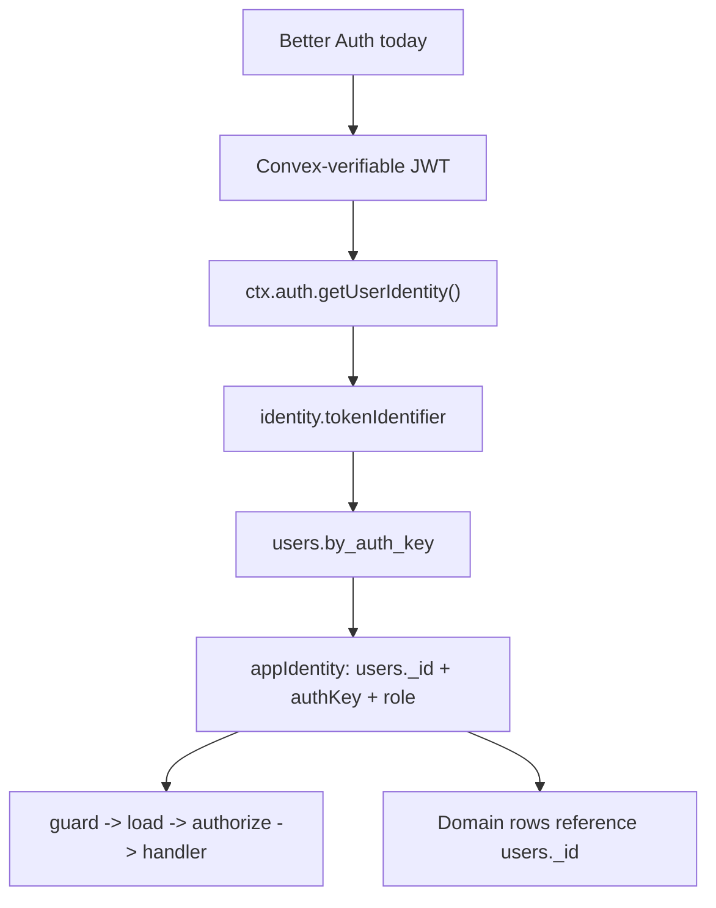

# RFC: Auth Foundation Refactor Before Provider Expansion

Status: Draft
Date: 2026-05-24
Owner: Matthias
Related: `meta/rfc-auth-provider-runtime.md`

## Purpose

Trellis is still greenfield and unreleased. This is the right time to fix the
auth foundation so future Clerk or WorkOS support can be added without forcing
users through a hard schema and API migration.

This RFC intentionally does not implement Clerk or WorkOS. It defines the
smaller refactor we should do now while Better Auth remains the only supported
auth provider.

The goal is to make the current Better Auth implementation honest and isolated:

- Better Auth remains the concrete auth/session provider today.
- Trellis app identity, permissions, and domain data stop depending on Better
  Auth-shaped IDs.
- Future providers can be added by replacing the token/session transport, not
  by rewriting app schemas and public auth concepts.

## Decision Summary

Do the foundation work now:

1. Replace `users.authId` with `users.authKey`.
2. Define `authKey` as `ctx.auth.getUserIdentity().tokenIdentifier`.
3. Use local `users._id` as the canonical app user id inside app/domain data.
4. Keep `authKey` only as the external-auth lookup key.
5. Rename Better Auth-specific public APIs so they say Better Auth.
6. Make `useConvexAuth()` provider-neutral by removing the Better Auth client
   from its return value.
7. Make app user bootstrap depend on Convex identity, not Better Auth trigger
   timing.
8. Isolate the current Better Auth token exchange in an internal Better
   Auth-named transport module.
9. Rename the public auth user projection away from `ConvexUser`, expose it as
   `sessionUser`, and remove provider-subject `id` from the public shape.

Do not do the provider work yet:

- no public `auth.provider = 'clerk' | 'workos'`;
- no generic provider adapter registry;
- no Clerk or WorkOS optional dependencies;
- no WorkOS routes;
- no provider-owned organization mode;
- no account linking;
- no webhook sync framework.

## Why This Is The Right Cut

The expensive migration is not adding a token source later. The expensive
migration is changing what Trellis means by "user".

Today, many paths treat the provider subject as the app user id:

```text
Better Auth user id -> users.authId -> appIdentity.userId -> domain tables
```

That works while there is one provider. It becomes the wrong foundation once
multiple providers are possible because raw provider subjects can collide and
provider migrations would require rewriting domain rows.

The correct foundation is:

```text
provider JWT -> Convex UserIdentity.tokenIdentifier -> users.authKey -> users._id
                                                                  |
                                                                  v
                                                        app/domain foreign keys
```

`authKey` is a boundary lookup key. `users._id` is the app user id.

## Non-Goals

- Implement Clerk support.
- Implement WorkOS support.
- Support multiple auth providers in one deployed app.
- Preserve `authId` compatibility.
- Keep old and new public composables side by side.
- Add migration tooling for released consumers.
- Add provider tables, provider registries, or generic adapter APIs.
- Make provider webhooks required for first login.

Because Trellis is unreleased, this should be a hard cutover.

## Current Coupling To Remove

Use this command before implementation to get the live list:

```bash
rg -n "authId|by_auth_id|useConvexSignIn|useConvexSignUp|useConvexPasswordReset|useConvexAuth\\(\\).*client|defineAuth" src examples apps tests meta -g '!**/_generated/**'
```

The important current coupling points are:

- `src/runtime/auth/define-auth.ts`
  - Better Auth bridge is named generically as `defineAuth`.
  - App users are created with `authId`.
  - Better Auth triggers create/update/delete app user rows.
- `src/runtime/auth/define-app-identity.ts`
  - Default app identity looks up `users.by_auth_id`.
  - `appIdentity.userId` is `user.authId`.
  - Trusted forwarded user subjects are forced through the same `authId` path.
- `src/runtime/auth/index.ts`
  - `getAuth()` exposes only `subject`, which encourages raw-subject lookup.
- `src/runtime/auth/composables/useConvexAuth.ts`
  - Provider-neutral composable exposes the Better Auth client.
  - The returned `user` is an auth-session profile, not an app `users` row.
- `src/runtime/utils/types.ts`
  - `ConvexUser` is not actually a Convex app user row.
  - `ConvexUser.id` is a provider/session subject, not local `users._id`.
- `src/runtime/auth/composables/useConvexSignIn.ts`
  - Better Auth email/password sign-in is named as Convex sign-in.
- `src/runtime/auth/composables/useConvexSignUp.ts`
  - Better Auth email/password sign-up is named as Convex sign-up.
- `src/runtime/auth/composables/useConvexPasswordReset.ts`
  - Better Auth password reset is named as Convex password reset.
- `src/runtime/testing/index.ts`
  - Testing helpers default to `users.authId`.
- Starters and examples
  - User schemas define `authId` and `by_auth_id`.
  - Domain tables frequently store auth ids in fields named `userId`,
    `ownerId`, or membership user fields.
- Docs and skill references
  - Public docs teach `client` from `useConvexAuth()`.
  - Auth troubleshooting references missing `authId` rows.

## Target Concepts

### Auth Identity

The identity Convex verified from a JWT.

```ts
export type AuthIdentity = {
  authKey: string
  providerSubject: string
  email?: string
  displayName?: string
  avatarUrl?: string
}
```

For now this comes from Better Auth through Convex. Later it can come from
Clerk or WorkOS through Convex without changing the rest of the app.

```ts
export async function getAuthIdentity(ctx: {
  auth: { getUserIdentity: () => Promise<any> }
}): Promise<AuthIdentity | null> {
  const identity = await ctx.auth.getUserIdentity()
  if (!identity) return null

  return {
    authKey: identity.tokenIdentifier,
    providerSubject: identity.subject,
    ...(typeof identity.email === 'string' ? { email: identity.email } : {}),
    ...(typeof identity.name === 'string' ? { displayName: identity.name } : {}),
    ...(typeof identity.picture === 'string' ? { avatarUrl: identity.picture } : {}),
  }
}
```

Do not use `identity.subject` for user lookup. It is provider-local.

### Auth Key

`authKey` is the canonical external-auth lookup key:

```ts
const identity = await ctx.auth.getUserIdentity()
const authKey = identity.tokenIdentifier
```

It is not the app user id. It is not a domain foreign key.

### App User

The row in the app-owned `users` table. Its `_id` is the canonical local user
id for app/domain relations.

```ts
export const userTables = {
  users: defineTable({
    authKey: v.string(),
    email: v.optional(v.string()),
    displayName: v.optional(v.string()),
    avatarUrl: v.optional(v.string()),
    role: v.union(v.literal('owner'), v.literal('admin'), v.literal('member'), v.literal('viewer')),
    workspaceId: v.optional(v.id('workspaces')),
    createdAt: v.number(),
    updatedAt: v.number(),
  }).index('by_auth_key', ['authKey']),
}
```

Do not add `provider` or `providerSubject` yet. Better Auth is the only
implemented provider today, and adding descriptive provider fields before a
second provider exists is extra schema. If a future provider needs these fields,
add them with the provider implementation and a clear migration story.

### App Identity

Protected handlers should receive the local app user id and the auth boundary
key separately.

```ts
export type DefaultAppIdentity = {
  kind: 'user'
  userId: Id<'users'>
  authKey: string
  role: string
  workspaceId?: Id<'workspaces'>
}
```

If public TypeScript cannot reference the consumer app's `Id<'users'>`, use
`string` in the generic module type, but examples and starter schemas should
use Convex ids.

### Domain References

Domain tables should reference local app users, not auth keys.

Good:

```ts
tasks: defineTable({
  title: v.string(),
  assigneeId: v.optional(v.id('users')),
  createdByUserId: v.id('users'),
})

memberships: defineTable({
  userId: v.id('users'),
  workspaceId: v.id('workspaces'),
  role: v.union(v.literal('admin'), v.literal('member')),
}).index('by_user', ['userId'])
```

Avoid:

```ts
tasks: defineTable({
  // Bad: this stores the external auth key or raw provider subject.
  createdBy: v.string(),
})
```

This is the main future-proofing win. If a user later migrates from Better Auth
to Clerk or WorkOS, only `users.authKey` needs to change or be relinked. Domain
rows continue pointing to the same local `users._id`.

## Target Flow



Future Clerk or WorkOS support changes only the provider/JWT source.

## Refactor 1: Rename Better Auth Bridge

Current:

```ts
import { defineAuth } from '@lupinum/trellis/auth'
```

Target:

```ts
import { defineBetterAuth } from '@lupinum/trellis/auth'
```

Rationale: `defineAuth` is not provider-neutral. It configures Better Auth,
the Better Auth Convex component, Better Auth plugins, Better Auth cookies, and
Better Auth user lifecycle hooks.

Hard cutover:

- Rename `defineAuth` to `defineBetterAuth`.
- Rename `DefineAuthOptions` to `DefineBetterAuthOptions`.
- Rename `DefineAuthDeps` to `DefineBetterAuthDeps`.
- Rename `ConvexAuthBridge` to `BetterAuthBridge`.
- Do not export a `defineAuth` alias.

Example:

```ts
// convex/auth.ts
import { defineBetterAuth } from '@lupinum/trellis/auth'
import { components, internal } from './_generated/api.js'
import { mutation } from './_generated/server.js'
import authConfig from './auth.config.js'

const auth = defineBetterAuth(
  { components, internal, mutation, authConfig },
  { emailPassword: true },
)

export const authComponent = auth.authComponent
export const createAuth = auth.createAuth
export const createUserIfNeeded = auth.createUserIfNeeded
```

## Refactor 2: Bootstrap Users From Convex Identity

Current Better Auth triggers create app users from Better Auth component user
documents. That does not give us `identity.tokenIdentifier`.

Target: the built-in bootstrap mutation is the canonical creator/updater for
the app user row.

```ts
function userPatchFromIdentity(identity: AuthIdentity, now: number) {
  return {
    email: identity.email,
    displayName: identity.displayName,
    avatarUrl: identity.avatarUrl,
    updatedAt: now,
  }
}

export const createUserIfNeeded = mutation({
  args: {},
  handler: async (ctx) => {
    const identity = await getAuthIdentity(ctx)
    if (!identity) {
      throw new Error('Not authenticated.')
    }

    const now = Date.now()
    const existing = await ctx.db
      .query('users')
      .withIndex('by_auth_key', (q) => q.eq('authKey', identity.authKey))
      .first()

    if (existing) {
      await ctx.db.patch(existing._id, userPatchFromIdentity(identity, now))
      return existing._id
    }

    const userId = await ctx.db.insert('users', {
      authKey: identity.authKey,
      ...userPatchFromIdentity(identity, now),
      role: 'member',
      createdAt: now,
    })

    return userId
  },
})
```

Better Auth triggers should not be the canonical app-user source anymore.

Recommended cut:

- Keep Better Auth triggers only if the Better Auth component requires them for
  auth-side plumbing.
- Do not let Better Auth triggers create app user rows by raw Better Auth id.
- Do not let Better Auth deletion automatically hard-delete app data.
- If an app needs account cleanup, expose an explicit app-owned cleanup hook
  later with a destructive-action story.

If we keep an app hook, it should be tied to the bootstrap event:

```ts
type DefineBetterAuthOptions = {
  onAppUserCreated?: (ctx: MutationCtx, userId: Id<'users'>) => Promise<void>
}
```

Avoid `onUserDeleted` for now. Provider deletion is not the same as app data
deletion.

## Refactor 3: Change `getAuth()` To Expose `authKey`

Current:

```ts
export type AuthIdentity = {
  subject: string
  email?: string
  name?: string
}
```

Target:

```ts
export type AuthIdentity = {
  authKey: string
  providerSubject: string
  email?: string
  displayName?: string
  avatarUrl?: string
}

export async function getAuth<DataModel extends GenericDataModel>(
  ctx: AnyCtx<DataModel>,
): Promise<AuthIdentity | null> {
  const identity = await ctx.auth.getUserIdentity()
  if (!identity) return null

  return {
    authKey: identity.tokenIdentifier,
    providerSubject: identity.subject,
    ...(typeof identity.email === 'string' ? { email: identity.email } : {}),
    ...(typeof identity.name === 'string' ? { displayName: identity.name } : {}),
    ...(typeof identity.picture === 'string' ? { avatarUrl: identity.picture } : {}),
  }
}
```

If some internal code still needs raw subject for debugging, name it
`providerSubject`. Do not call it `userId`.

## Refactor 4: Split Forwarded User Identity From Auth Identity

Current `defineAppIdentity` conflates these two cases:

- browser-authenticated provider identity;
- trusted forwarded local user identity.

Target behavior:

1. Trusted forwarding uses local app user ids.
2. Browser auth uses `authKey`.

Example:

```ts
async function resolveForwardedUserId(ctx: AnyCtx): Promise<string | null> {
  const forwardedActingFor = getForwardedActingFor<{ subject: Subject }>(ctx)
  const delegatedUserId = getSubjectValue(forwardedActingFor?.subject, 'user')
  if (delegatedUserId) return delegatedUserId

  const forwardedCaller = getForwardedCaller<{ subject: Subject }>(ctx)
  return getSubjectValue(forwardedCaller?.subject, 'user')
}

async function resolveDefaultUser(ctx: AnyCtx): Promise<Record<string, unknown> | null> {
  if (!hasDb(ctx)) return null

  const forwardedUserId = await resolveForwardedUserId(ctx)
  if (forwardedUserId) {
    return await (ctx.db as any).get(forwardedUserId)
  }

  const identity = await getAuth(ctx)
  if (!identity) return null

  return await (ctx.db as any)
    .query('users')
    .withIndex('by_auth_key', (q: any) => q.eq('authKey', identity.authKey))
    .first()
}
```

Missing user error should mention `authKey`, not raw subject:

```ts
throw new ConvexError({
  code: 'NOT_FOUND',
  message: [
    `Expected a Trellis users row for auth key "${identity.authKey}", but none was found.`,
    'Ensure the built-in auth bootstrap mutation runs after sign-in.',
  ].join(' '),
})
```

Default app identity should return local user id:

```ts
return {
  kind: 'user',
  userId: user._id,
  authKey: String(user.authKey),
  role: typeof user.role === 'string' ? user.role : 'member',
  ...(user.workspaceId ? { workspaceId: user.workspaceId } : {}),
}
```

## Refactor 5: Update Canonical Subject Semantics

Current examples often treat `subject.user(value)` as `user:<authId>`.

Target:

```ts
subject.user(String(user._id))
```

This matters for MCP and trusted forwarding. A forwarded user should be a local
app user, not an external provider subject.

Rule:

- `subject.user(...)` means local `users._id`.
- `authKey` means external auth lookup key.
- `providerSubject` means raw provider subject.

Do not reuse one string for all three.

## Naming Convention

This refactor should leave Trellis with names that are boring, specific, and
hard to misuse.

### Identity Names

| Name              | Meaning                                          | Stored where               | May be used as domain FK? |
| ----------------- | ------------------------------------------------ | -------------------------- | ------------------------- |
| `userId`          | Local Convex `users._id`                         | Domain rows, appIdentity   | Yes                       |
| `authKey`         | `ctx.auth.getUserIdentity().tokenIdentifier`     | `users.authKey`            | No                        |
| `providerSubject` | Raw provider subject, usually `identity.subject` | Debug/provider integration | No                        |
| `appIdentity`     | Protected-handler actor resolved from app data   | Runtime only               | No                        |
| `authIdentity`    | Normalized verified identity from Convex auth    | Runtime only               | No                        |
| `sessionUser`     | Best-effort UI profile from current auth session | Client/server auth state   | No                        |
| `appUser`         | Loaded app-owned `users` document                | Runtime local variable     | Its `_id` only            |

`userId` must always mean local app user id. Do not use `userId` for
`authKey`, Better Auth ids, Clerk ids, WorkOS ids, email addresses, or MCP
principal strings.

### Recommended Types

```ts
export type AuthIdentity = {
  authKey: string
  providerSubject: string
  email?: string
  displayName?: string
  avatarUrl?: string
}

export type AuthSessionUser = {
  email?: string
  displayName?: string
  avatarUrl?: string
  emailVerified?: boolean
}

export type AppIdentity = {
  kind: 'user'
  userId: Id<'users'>
  authKey: string
  role: string
  workspaceId?: Id<'workspaces'>
}
```

`AuthSessionUser` intentionally has no `id`. If a UI needs the local user id,
load it through an app query that returns app-owned data. If internal debugging
needs the raw provider subject, use `providerSubject`, not `id`.

### Schema Field Names

Use these names in maintained examples and starter fixtures:

```ts
users: defineTable({
  authKey: v.string(),
  email: v.optional(v.string()),
  displayName: v.optional(v.string()),
  avatarUrl: v.optional(v.string()),
  createdAt: v.number(),
  updatedAt: v.number(),
}).index('by_auth_key', ['authKey'])

memberships: defineTable({
  userId: v.id('users'),
  workspaceId: v.id('workspaces'),
})
  .index('by_user', ['userId'])
  .index('by_workspace', ['workspaceId'])
  .index('by_workspace_user', ['workspaceId', 'userId'])
```

Use `displayName` and `avatarUrl` for app-owned profile fields. Provider claim
names like `name`, `nickname`, `picture`, and `image` should be mapped at the
auth boundary.

### Public API Names

Provider-neutral APIs:

```ts
useConvexAuth()
useAuthRedirect()
serverConvexQuery()
serverConvexMutation()
defineAppIdentity
```

Better Auth-specific APIs:

```ts
defineBetterAuth()
useBetterAuthClient()
useBetterAuthActions()
useBetterAuthSignIn()
useBetterAuthSignUp()
useBetterAuthPasswordReset()
```

Internal Better Auth files should also carry the provider name:

```text
define-better-auth.ts
better-auth-transport.ts
better-auth-request-auth.ts
```

Avoid generic names for provider-specific things:

```text
defineAuth
useConvexSignIn
useConvexSignUp
useConvexPasswordReset
authClient
authTransport
```

`authClient` and `authTransport` are only acceptable as local variables inside
Better Auth-named modules. Public and cross-module names should say
`betterAuthClient` or `betterAuthTransport`.

### Public Auth State Names

Use this shape:

```ts
const { sessionUser, isAuthenticated, signOut } = useConvexAuth()
```

Avoid this shape:

```ts
const { user } = useConvexAuth()
```

`user` is too ambiguous once the app also has a `users` table. `sessionUser`
means "profile projection from the current auth session" and does not imply a
local app user row has been loaded.

## Refactor 6: Rename Public Auth User Projection

Current:

```ts
export interface ConvexUser {
  id: string
  name: string
  email: string
  emailVerified?: boolean
  image?: string
}
```

Target:

```ts
export interface AuthSessionUser {
  email?: string
  displayName?: string
  avatarUrl?: string
  emailVerified?: boolean
}
```

Hard cutover:

- Rename `ConvexUser` to `AuthSessionUser`.
- Map provider `name` to `displayName`.
- Map provider `image` or `picture` to `avatarUrl`.
- Return it from `useConvexAuth()` as `sessionUser`.
- Do not expose `id` from `useConvexAuth().sessionUser`.
- Keep `providerSubject` internal unless a real public use case appears.

This prevents a common bug where UI code passes `user.id` into a Convex
function and accidentally sends a provider subject instead of local `users._id`.

## Refactor 7: Make `useConvexAuth()` Provider-Neutral

Current:

```ts
const { user, isAuthenticated, client, signOut } = useConvexAuth()
```

Target:

```ts
const {
  sessionUser,
  isAuthenticated,
  isPending,
  isAnonymous,
  isSessionExpired,
  signOut,
  refreshAuth,
} = useConvexAuth()
```

Remove:

```ts
client
```

from `useConvexAuth()`.

Provider-neutral return type:

```ts
export interface UseConvexAuthReturn {
  sessionUser: Readonly<Ref<AuthSessionUser | null>>
  isAuthenticated: ComputedRef<boolean>
  isPending: Readonly<Ref<boolean>>
  isAnonymous: ComputedRef<boolean>
  isSessionExpired: ComputedRef<boolean>
  refreshAuth: () => Promise<void>
  authError: Readonly<Ref<Error | null>>
  signOut: () => Promise<void>
}
```

Add a Better Auth-specific client composable:

```ts
export function useBetterAuthClient() {
  return useConvexAuthController().client
}
```

This keeps current Better Auth direct access available without teaching future
apps that every provider has a Better Auth client.

## Refactor 8: Rename Better Auth Action Composables

Current names:

```ts
useConvexSignIn()
useConvexSignUp()
useConvexPasswordReset()
useConvexAuthActions()
```

Target names:

```ts
useBetterAuthSignIn()
useBetterAuthSignUp()
useBetterAuthPasswordReset()
useBetterAuthActions()
```

Hard cutover:

- Rename files.
- Rename exports.
- Rename auto-imports in `src/installers/auth.ts`.
- Rename public docs.
- Rename tests.
- Do not keep old aliases.

Example:

```ts
export function useBetterAuthSignIn() {
  const client = useBetterAuthClient()
  const { runAuthAction } = useBetterAuthActions()

  async function signIn(input: { email: string; password: string }) {
    if (!client?.signIn?.email) {
      throw new Error('[useBetterAuthSignIn] Better Auth email/password sign-in is unavailable.')
    }

    return await runAuthAction(() => client.signIn.email(input))
  }

  return { signIn }
}
```

This is not just naming polish. It prevents future Clerk apps from importing a
Composable named `useConvexSignIn()` and expecting it to work.

## Refactor 9: Keep Current Auth Transport Internal And Better Auth-Named

Do not add a provider registry yet.

Do isolate the current server/client token exchange behind Better Auth-named
internal files so the future diff is small.

Suggested internal structure:

```text
src/runtime/auth/client/
  auth-engine.ts
  better-auth-transport.ts

src/runtime/auth/server/
  better-auth-request-auth.ts
  auth-resolver.ts
```

The public server helper remains provider-neutral:

```ts
await serverConvexQuery(api.tasks.list, args, { auth: 'required' })
```

The internal resolver can still be Better Auth-only:

```ts
export async function resolveRequestAuth(event: H3Event, config: NormalizedConvexRuntimeConfig) {
  return await resolveBetterAuthRequestAuth(event, config)
}
```

Future provider work can replace this one call site after experiments pass.

Do not expose:

```ts
auth: {
  provider: 'better-auth'
}
```

yet. A public provider option promises providers we do not implement.

## Refactor 10: Update Testing Helpers

Current testing helpers default to `authId`.

Target defaults:

```ts
type TestUserInput = {
  authKey?: string
  email?: string
  displayName?: string
  role?: string
  workspaceId?: Id<'workspaces'>
}
```

Default generated values:

```ts
const authKey = user.authKey ?? `test://trellis/${slug}/${key}`
```

Inserted user:

```ts
const userId = await ctx.db.insert('users', {
  authKey,
  email,
  displayName,
  role,
  workspaceId,
  createdAt: now,
  updatedAt: now,
})
```

Returned fixture shape should expose both:

```ts
return {
  userId,
  authKey,
}
```

Tests should authenticate with `tokenIdentifier = authKey`, not only
`subject = authKey`.

## Refactor 11: Update Starters And Examples

Every maintained starter/example should follow the same canonical model.

User schema:

```ts
users: defineTable({
  authKey: v.string(),
  email: v.optional(v.string()),
  displayName: v.optional(v.string()),
  role: v.union(v.literal('owner'), v.literal('admin'), v.literal('member'), v.literal('viewer')),
  workspaceId: v.optional(v.id('workspaces')),
  createdAt: v.number(),
  updatedAt: v.number(),
}).index('by_auth_key', ['authKey'])
```

App identity:

```ts
const identity = await ctx.auth.getUserIdentity()
if (!identity) return null

const user = await ctx.db
  .query('users')
  .withIndex('by_auth_key', (q) => q.eq('authKey', identity.tokenIdentifier))
  .first()

return user
  ? {
      kind: 'user' as const,
      userId: user._id,
      authKey: user.authKey,
      role: user.role,
      workspaceId: user.workspaceId,
    }
  : null
```

Workspace creation:

```ts
const userId = appIdentity.userId

const workspaceId = await ctx.db.insert('workspaces', {
  name,
  ownerId: userId,
  createdAt: now,
})

await ctx.db.insert('memberships', {
  workspaceId,
  userId,
  role: 'owner',
  createdAt: now,
})
```

Do not store `authKey` in `ownerId`, `memberId`, `createdBy`, or `assigneeId`.

## Refactor 12: Update Docs And Skill References

Docs should say:

- Better Auth is the current supported provider.
- Trellis app authorization is provider-neutral after Convex verifies a token.
- `users.authKey` maps external auth identity to local app user.
- Domain rows reference `users._id`.
- `useConvexAuth()` is for auth state and provider-neutral sign-out.
- `useConvexAuth().sessionUser` is an `AuthSessionUser` profile snapshot
  without an `id`.
- Better Auth email/password flows use `useBetterAuthSignIn()` and related
  composables.

Docs should stop saying:

- `useConvexAuth().client`
- `useConvexAuth().user`
- `useConvexSignIn()`
- `users.authId`
- `by_auth_id`
- `appIdentity.userId` is the Better Auth user id
- `ConvexUser.id`

## Implementation Phases

### Phase 0: Inventory And Guard Rails

Run:

```bash
rg -n "authId|by_auth_id" src examples apps tests meta -g '!**/_generated/**'
rg -n "useConvexSignIn|useConvexSignUp|useConvexPasswordReset|useConvexAuth\\(\\).*client" src examples apps tests apps/docs meta -g '!**/_generated/**'
```

Add a temporary failing unit test or repo-policy check for the final desired
state if useful.

### Phase 1: Public Better Auth Names

Rename Better Auth-specific APIs first:

- `defineAuth` -> `defineBetterAuth`
- `useConvexSignIn` -> `useBetterAuthSignIn`
- `useConvexSignUp` -> `useBetterAuthSignUp`
- `useConvexPasswordReset` -> `useBetterAuthPasswordReset`
- `useConvexAuthActions` -> `useBetterAuthActions`

Update exports, auto-imports, docs, tests, and examples in the same commit.

### Phase 2: Public Auth User Projection

Hard cut:

- `ConvexUser` -> `AuthSessionUser`
- `name` -> `displayName`
- `image` -> `avatarUrl`
- `useConvexAuth().user` -> `useConvexAuth().sessionUser`
- no public `sessionUser.id`

### Phase 3: Canonical User Model

Hard cut:

- `authId` -> `authKey`
- `by_auth_id` -> `by_auth_key`
- bootstrap uses `identity.tokenIdentifier`
- `getAuth()` returns `authKey`

Do not keep compatibility fields.

### Phase 4: Local User Id In App Identity

Change default app identity:

- `appIdentity.userId = user._id`
- `appIdentity.authKey = user.authKey`

Update trusted forwarding subject semantics:

- `subject.user(...)` uses local `users._id`
- forwarded user resolution loads by `ctx.db.get(userId)`

### Phase 5: Domain Foreign Keys

Update starters/examples/tests so domain references use local user ids.

High-risk examples to check:

- workspace owner fields;
- membership `userId`;
- task creator/assignee fields;
- article/team visibility sets;
- MCP key bound-user fields;
- testing fixture return shapes.

### Phase 6: Transport Isolation

Rename internal Better Auth token/session code where useful:

- client token exchange module;
- server request auth resolver internals;
- error messages that say Better Auth only when the path is Better Auth.

Do not add a provider registry.

### Phase 7: Docs And Policy Checks

Update public docs and skill references.

Add checks so old concepts do not return:

```bash
rg -n "authId|by_auth_id|useConvexSignIn|useConvexSignUp|useConvexPasswordReset" src examples apps tests apps/docs meta -g '!**/_generated/**'
```

Expected result: no maintained public/runtime references except this RFC and
the provider runtime RFC.

## Required Tests

### Auth Key Lookup

```ts
it('looks up users by tokenIdentifier, not raw subject', async () => {
  const identity = {
    subject: 'user_same',
    tokenIdentifier: 'https://issuer.example|user_same',
    email: 'a@example.test',
    name: 'A',
  }

  const userId = await createUserIfNeeded(ctx.withIdentity(identity))
  const user = await ctx.db.get(userId)

  expect(user.authKey).toBe(identity.tokenIdentifier)
})
```

### Subject Collision

```ts
it('allows same provider subject from different issuers', async () => {
  const clerkLike = {
    subject: 'user_same',
    tokenIdentifier: 'https://clerk.example|user_same',
  }
  const workosLike = {
    subject: 'user_same',
    tokenIdentifier: 'https://api.workos.com/|user_same',
  }

  const clerkUserId = await createUserIfNeeded(ctx.withIdentity(clerkLike))
  const workosUserId = await createUserIfNeeded(ctx.withIdentity(workosLike))

  expect(clerkUserId).not.toBe(workosUserId)
})
```

### App Identity Uses Local User Id

```ts
it('returns local users._id as appIdentity.userId', async () => {
  const userId = await ctx.db.insert('users', {
    authKey: 'issuer|subject',
    role: 'member',
    createdAt: Date.now(),
    updatedAt: Date.now(),
  })

  const appIdentity = await appIdentityResolver.resolve(
    ctx.withIdentity({ subject: 'subject', tokenIdentifier: 'issuer|subject' }),
  )

  expect(appIdentity?.userId).toBe(userId)
  expect(appIdentity?.authKey).toBe('issuer|subject')
})
```

### Domain Rows Do Not Store Auth Keys

```ts
it('stores local user ids in membership rows', async () => {
  const userId = await createSignedInUser()
  const workspaceId = await createWorkspaceForUser(userId)
  const membership = await getMembership(userId, workspaceId)

  expect(membership.userId).toBe(userId)
  expect(membership.userId).not.toContain('|')
})
```

### Public Composable Surface

```ts
it('keeps useConvexAuth provider-neutral and profile-only', () => {
  const auth = useConvexAuth()

  expect('client' in auth).toBe(false)
  expect('user' in auth).toBe(false)
  expect('sessionUser' in auth).toBe(true)
  expect('id' in (auth.sessionUser.value ?? {})).toBe(false)
})
```

## Verification Commands

Run the focused checks after implementation:

```bash
pnpm run format:check
pnpm run lint
pnpm run test:internals
pnpm run test:contracts
pnpm run test:types
```

Also run maintained example tests after schema changes:

```bash
pnpm run test:examples
```

Full release verification can wait until implementation is stable:

```bash
pnpm run release:verify
```

## Acceptance Criteria

The foundation refactor is complete when:

- Maintained schemas use `users.authKey`, not `users.authId`.
- Maintained indexes use `by_auth_key`, not `by_auth_id`.
- Bootstrap creates/updates app users from `identity.tokenIdentifier`.
- `getAuth()` exposes `authKey` and `providerSubject`.
- `defineAppIdentity.fromAuth()` looks up by `authKey` for browser auth.
- Trusted forwarded user subjects refer to local `users._id`.
- `appIdentity.userId` is local `users._id`.
- Domain user foreign keys point to local `users._id`.
- `useConvexAuth()` no longer exposes the Better Auth client.
- `useConvexAuth().sessionUser` is `AuthSessionUser | null` and has no `id`.
- Better Auth direct APIs are named with `BetterAuth`.
- `defineAuth` is renamed to `defineBetterAuth`.
- Better Auth triggers do not create canonical app user rows by raw provider id.
- Docs no longer teach `authId`, `by_auth_id`, or `useConvexAuth().client`.
- Existing Better Auth behavior still works through the renamed Better Auth
  APIs.
- No public Clerk/WorkOS config or dependencies are introduced.

## Expected Wins

- Future provider support does not require rewriting domain tables.
- Provider migrations can relink one user row instead of rewriting every task,
  membership, workspace, MCP key, and audit record.
- Public APIs stop pretending Better Auth actions are generic Convex auth
  actions.
- Trusted forwarding becomes clearer because forwarded users are local app
  users, not external auth subjects.
- The eventual provider runtime work becomes a token/session transport change.

## Costs

- This is a breaking internal/public API cutover.
- Many examples and tests need updates at once.
- Better Auth trigger behavior becomes less magical; user creation happens on
  authenticated bootstrap.
- Some domain schemas must change from strings to `v.id('users')`.
- Existing docs and skill references need a coordinated rewrite.

These costs are acceptable because Trellis is unreleased. Carrying old and new
paths would make the system harder to reason about and would create the exact
migration burden this refactor is supposed to avoid.

## Deferrals

Defer until the provider experiments pass:

- `auth.provider`;
- Clerk token source;
- Clerk SSR resolver;
- WorkOS sealed-session routes;
- WorkOS org switching;
- provider-owned organization mode;
- provider webhooks;
- account linking;
- generic provider adapters.

When that work starts, the implementation should build on this foundation and
the detailed provider RFC.

## Source Links

- Provider runtime RFC:
  `meta/rfc-auth-provider-runtime.md`
- Convex auth overview:
  https://docs.convex.dev/auth
- Convex auth in functions:
  https://docs.convex.dev/auth/functions-auth
- Convex custom JWT provider:
  https://docs.convex.dev/auth/advanced/custom-jwt
- Clerk Convex integration:
  https://clerk.com/docs/guides/development/integrations/databases/convex
- WorkOS AuthKit sessions:
  https://workos.com/docs/authkit/sessions
- WorkOS session helpers:
  https://workos.com/docs/reference/authkit/session-helpers
