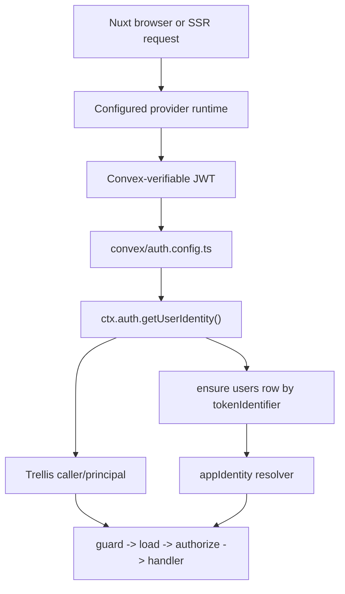

# RFC: Provider-Neutral Auth Runtime

Status: Draft
Date: 2026-05-24
Owner: Matthias
Reviewers: Trellis maintainer plus one security-aware reviewer before implementation

## Purpose

Trellis currently treats Better Auth as the auth foundation. The next version
should support Clerk and WorkOS AuthKit as first-class additional auth providers
without creating a second authorization system, duplicate user tables, or
transport-specific protected handlers.

This RFC defines the desired architecture, the implementation path, and the
experiments that must pass before the framework implementation starts.

The target reader is a junior developer who knows TypeScript, Nuxt, and Convex
but has not worked on Trellis internals before.

## Short Answer

The right architecture is:

```text
Nuxt auth provider session
  -> provider-specific token source
  -> Convex verifies the provider JWT
  -> Trellis resolves a provider-neutral principal
  -> app-owned user/appIdentity resolution
  -> existing guard/load/authorize/handler pipeline
```

Better Auth, Clerk, and WorkOS should be alternative providers for the same
Trellis auth boundary. They should not run side by side in one app.

The provider-specific code should stop at:

- getting a Convex-verifiable JWT;
- projecting a minimal current-user object for UI hydration;
- signing out or invalidating the provider session;
- optionally selecting the active provider organization.

Everything after Convex authentication remains provider-neutral:

- caller/principal resolution;
- user row lookup;
- appIdentity resolution;
- permissions;
- tenant isolation;
- destructive operation safety;
- MCP and trusted forwarding.

## Current Research Check

The proposed direction is feasible according to current official documentation:

- Convex accepts most auth providers through OIDC JWTs and also supports custom
  JWT provider entries in `convex/auth.config.ts`.
- Convex `ctx.auth.getUserIdentity()` exposes `subject`, `issuer`, and
  `tokenIdentifier`. The `tokenIdentifier` combines issuer and subject and is
  the safest app user lookup key when multiple providers exist.
- Clerk has a Convex integration that configures `CLERK_FRONTEND_API_URL` and
  `applicationID: 'convex'`. The Clerk Nuxt SDK exposes `useAuth().getToken()`
  client-side and `event.context.auth().getToken()` server-side.
- WorkOS AuthKit access tokens are JWTs signed by a JWKS at
  `https://api.workos.com/sso/jwks/<clientId>`. WorkOS also documents a Convex
  AuthKit config using `customJwt` providers.
- WorkOS Node session helpers can load sealed sessions, authenticate them,
  refresh them, switch organization by refreshing with an `organizationId`, and
  return the access token plus a sealed replacement session.
- WorkOS Node SDK 9.3.1 types confirm `session.authenticate()` returns a
  top-level `accessToken`, while `session.refresh()` returns a refreshed
  `session` object plus `sealedSession`. Refresh code must read
  `refreshResult.session.accessToken`.
- Better Auth can consume SSO/OIDC providers, but using Better Auth as a wrapper
  around Clerk or WorkOS would make Better Auth the actual Trellis provider and
  would hide provider-specific session semantics behind a second auth system.

Sources are listed at the end of this RFC.

## Local Template Review

Reference checked:
`/Users/matthias/Git/external/my-sveltekit-template`.

Useful concepts from that template:

- Clerk client state is isolated in a provider wrapper/store.
- Convex client auth is fed by the current Clerk session token:
  `currentSession.getToken({ template: 'convex' })`.
- Convex functions are split into a client-authenticated lane under
  `src/convex/authed` and a backend-private lane under `src/convex/private`.
- The backend-private lane is called through a server service wrapper, not
  directly from UI code.
- Server-side Clerk validation is isolated in a `ClerkService` using
  `authenticateRequest(...)`.
- Backend service errors are tagged with trace ids, operation names, and public
  error mapping.

What Trellis should adopt:

- Keep the provider wrapper idea: provider runtime owns session state and token
  retrieval.
- Keep the explicit lane separation: browser-authenticated Convex calls and
  trusted server/private Convex calls are different trust boundaries.
- Keep tagged server error shape as a good DX reference for server helpers and
  diagnostics.
- Keep the Clerk token-template experiment. The template uses
  `template: 'convex'`; Clerk's official Convex docs imply a default token can
  work after integration setup. Trellis should not hardcode either until
  EXP-CLERK-01 proves the current behavior.

What Trellis should not copy directly:

- Do not pass a private bridge key as a public Convex function arg. Trellis'
  trusted forwarding/private bridge should keep trust material in server-owned
  headers/envelopes.
- Do not disable SSR as the auth strategy. The template sets `ssr = false` for
  the app route, but Trellis must preserve Nuxt SSR auth hydration.
- Do not treat Clerk's `user.id` as app identity. The template has no local app
  user table, so it does not solve the `users._id` versus provider subject
  boundary.

## Correctness Double Check

The provider-neutral token seam is still the recommended path.

### Why not put Clerk and WorkOS behind Better Auth?

Concern: that creates two auth systems for one app.

If Clerk or WorkOS are configured as upstream providers inside Better Auth,
Trellis still depends on Better Auth sessions, Better Auth cookies, Better Auth
Convex JWT exchange, Better Auth user sync, and Better Auth routes. The app gets
"Clerk login" or "WorkOS login" as a feature of Better Auth, not first-class
Clerk or WorkOS support.

That is useful as an app-owned escape hatch, but it is not the dream
architecture for Trellis.

Simpler alternative: make Better Auth, Clerk, and WorkOS peer providers that
all produce Convex-verifiable tokens.

Tradeoff: Trellis needs three small provider runtimes instead of one Better Auth
runtime. The payoff is that app identity, permissions, and tenant logic stay one
system instead of being layered on a hidden Better Auth session.

Recommendation: keep Better Auth's custom/OIDC abilities available, but do not
implement Clerk/WorkOS first-class support by wrapping them in Better Auth.

### Why not sync everything with webhooks first?

Concern: webhooks are eventually consistent and can fail or arrive after first
login.

Clerk's own docs warn that webhook sync is eventually consistent and can create
race conditions. WorkOS events are also a sync mechanism, not the synchronous
request identity boundary.

Simpler alternative: authenticate each request by the provider JWT, then use a
small bootstrap mutation to create/update the local `users` row from the
current `ctx.auth.getUserIdentity()`.

Tradeoff: some profile fields may be missing until a webhook or provider API
sync fills them in. Authorization remains correct because it uses the verified
request identity and app-owned state, not webhook arrival timing.

Recommendation: make webhooks optional profile/org sync, never required for the
first authenticated request to work.

### Why not support multiple providers in one deployed app?

Concern: multi-provider login creates hard account-linking, user merge, and
security edge cases. It also makes "who owns this user's identity" ambiguous.

Simpler alternative: one active provider per Trellis app deployment.

Tradeoff: migrations between providers need a deliberate cutover plan. The
framework remains easier to reason about and test.

Recommendation: support exactly one configured browser/session provider:
`better-auth`, `clerk`, or `workos`.

### Why change `users.authId`?

Concern: `authId` currently means "Better Auth subject". With Clerk and WorkOS,
the raw subject can collide across issuers. Convex explicitly provides
`tokenIdentifier` for this reason.

Simpler alternative: use one canonical auth key:
`users.authKey = identity.tokenIdentifier`.

Tradeoff: starters and examples need a hard cutover from `authId` to `authKey`.
That is cheaper now than carrying both forever.

Recommendation: hard cutover internal starters/examples to `authKey` for the
next auth-provider version. Do not keep `authId` and `authKey` side by side.

## Non-Goals

- Support two browser/session providers in one app at the same time.
- Provide account linking between providers.
- Make Trellis a general auth broker.
- Reimplement Clerk or WorkOS hosted UI.
- Make provider roles the universal Trellis permission model.
- Require webhooks for first request authorization.
- Add provider-specific user tables.
- Add a public adapter marketplace.
- Keep old `users.authId` and new `users.authKey` paths side by side.

## Existing Trellis Invariants

These invariants must not change:

- Convex owns app data and business rules.
- Frontend permission state is a projection, not authority.
- The protected backend decision path stays:

```text
principal -> actor -> guard -> load -> authorize -> handler
```

- Public args are not identity.
- Trusted forwarding stays the server/MCP identity bridge.
- Tenant isolation is backend-owned.
- Destructive operation preview/confirm/execute stays independent of provider
  login.

Provider support should change how Trellis gets the Convex auth token. It
should not change what a protected handler means.

## Vocabulary

### Provider

The external/session system used by the Nuxt app:

- `better-auth`
- `clerk`
- `workos`

### Provider Subject

The provider's raw user ID:

- Better Auth user id
- Clerk `user_...`
- WorkOS `user_...`

Provider subject alone is not globally safe across providers.

### Auth Key

The canonical key Trellis stores in `users.authKey`.

It comes from Convex:

```ts
const identity = await ctx.auth.getUserIdentity()
const authKey = identity.tokenIdentifier
```

Use this for local user lookup.

### App User

The row in the app-owned `users` table. It stores local profile and app-specific
state.

It is not a provider user table.

### App Identity

The app-owned actor used by protected handlers. It is resolved from the
verified request identity plus app data.

Example:

```ts
export type AppIdentity = {
  kind: 'user'
  userId: Id<'users'>
  authKey: string
  role: 'owner' | 'admin' | 'member' | 'viewer'
  workspaceId?: Id<'workspaces'>
}
```

## Target Architecture



There are three provider runtimes, but only one Trellis backend path.

```text
src/runtime/auth/providers/
  types.ts
  better-auth/
    client.ts
    server.ts
  clerk/
    client.ts
    server.ts
  workos/
    client.ts
    server.ts
```

These modules are internal. They should not become a public adapter system until
real consumers need that.

## Provider Runtime Contract

This is the shape to implement internally.

```ts
// src/runtime/auth/providers/types.ts
import type { H3Event } from 'h3'
import type { Ref } from 'vue'

import type { RuntimeObserver } from '../../observability/runtime-observer'
import type { AuthSessionUser } from '../../utils/types'

export type AuthProviderKind = 'better-auth' | 'clerk' | 'workos'

export interface ProviderSessionUser extends AuthSessionUser {
  provider: AuthProviderKind
  providerSubject: string
  issuer: string
  /**
   * Best-effort client/server projection. Convex remains authoritative through
   * ctx.auth.getUserIdentity().tokenIdentifier.
   */
  authKey?: string
  workspaceId?: string
  role?: string
}

export type ProviderAuthState =
  | {
      status: 'authenticated'
      token: string
      sessionUser: ProviderSessionUser
      source: 'cache' | 'exchange' | 'provider'
    }
  | {
      status: 'unauthenticated'
      token: null
      sessionUser: null
      source: 'none' | 'cache' | 'exchange' | 'provider'
      error: string | null
    }

export interface ClientProviderRuntime {
  kind: AuthProviderKind
  client: unknown
  fetchAuthState(input: {
    forceRefreshToken: boolean
    signal?: AbortSignal
    trigger?: string
  }): Promise<ProviderAuthState>
  signOut(): Promise<void>
}

export interface ServerProviderRuntime {
  kind: AuthProviderKind
  hasSession(event: H3Event): boolean
  resolveRequestAuth(event: H3Event): Promise<ProviderAuthState>
}

export interface CreateClientProviderInput {
  logger: RuntimeObserver
  token: Ref<string | null>
  sessionUser: Ref<AuthSessionUser | null>
}
```

This does not replace the existing auth engine. It feeds the existing auth
engine with a provider-specific `AuthTransport`.

## Module Configuration

Add `provider` to the existing `trellis.auth` object.

```ts
// src/module-internals/options.ts
export type TrellisAuthProvider = 'better-auth' | 'clerk' | 'workos'

export interface AuthOptions extends ConvexAuthConfigInput {
  /**
   * Auth provider used by this app deployment.
   *
   * - better-auth: current Trellis behavior
   * - clerk: use @clerk/nuxt for session/UI and Clerk JWTs for Convex
   * - workos: use WorkOS AuthKit sealed sessions and WorkOS JWTs for Convex
   *
   * @default 'better-auth'
   */
  provider?: TrellisAuthProvider

  route?: string
  trustedOrigins?: string[]
  skipAuthTokenFetchRoutes?: string[]
  cache?: AuthCacheOptions
  proxy?: AuthProxyOptions
}
```

Normalization:

```ts
export function normalizeAuthProvider(value: unknown): TrellisAuthProvider {
  if (value === 'clerk' || value === 'workos' || value === 'better-auth') {
    return value
  }
  return 'better-auth'
}
```

Runtime public config may contain the provider name. It must not contain secrets.

```ts
auth: {
  enabled: true,
  provider: 'workos',
  route: '/api/auth',
}
```

Private provider secrets are read from environment variables in server-only
code.

## Package Dependencies

Do not add Clerk and WorkOS to Trellis hard dependencies unless implementation
proves there is no good alternative.

Use optional peer dependencies:

```json
{
  "peerDependencies": {
    "@clerk/nuxt": "^x.y.z",
    "@workos-inc/node": "^x.y.z"
  },
  "peerDependenciesMeta": {
    "@clerk/nuxt": { "optional": true },
    "@workos-inc/node": { "optional": true }
  }
}
```

Provider runtimes should dynamic-import optional packages and throw a clear
configuration error when the selected provider is missing.

```ts
async function importWorkOS() {
  try {
    return await import('@workos-inc/node')
  } catch (error) {
    throw new Error(
      '[trellis] trellis.auth.provider = "workos" requires @workos-inc/node. ' +
        'Install it in the app package.',
      { cause: error },
    )
  }
}
```

## Convex Auth Config Examples

Each provider gets exactly one `convex/auth.config.ts` shape.

### Better Auth

This is the current behavior.

```ts
// convex/auth.config.ts
import { getAuthConfigProvider } from '@convex-dev/better-auth/auth-config'
import type { AuthConfig } from 'convex/server'

export default {
  providers: [getAuthConfigProvider()],
} satisfies AuthConfig
```

### Clerk

```ts
// convex/auth.config.ts
import type { AuthConfig } from 'convex/server'

const clerkDomain = process.env.CLERK_FRONTEND_API_URL

if (!clerkDomain) {
  throw new Error('CLERK_FRONTEND_API_URL is required for Clerk auth.')
}

export default {
  providers: [
    {
      domain: clerkDomain,
      applicationID: 'convex',
    },
  ],
} satisfies AuthConfig
```

The experiment must prove whether Clerk Nuxt should call `getToken()` with no
template or with a named template. Clerk's Convex integration says the Convex
audience claim is pre-mapped, so the expected first attempt is no template.

```ts
const token = await getToken.value()
```

If the token does not have `aud = convex`, the fallback is:

```ts
const token = await getToken.value({ template: 'convex' })
```

Do not choose the fallback before the Clerk experiment proves it is required.

### WorkOS

```ts
// convex/auth.config.ts
import type { AuthConfig } from 'convex/server'

const clientId = process.env.WORKOS_CLIENT_ID

if (!clientId) {
  throw new Error('WORKOS_CLIENT_ID is required for WorkOS AuthKit.')
}

export default {
  providers: [
    {
      type: 'customJwt',
      issuer: 'https://api.workos.com/',
      algorithm: 'RS256',
      jwks: `https://api.workos.com/sso/jwks/${clientId}`,
      applicationID: clientId,
    },
    {
      type: 'customJwt',
      issuer: `https://api.workos.com/user_management/${clientId}`,
      algorithm: 'RS256',
      jwks: `https://api.workos.com/sso/jwks/${clientId}`,
    },
  ],
} satisfies AuthConfig
```

The experiment must also check WorkOS custom auth domains. If a custom auth
domain changes `iss`, the WorkOS provider config needs an explicit
`WORKOS_ISSUER` env override instead of assuming `https://api.workos.com/`.

## Canonical App User Schema

Hard cutover examples and starters from `authId` to `authKey`.

```ts
// convex/features/users/schema.ts
import { defineTable } from 'convex/server'
import { v } from 'convex/values'

export const userTables = {
  users: defineTable({
    authKey: v.string(),
    provider: v.union(v.literal('better-auth'), v.literal('clerk'), v.literal('workos')),
    providerSubject: v.string(),
    issuer: v.string(),
    email: v.optional(v.string()),
    displayName: v.optional(v.string()),
    avatarUrl: v.optional(v.string()),
    role: v.union(v.literal('owner'), v.literal('admin'), v.literal('member'), v.literal('viewer')),
    workspaceId: v.optional(v.id('workspaces')),
    createdAt: v.number(),
    updatedAt: v.number(),
  })
    .index('by_auth_key', ['authKey'])
    .index('by_workspace', ['workspaceId']),
}
```

Why this is one source of truth:

- `authKey` identifies the external authenticated identity.
- `provider`, `providerSubject`, and `issuer` are descriptive fields copied
  from the same identity for debugging and provider API calls.
- App role/workspace fields are app-owned only if the app chooses app-owned
  authorization.
- If the app chooses provider-owned organization authority, app role/workspace
  fields must be treated as derived/cache fields or omitted from authorization.

## Current User Bootstrap

This mutation cannot require `appIdentity`, because it creates the row needed
to resolve `appIdentity`.

Use a raw Convex mutation or a Trellis unsafe/open lane that only relies on
`ctx.auth.getUserIdentity()`.

```ts
// convex/auth/users.ts
import { mutation } from '../_generated/server'

function providerFromIssuer(issuer: string): 'better-auth' | 'clerk' | 'workos' {
  if (issuer.includes('clerk.accounts.dev') || issuer.includes('clerk.')) return 'clerk'
  if (issuer.includes('workos.com')) return 'workos'
  return 'better-auth'
}

function displayNameFromIdentity(identity: Record<string, unknown>): string | undefined {
  if (typeof identity.name === 'string' && identity.name.trim()) return identity.name
  if (typeof identity.nickname === 'string' && identity.nickname.trim()) return identity.nickname

  const given = typeof identity.givenName === 'string' ? identity.givenName : ''
  const family = typeof identity.familyName === 'string' ? identity.familyName : ''
  const combined = `${given} ${family}`.trim()
  return combined || undefined
}

function emailFromIdentity(identity: Record<string, unknown>): string | undefined {
  if (typeof identity.email === 'string') return identity.email
  if (typeof identity['properties.email'] === 'string') return identity['properties.email']
  return undefined
}

export const ensureCurrentUser = mutation({
  args: {},
  handler: async (ctx) => {
    const identity = await ctx.auth.getUserIdentity()
    if (!identity) {
      throw new Error('Not authenticated.')
    }

    const now = Date.now()
    const authKey = identity.tokenIdentifier
    const provider = providerFromIssuer(identity.issuer)
    const existing = await ctx.db
      .query('users')
      .withIndex('by_auth_key', (q) => q.eq('authKey', authKey))
      .first()

    const patch = {
      provider,
      providerSubject: identity.subject,
      issuer: identity.issuer,
      email: emailFromIdentity(identity),
      displayName: displayNameFromIdentity(identity),
      updatedAt: now,
    }

    if (existing) {
      await ctx.db.patch(existing._id, patch)
      return existing._id
    }

    return await ctx.db.insert('users', {
      authKey,
      ...patch,
      role: 'member',
      createdAt: now,
    })
  },
})
```

Implementation note: this code is intentionally boring. Do not add a generic
mapper system until the first real app needs it.

## App Identity Resolution

### App-Owned Membership Mode

Use this when Convex is the source of truth for roles and workspace membership.
Provider org claims may exist, but they do not authorize app work.

```ts
// convex/auth/appIdentity.ts
import type { GenericMutationCtx, GenericQueryCtx } from 'convex/server'

import type { DataModel, Id } from '../_generated/dataModel'

type Ctx = GenericQueryCtx<DataModel> | GenericMutationCtx<DataModel>

export type AppIdentity = {
  kind: 'user'
  userId: Id<'users'>
  authKey: string
  role: 'owner' | 'admin' | 'member' | 'viewer'
  workspaceId?: Id<'workspaces'>
}

export async function getAppIdentity(ctx: Ctx): Promise<AppIdentity | null> {
  const identity = await ctx.auth.getUserIdentity()
  if (!identity) return null

  const user = await ctx.db
    .query('users')
    .withIndex('by_auth_key', (q) => q.eq('authKey', identity.tokenIdentifier))
    .first()

  if (!user) return null

  return {
    kind: 'user',
    userId: user._id,
    authKey: user.authKey,
    role: user.role,
    workspaceId: user.workspaceId,
  }
}
```

### Provider-Owned Organization Mode

Use this when the provider organization is the membership source of truth.

In this mode:

- WorkOS `org_id` or Clerk active org claim selects the workspace.
- Provider role/permission claims can seed the actor role.
- Convex `workspaces` rows may store app metadata for the external org.
- Convex membership rows must not become an independent authority unless a
  deliberate sync/rebuild story exists.

Example resolver:

```ts
// convex/auth/providerOrgIdentity.ts
import type { GenericMutationCtx, GenericQueryCtx } from 'convex/server'

import type { DataModel, Id } from '../_generated/dataModel'

type Ctx = GenericQueryCtx<DataModel> | GenericMutationCtx<DataModel>

type ProviderRole = 'owner' | 'admin' | 'member' | 'viewer'

function stringClaim(identity: Record<string, unknown>, keys: string[]): string | undefined {
  for (const key of keys) {
    const value = identity[key]
    if (typeof value === 'string' && value.trim()) return value
  }
  return undefined
}

function normalizeProviderRole(value: string | undefined): ProviderRole {
  if (value === 'owner' || value === 'admin' || value === 'viewer') return value
  if (value === 'org:admin') return 'admin'
  if (value === 'org:member') return 'member'
  return 'member'
}

export async function getProviderOrgAppIdentity(ctx: Ctx) {
  const identity = await ctx.auth.getUserIdentity()
  if (!identity) return null

  const user = await ctx.db
    .query('users')
    .withIndex('by_auth_key', (q) => q.eq('authKey', identity.tokenIdentifier))
    .first()
  if (!user) return null

  const externalOrgId = stringClaim(identity, [
    'org_id',
    'orgId',
    'organization_id',
    'properties.org_id',
  ])
  if (!externalOrgId) return null

  const workspace = await ctx.db
    .query('workspaces')
    .withIndex('by_external_org', (q) => q.eq('externalOrgId', externalOrgId))
    .first()
  if (!workspace) return null

  const providerRole = stringClaim(identity, ['role', 'orgRole', 'properties.role'])

  return {
    kind: 'user' as const,
    userId: user._id,
    authKey: user.authKey,
    workspaceId: workspace._id as Id<'workspaces'>,
    role: normalizeProviderRole(providerRole),
  }
}
```

This mode should get its own example only after the WorkOS/Clerk org experiments
prove the claim shape.

## Better Auth Provider Runtime

The Better Auth provider is mostly the existing runtime moved behind a provider
name.

Implementation steps:

1. Rename internal docs/comments from "auth means Better Auth" to
   "provider better-auth".
2. Keep the Better Auth proxy route only when `provider === 'better-auth'`.
3. Keep `defineAuth(...)` under `@lupinum/trellis/auth` for Better Auth apps.
4. Keep Better Auth trigger bootstrap for Better Auth only.
5. Do not install Better Auth route/proxy pieces for Clerk or WorkOS apps.

Expected normalized provider:

```ts
if (auth.enabled && auth.provider === 'better-auth') {
  installBetterAuthProxy()
  installBetterAuthClientTransport()
}
```

## Shared Provider Utilities

Provider runtimes may decode JWT payloads for UI projection and debugging.
Decoded payloads must never be used for authorization. Convex-verified
`ctx.auth.getUserIdentity()` remains the backend authority.

```ts
// src/runtime/auth/providers/jwt.ts
export function decodeJwtPayload(token: string): Record<string, unknown> {
  const [, payload] = token.split('.')
  if (!payload) return {}

  try {
    const normalized = payload.replace(/-/g, '+').replace(/_/g, '/')
    const padded = normalized.padEnd(Math.ceil(normalized.length / 4) * 4, '=')
    const json = globalThis.atob(padded)

    const decoded = JSON.parse(json)
    return decoded && typeof decoded === 'object' ? decoded : {}
  } catch {
    return {}
  }
}
```

## Clerk Provider Runtime

### Nuxt Config

```ts
// nuxt.config.ts
export default defineNuxtConfig({
  modules: ['@clerk/nuxt', '@lupinum/trellis'],
  trellis: {
    url: process.env.NUXT_PUBLIC_CONVEX_URL,
    auth: {
      enabled: true,
      provider: 'clerk',
      routeProtection: {
        redirectTo: '/sign-in',
      },
    },
  },
})
```

### Client Token Source

The provider runtime wraps Clerk `useAuth()`.

```ts
// src/runtime/auth/providers/clerk/client.ts
import { useAuth } from '@clerk/nuxt'

import { decodeJwtPayload } from '../jwt'
import type { ClientProviderRuntime, ProviderSessionUser } from '../types'

function projectClerkUser(input: {
  token: string
  userId: string
  orgId?: string | null
  orgRole?: string | null
}): ProviderSessionUser {
  const payload = decodeJwtPayload(token)
  return {
    provider: 'clerk',
    providerSubject: input.userId,
    issuer: typeof payload?.iss === 'string' ? payload.iss : '',
    displayName: typeof payload?.name === 'string' ? payload.name : '',
    email: typeof payload?.email === 'string' ? payload.email : '',
    avatarUrl: typeof payload?.picture === 'string' ? payload.picture : undefined,
    workspaceId: input.orgId ?? undefined,
    role: input.orgRole ?? undefined,
  }
}

export function createClerkClientProvider(): ClientProviderRuntime {
  const auth = useAuth()

  return {
    kind: 'clerk',
    client: auth,
    async fetchAuthState(input) {
      if (!auth.isLoaded.value || !auth.isSignedIn.value || !auth.userId.value) {
        return {
          status: 'unauthenticated',
          token: null,
          sessionUser: null,
          source: 'provider',
          error: null,
        }
      }

      const token = await auth.getToken.value({
        // The experiment decides whether template is needed.
        // template: 'convex',
        skipCache: input.forceRefreshToken,
      })

      if (!token) {
        return {
          status: 'unauthenticated',
          token: null,
          sessionUser: null,
          source: 'provider',
          error: null,
        }
      }

      return {
        status: 'authenticated',
        token,
        sessionUser: projectClerkUser({
          token,
          userId: auth.userId.value,
          orgId: auth.orgId.value,
          orgRole: auth.orgRole.value,
        }),
        source: 'provider',
      }
    },
    async signOut() {
      await auth.signOut.value()
    },
  }
}
```

Implementation detail: the final code must import `useAuth` from Clerk only in
the Clerk provider module, and only after confirming `@clerk/nuxt` is installed.

### Server Token Source

Use Clerk's Nuxt server auth object.

```ts
// src/runtime/auth/providers/clerk/server.ts
export function createClerkServerProvider(): ServerProviderRuntime {
  return {
    kind: 'clerk',
    hasSession(event) {
      return Boolean(event.context.auth?.().sessionId)
    },
    async resolveRequestAuth(event) {
      const auth = event.context.auth?.()
      if (!auth?.isAuthenticated) {
        return {
          status: 'unauthenticated',
          token: null,
          sessionUser: null,
          source: 'none',
          error: null,
        }
      }

      const token = await auth.getToken({
        // The experiment decides whether template is needed.
        // template: 'convex',
      })

      if (!token || !auth.userId) {
        return {
          status: 'unauthenticated',
          token: null,
          sessionUser: null,
          source: 'provider',
          error: null,
        }
      }

      return {
        status: 'authenticated',
        token,
        sessionUser: projectClerkUser({
          token,
          userId: auth.userId,
          orgId: auth.orgId,
          orgRole: auth.orgRole,
        }),
        source: 'provider',
      }
    },
  }
}
```

### Clerk Bootstrap Flow

On sign-in, Trellis must run `auth/users.ensureCurrentUser` before protected UI
assumes `appIdentity` exists.

The existing `setupConfiguredAuthBootstrap(...)` can remain provider-neutral if
it calls a configured bootstrap mutation after auth becomes authenticated.

```ts
trellis: {
  auth: { provider: 'clerk', enabled: true },
  bootstrap: {
    ensureUserMutation: 'auth/users.ensureCurrentUser',
  },
}
```

Do not add provider-specific user sync as a required part of Clerk support.

## WorkOS Provider Runtime

WorkOS has no official Nuxt SDK at the time of this RFC. The clean Trellis path
is a small Nitro/server runtime built on `@workos-inc/node`.

### Required Environment

```text
WORKOS_API_KEY=sk_test_...
WORKOS_CLIENT_ID=client_...
WORKOS_COOKIE_PASSWORD=<at least 32 chars>
WORKOS_REDIRECT_URI=http://localhost:3000/api/auth/workos/callback
```

Optional:

```text
WORKOS_ISSUER=https://api.workos.com/
WORKOS_COOKIE_NAME=trellis-workos-session
```

### Nuxt Config

```ts
// nuxt.config.ts
export default defineNuxtConfig({
  modules: ['@lupinum/trellis'],
  trellis: {
    url: process.env.NUXT_PUBLIC_CONVEX_URL,
    auth: {
      enabled: true,
      provider: 'workos',
      route: '/api/auth',
      routeProtection: {
        redirectTo: '/api/auth/workos/login',
      },
    },
  },
})
```

### WorkOS Server Helpers

```ts
// src/runtime/auth/providers/workos/server-helpers.ts
import { randomUUID } from 'node:crypto'
import { createError, deleteCookie, getCookie, getRequestHeader, setCookie } from 'h3'
import type { H3Event } from 'h3'

import { decodeJwtPayload } from '../jwt'
import type { ProviderSessionUser } from '../types'

const DEFAULT_COOKIE_NAME = 'trellis-workos-session'
const WORKOS_STATE_COOKIE_NAME = 'trellis-workos-state'

export function getWorkosCookieName() {
  return process.env.WORKOS_COOKIE_NAME || DEFAULT_COOKIE_NAME
}

export function requireWorkosEnv() {
  const apiKey = process.env.WORKOS_API_KEY
  const clientId = process.env.WORKOS_CLIENT_ID
  const cookiePassword = process.env.WORKOS_COOKIE_PASSWORD
  const redirectUri = process.env.WORKOS_REDIRECT_URI

  if (!apiKey) throw new Error('WORKOS_API_KEY is required.')
  if (!clientId) throw new Error('WORKOS_CLIENT_ID is required.')
  if (!cookiePassword || cookiePassword.length < 32) {
    throw new Error('WORKOS_COOKIE_PASSWORD must be at least 32 characters.')
  }
  if (!redirectUri) throw new Error('WORKOS_REDIRECT_URI is required.')

  return { apiKey, clientId, cookiePassword, redirectUri }
}

export function setWorkosSessionCookie(event: H3Event, sealedSession: string) {
  setCookie(event, getWorkosCookieName(), sealedSession, {
    path: '/',
    httpOnly: true,
    secure: process.env.NODE_ENV === 'production',
    sameSite: 'lax',
  })
}

export function clearWorkosSessionCookie(event: H3Event) {
  deleteCookie(event, getWorkosCookieName(), { path: '/' })
}

export function safeReturnTo(value: unknown) {
  if (typeof value !== 'string') return '/'
  if (!value.startsWith('/') || value.startsWith('//')) return '/'
  return value
}

function encodeWorkosState(state: { nonce: string; returnTo: string }) {
  return Buffer.from(JSON.stringify(state), 'utf8').toString('base64url')
}

function decodeWorkosState(value: string) {
  try {
    const parsed = JSON.parse(Buffer.from(value, 'base64url').toString('utf8'))
    if (
      parsed &&
      typeof parsed === 'object' &&
      typeof parsed.nonce === 'string' &&
      typeof parsed.returnTo === 'string'
    ) {
      return parsed as { nonce: string; returnTo: string }
    }
  } catch {
    // Invalid state is handled by the caller.
  }
  return null
}

export function createWorkosState(event: H3Event, unsafeReturnTo: unknown) {
  const state = {
    nonce: randomUUID(),
    returnTo: safeReturnTo(unsafeReturnTo),
  }

  setCookie(event, WORKOS_STATE_COOKIE_NAME, state.nonce, {
    path: '/',
    httpOnly: true,
    secure: process.env.NODE_ENV === 'production',
    sameSite: 'lax',
    maxAge: 300,
  })

  return encodeWorkosState(state)
}

export function consumeWorkosState(event: H3Event, value: unknown) {
  const expectedNonce = getCookie(event, WORKOS_STATE_COOKIE_NAME)
  deleteCookie(event, WORKOS_STATE_COOKIE_NAME, { path: '/' })

  if (typeof value !== 'string' || !expectedNonce) {
    throw createError({ statusCode: 400, statusMessage: 'Invalid WorkOS state.' })
  }

  const decoded = decodeWorkosState(value)
  if (!decoded || decoded.nonce !== expectedNonce) {
    throw createError({ statusCode: 400, statusMessage: 'Invalid WorkOS state.' })
  }

  return safeReturnTo(decoded.returnTo)
}

export function getRequestIpAndAgent(event: H3Event) {
  return {
    ipAddress:
      getRequestHeader(event, 'x-forwarded-for')?.split(',')[0]?.trim() ??
      event.node.req.socket.remoteAddress,
    userAgent: getRequestHeader(event, 'user-agent'),
  }
}

type WorkosAuthLike = {
  accessToken?: string
  session?: { accessToken?: string }
  user?: {
    id: string
    email: string
    firstName: string | null
    lastName: string | null
    profilePictureUrl: string | null
  }
  organizationId?: string
  role?: string
}

export function workosAccessTokenFromResult(result: WorkosAuthLike) {
  const token = result.accessToken ?? result.session?.accessToken
  if (!token) {
    throw createError({ statusCode: 502, statusMessage: 'WorkOS returned no access token.' })
  }
  return token
}

export function projectWorkosUser(result: WorkosAuthLike): ProviderSessionUser {
  const token = workosAccessTokenFromResult(result)
  const payload = decodeJwtPayload(token)
  const user = result.user

  if (!user) {
    throw createError({ statusCode: 502, statusMessage: 'WorkOS returned no user.' })
  }

  const name = [user.firstName, user.lastName].filter(Boolean).join(' ') || user.email

  return {
    provider: 'workos',
    providerSubject: user.id,
    issuer: typeof payload.iss === 'string' ? payload.iss : '',
    displayName: name,
    email: user.email,
    avatarUrl: user.profilePictureUrl ?? undefined,
    workspaceId:
      result.organizationId ?? (typeof payload.org_id === 'string' ? payload.org_id : undefined),
    role: result.role ?? (typeof payload.role === 'string' ? payload.role : undefined),
  }
}
```

### Login Route

The route snippets below assume the helper functions from
`server-helpers.ts` are imported from Trellis' generated WorkOS helper module.

```ts
// server/api/auth/workos/login.get.ts
import { sendRedirect, getQuery } from 'h3'
import { WorkOS } from '@workos-inc/node'

export default defineEventHandler(async (event) => {
  const { apiKey, clientId, redirectUri } = requireWorkosEnv()
  const workos = new WorkOS(apiKey, { clientId })
  const query = getQuery(event)
  const state = createWorkosState(event, query.returnTo)

  const authorizationUrl = workos.userManagement.getAuthorizationUrl({
    provider: 'authkit',
    clientId,
    redirectUri,
    state,
  })

  return sendRedirect(event, authorizationUrl)
})
```

### Callback Route

```ts
// server/api/auth/workos/callback.get.ts
import { createError, getQuery, sendRedirect } from 'h3'
import { WorkOS } from '@workos-inc/node'

export default defineEventHandler(async (event) => {
  const { apiKey, clientId, cookiePassword } = requireWorkosEnv()
  const workos = new WorkOS(apiKey, { clientId })
  const code = getQuery(event).code

  if (typeof code !== 'string' || !code) {
    throw createError({ statusCode: 400, statusMessage: 'Missing WorkOS code.' })
  }

  const returnTo = consumeWorkosState(event, getQuery(event).state)
  const { ipAddress, userAgent } = getRequestIpAndAgent(event)
  const response = await workos.userManagement.authenticateWithCode({
    clientId,
    code,
    ipAddress,
    userAgent,
    session: {
      sealSession: true,
      cookiePassword,
    },
  })

  if (!response.sealedSession) {
    throw createError({ statusCode: 502, statusMessage: 'WorkOS returned no sealed session.' })
  }

  setWorkosSessionCookie(event, response.sealedSession)
  return sendRedirect(event, returnTo)
})
```

### Token Route For Convex Browser Auth

This route is provider-specific, but it serves the same purpose as Better Auth's
existing Convex token endpoint.

```ts
// server/api/auth/workos/token.get.ts
import { createError, getCookie, setHeader } from 'h3'
import { WorkOS } from '@workos-inc/node'

export default defineEventHandler(async (event) => {
  setHeader(event, 'Cache-Control', 'no-store')
  setHeader(event, 'X-Content-Type-Options', 'nosniff')

  const { apiKey, clientId, cookiePassword } = requireWorkosEnv()
  const sealed = getCookie(event, getWorkosCookieName())
  if (!sealed) return { token: null, sessionUser: null }

  const workos = new WorkOS(apiKey, { clientId })
  const session = await workos.userManagement.loadSealedSession({
    sessionData: sealed,
    cookiePassword,
  })

  const auth = await session.authenticate()
  if (auth.authenticated) {
    const token = workosAccessTokenFromResult(auth)
    return {
      token,
      sessionUser: projectWorkosUser(auth),
    }
  }

  const refreshed = await session.refresh()
  if (!refreshed.authenticated) {
    clearWorkosSessionCookie(event)
    throw createError({ statusCode: 401, statusMessage: 'WorkOS session expired.' })
  }
  if (!refreshed.sealedSession) {
    throw createError({ statusCode: 502, statusMessage: 'WorkOS returned no sealed session.' })
  }

  setWorkosSessionCookie(event, refreshed.sealedSession)

  const token = workosAccessTokenFromResult(refreshed)
  return {
    token,
    sessionUser: projectWorkosUser(refreshed),
  }
})
```

The implementation must pin and confirm the exact SDK response type during
EXP-WORKOS-01. With `@workos-inc/node@9.3.1`, `session.authenticate()` exposes
`accessToken` and `session.refresh()` exposes the new access token as
`refreshResult.session.accessToken`.

### Logout Route

Logout mutates local session state, so keep it as a POST route and have the
browser navigate to the provider logout URL returned by the route.

```ts
// server/api/auth/workos/logout.post.ts
import { getCookie } from 'h3'
import { WorkOS } from '@workos-inc/node'

export default defineEventHandler(async (event) => {
  const { apiKey, clientId, cookiePassword } = requireWorkosEnv()
  const sealed = getCookie(event, getWorkosCookieName())

  if (!sealed) {
    clearWorkosSessionCookie(event)
    return { redirectTo: '/' }
  }

  const workos = new WorkOS(apiKey, { clientId })
  const session = await workos.userManagement.loadSealedSession({
    sessionData: sealed,
    cookiePassword,
  })

  const redirectTo = await session.getLogoutUrl({ returnTo: '/' })
  clearWorkosSessionCookie(event)

  return { redirectTo }
})
```

### Client Runtime

The WorkOS browser runtime calls the same-origin token route.

```ts
// src/runtime/auth/providers/workos/client.ts
export function createWorkosClientProvider(baseRoute: string): ClientProviderRuntime {
  return {
    kind: 'workos',
    client: null,
    async fetchAuthState() {
      const response = await $fetch<{
        token: string | null
        sessionUser: ProviderSessionUser | null
      }>(`${baseRoute}/workos/token`, { credentials: 'include' })

      if (!response.token || !response.sessionUser) {
        return {
          status: 'unauthenticated',
          token: null,
          sessionUser: null,
          source: 'provider',
          error: null,
        }
      }

      return {
        status: 'authenticated',
        token: response.token,
        sessionUser: response.sessionUser,
        source: 'provider',
      }
    },
    async signOut() {
      const response = await $fetch<{ redirectTo: string }>(`${baseRoute}/workos/logout`, {
        method: 'POST',
        credentials: 'include',
      })

      await navigateTo(response.redirectTo, { external: true })
    },
  }
}
```

### Organization Switch Route

WorkOS organization switching should refresh the sealed session with a new
`organizationId`. The browser should not mutate workspace state directly.

```ts
// server/api/auth/workos/organization.post.ts
import { createError, getCookie, readBody } from 'h3'
import { WorkOS } from '@workos-inc/node'

export default defineEventHandler(async (event) => {
  const body = await readBody<{ organizationId?: string }>(event)
  if (!body.organizationId) {
    throw createError({ statusCode: 400, statusMessage: 'organizationId is required.' })
  }

  const { apiKey, clientId, cookiePassword } = requireWorkosEnv()
  const sealed = getCookie(event, getWorkosCookieName())
  if (!sealed) throw createError({ statusCode: 401, statusMessage: 'Not authenticated.' })

  const workos = new WorkOS(apiKey, { clientId })
  const session = await workos.userManagement.loadSealedSession({
    sessionData: sealed,
    cookiePassword,
  })

  const refreshed = await session.refresh({ organizationId: body.organizationId })
  if (!refreshed.authenticated) {
    throw createError({ statusCode: 403, statusMessage: 'Organization switch denied.' })
  }
  if (!refreshed.sealedSession) {
    throw createError({ statusCode: 502, statusMessage: 'WorkOS returned no sealed session.' })
  }

  setWorkosSessionCookie(event, refreshed.sealedSession)
  return { ok: true }
})
```

Acceptance detail: after this route succeeds, Trellis must refresh Convex auth
so `ctx.auth.getUserIdentity()` sees the new `org_id`.

## Provider Selection In Installers

Auth installer behavior:

```ts
if (!setup.isAuthEnabled) {
  return
}

switch (setup.authProvider) {
  case 'better-auth':
    installBetterAuthTrellis({ resolver, authRoute })
    break
  case 'clerk':
    installClerkTrellis({ resolver })
    break
  case 'workos':
    installWorkosTrellis({ resolver, authRoute })
    break
}
```

Expected installation table:

| Provider    | Nuxt client transport | Server SSR resolver  | Nitro routes installed by Trellis | Convex component |
| ----------- | --------------------- | -------------------- | --------------------------------- | ---------------- |
| better-auth | Better Auth client    | Better Auth cookie   | auth proxy                        | betterAuth       |
| clerk       | Clerk Nuxt SDK        | Clerk Nuxt SDK       | none unless bootstrap helper      | none             |
| workos      | Trellis token route   | WorkOS sealed cookie | login/callback/token/logout/org   | none             |

Do not install Better Auth routes for Clerk or WorkOS.

## Auth Composable Surface

Current `useConvexAuth()` exposes a Better Auth `client`. That becomes wrong
once Clerk and WorkOS are first-class.

Target provider-neutral shape:

```ts
const auth = useConvexAuth()

auth.sessionUser.value
auth.isAuthenticated.value
auth.isPending.value
await auth.refreshAuth()
await auth.signOut()
```

Provider-specific UI/actions should live outside this generic surface:

- Better Auth apps can use `useBetterAuthClient()` or existing Better Auth
  helpers during the transition.
- Clerk apps use Clerk components/composables directly.
- WorkOS apps use Trellis-installed WorkOS routes and, later, optional WorkOS
  widgets.

Recommended hard cutover for the next provider release:

- Keep `useConvexAuth()` state/action fields provider-neutral.
- Move `client` to `useBetterAuthClient()`.
- Rename Better Auth-specific composables so they say Better Auth:
  `useBetterAuthSignIn`, `useBetterAuthSignUp`, `useBetterAuthPasswordReset`.

Do not pretend email/password sign-in is provider-neutral. Clerk and WorkOS own
their own sign-in UI.

## Server Helpers

`serverConvexQuery`, `serverConvexMutation`, and related helpers currently know
Better Auth cookies. They should ask the configured server provider for a token.

```ts
export async function resolveRequestAuthToken(
  event: H3Event,
  config: NormalizedConvexRuntimeConfig,
  options?: { auth?: ConvexServerAuthMode; authToken?: string },
) {
  if (options?.authToken) return options.authToken
  if (options?.auth === 'none') return undefined

  const provider = createServerProviderRuntime(config.auth.provider)
  const resolved = await provider.resolveRequestAuth(event)

  if (resolved.status === 'authenticated') return resolved.token
  if (options?.auth === 'required') {
    throw new Error(resolved.error ?? '[serverConvex] Authentication required.')
  }
  return undefined
}
```

Trusted forwarding and MCP do not change. They already have their own trust
boundary.

## Doctor Checks

`trellis doctor` should become provider-aware.

### Better Auth Checks

Keep existing checks:

- `BETTER_AUTH_SECRET`
- Better Auth route registration in `convex/http.ts`
- Better Auth trigger exports in `convex/auth.ts`
- `convex/auth.config.ts` contains Better Auth provider

### Clerk Checks

When `trellis.auth.provider = 'clerk'`:

- `@clerk/nuxt` is installed or configured in `nuxt.config.ts`.
- `CLERK_FRONTEND_API_URL` exists in env or docs say to configure it in Convex.
- `convex/auth.config.ts` contains a provider with `domain:
process.env.CLERK_FRONTEND_API_URL` and `applicationID: 'convex'`.
- Better Auth routes are not required.
- Better Auth trigger exports are not required.

### WorkOS Checks

When `trellis.auth.provider = 'workos'`:

- `@workos-inc/node` is installed.
- `WORKOS_API_KEY`, `WORKOS_CLIENT_ID`, `WORKOS_COOKIE_PASSWORD`, and
  `WORKOS_REDIRECT_URI` are present in local env guidance.
- `WORKOS_COOKIE_PASSWORD` length is at least 32.
- `convex/auth.config.ts` contains WorkOS `customJwt` providers.
- WorkOS routes are installed.
- Better Auth routes are not required.

### Shared Checks

For all auth providers:

- Starters/examples use `users.authKey` with `by_auth_key`.
- `auth/users.ensureCurrentUser` or equivalent bootstrap exists when protected
  handlers require app users.
- `appIdentity` resolver looks up by `identity.tokenIdentifier`.
- Auth provider docs do not claim frontend guards are authoritative.

## Testing Plan

### Unit Tests

Add provider-neutral tests:

```ts
describe('auth provider config normalization', () => {
  it('defaults to better-auth', () => {
    expect(normalizeAuthProvider(undefined)).toBe('better-auth')
  })

  it('accepts supported providers', () => {
    expect(normalizeAuthProvider('clerk')).toBe('clerk')
    expect(normalizeAuthProvider('workos')).toBe('workos')
  })
})
```

Auth key tests:

```ts
it('uses tokenIdentifier instead of raw subject for user lookup', async () => {
  const clerk = {
    subject: 'user_same',
    issuer: 'https://example.clerk.accounts.dev',
    tokenIdentifier: 'https://example.clerk.accounts.dev|user_same',
  }
  const workos = {
    subject: 'user_same',
    issuer: 'https://api.workos.com/',
    tokenIdentifier: 'https://api.workos.com/|user_same',
  }

  expect(clerk.subject).toBe(workos.subject)
  expect(clerk.tokenIdentifier).not.toBe(workos.tokenIdentifier)
})
```

Installer tests:

```ts
it('does not install Better Auth proxy routes for Clerk', () => {
  const installed = setupModule({ auth: { enabled: true, provider: 'clerk' } })
  expect(installed.serverRoutes).not.toContain('/api/auth/**')
})
```

### Integration Tests

- Existing Better Auth examples still pass.
- A fake provider runtime can provide deterministic JWTs to the auth engine.
- SSR hydration works with fake provider tokens.
- `serverConvex*` helpers use provider runtime, not Better Auth cookie helpers.
- Bootstrap mutation runs after sign-in and before protected UI queries.

### Provider Experiments

Provider experiments are mandatory before production implementation. They are
listed below.

## Experiment Gates

Do not start the full implementation until EXP-FAKE-01, EXP-CLERK-01,
EXP-CLERK-02, EXP-WORKOS-01, and EXP-WORKOS-02 pass.

Experiments should live under:

```text
labs/auth-provider-spikes/
  clerk-nuxt-convex/
  workos-nuxt-convex/
  fake-provider-harness/
```

Each experiment must have a short README with:

- setup commands;
- required env vars;
- what was proven;
- screenshots or log snippets where useful;
- pass/fail status;
- date and SDK versions.

No provider secrets go into git.

### EXP-FAKE-01: Provider Runtime Without Real Provider

Goal: prove Trellis auth engine can be fed by a provider-neutral runtime.

Steps:

1. Create a fake provider that returns a signed local JWT.
2. Wire it into the existing auth engine in a harness-only app.
3. Confirm `ConvexClient.setAuth()` receives the token.
4. Confirm SSR hydration commits token and user together.
5. Confirm `signOut()` clears Convex state before provider cleanup finishes.

Acceptance:

- Existing Better Auth tests still pass.
- Fake provider has no Better Auth imports.
- Auth engine does not care which provider produced the token.

Stop if:

- The current auth engine cannot accept provider-specific `user` projection
  without assuming Better Auth.

### EXP-CLERK-01: Clerk Token Works With Convex

Goal: prove a Clerk Nuxt app can obtain a JWT that Convex accepts.

Setup:

```bash
mkdir -p labs/auth-provider-spikes
cd labs/auth-provider-spikes
pnpm dlx nuxi@latest init clerk-nuxt-convex
cd clerk-nuxt-convex
pnpm add @clerk/nuxt convex jose
```

Required env:

```text
NUXT_PUBLIC_CLERK_PUBLISHABLE_KEY=...
CLERK_SECRET_KEY=...
CLERK_FRONTEND_API_URL=https://...clerk.accounts.dev
CONVEX_DEPLOYMENT=...
NUXT_PUBLIC_CONVEX_URL=...
```

Convex config:

```ts
// convex/auth.config.ts
export default {
  providers: [
    {
      domain: process.env.CLERK_FRONTEND_API_URL,
      applicationID: 'convex',
    },
  ],
}
```

Test function:

```ts
// convex/whoami.ts
import { query } from './_generated/server'

export const whoami = query({
  args: {},
  handler: async (ctx) => {
    return await ctx.auth.getUserIdentity()
  },
})
```

Nuxt page:

```vue
<script setup lang="ts">
const { getToken, isLoaded, isSignedIn } = useAuth()

async function inspect() {
  const token = await getToken.value()
  console.log('token payload', JSON.parse(atob(token!.split('.')[1]!)))
}
</script>
```

Acceptance:

- `getToken.value()` returns a JWT after sign-in.
- JWT payload has an issuer matching `CLERK_FRONTEND_API_URL`.
- JWT payload has `aud` compatible with Convex `applicationID: 'convex'`.
- A Convex query returns non-null `ctx.auth.getUserIdentity()`.
- `identity.subject` is the Clerk user ID.
- `identity.tokenIdentifier` is stable across refresh.

Stop if:

- `getToken.value()` does not produce a token Convex accepts.

Fallback to test:

```ts
const token = await getToken.value({ template: 'convex' })
```

If the fallback is required, the RFC implementation must expose a Clerk
`tokenTemplate` option or document the required template name.

### EXP-CLERK-02: Clerk SSR Token Works In Nuxt

Goal: prove server-side rendering can get a Clerk token without browser-only
state.

Server route:

```ts
// server/api/clerk-token.get.ts
export default defineEventHandler(async (event) => {
  const auth = event.context.auth()
  const token = await auth.getToken()
  return {
    isAuthenticated: auth.isAuthenticated,
    userId: auth.userId,
    orgId: auth.orgId,
    hasToken: Boolean(token),
  }
})
```

Acceptance:

- Signed-in SSR request returns `hasToken: true`.
- Signed-out SSR request returns `hasToken: false`.
- The token is accepted by Convex from a server-side `serverConvexQuery`
  equivalent.

Stop if:

- `event.context.auth().getToken()` is unavailable in the current Nuxt SDK.

Fallback to test:

```ts
import { clerkClient } from '@clerk/nuxt/server'

const token = await clerkClient(event).sessions.getToken(sessionId, 'convex')
```

### EXP-CLERK-03: Clerk Active Organization Claim Shape

Goal: determine whether provider-owned organization mode is viable for Clerk.

Steps:

1. Enable Clerk organizations.
2. Sign into an active organization.
3. Inspect the token from `getToken()`.
4. Inspect `event.context.auth()`.

Acceptance:

- We know the exact fields for active org id and role.
- We know whether those fields appear in Convex `ctx.auth.getUserIdentity()`.

Stop if:

- Clerk active org data is not available in the token. In that case,
  provider-owned org mode for Clerk needs a server-side lookup or must stay out
  of the first release.

### EXP-WORKOS-01: WorkOS Sealed Session Token Route

Goal: prove a Nuxt/Nitro route can authenticate a WorkOS sealed session and
return an access token for Convex browser auth.

Setup:

```bash
mkdir -p labs/auth-provider-spikes
cd labs/auth-provider-spikes
pnpm dlx nuxi@latest init workos-nuxt-convex
cd workos-nuxt-convex
pnpm add @workos-inc/node convex jose
```

Required env:

```text
WORKOS_API_KEY=sk_test_...
WORKOS_CLIENT_ID=client_...
WORKOS_COOKIE_PASSWORD=<openssl rand -base64 32>
WORKOS_REDIRECT_URI=http://localhost:3000/api/auth/workos/callback
CONVEX_DEPLOYMENT=...
NUXT_PUBLIC_CONVEX_URL=...
```

Steps:

1. Implement login, callback, token, and logout routes from this RFC.
2. Sign in through AuthKit.
3. Call `/api/auth/workos/token`.
4. Decode the access token with `jose.decodeJwt`.
5. Configure Convex WorkOS `customJwt` providers.
6. Call `whoami` Convex query with the WorkOS token.

Acceptance:

- Callback receives `sealedSession`.
- Token route returns `accessToken`.
- Token payload has `sub`, `iss`, `exp`, and `iat`.
- WorkOS JWKS validates the token locally with `jose`.
- Convex returns non-null `ctx.auth.getUserIdentity()`.
- `identity.subject` matches the WorkOS user ID.
- `identity.tokenIdentifier` is stable across refresh.

Stop if:

- WorkOS access tokens cannot be accepted by Convex `customJwt` config.

Fallback to test:

- WorkOS JWT template endpoint.
- WorkOS `issuer` override for custom auth domain.
- Server-side custom JWT broker only if Convex cannot directly accept WorkOS
  tokens. This is a last resort because it makes Trellis an auth issuer.

### EXP-WORKOS-02: WorkOS SSR Refresh And Cookie Update

Goal: prove SSR can refresh an expired WorkOS access token and update the sealed
session cookie.

Steps:

1. Configure a short WorkOS access token duration in a dev environment.
2. Sign in.
3. Wait until access token expiry.
4. Request an SSR page that needs auth.
5. Load sealed session.
6. Call `session.authenticate()`.
7. If unauthenticated, call `session.refresh()`.
8. Set the replacement sealed session cookie.

Acceptance:

- SSR request does not flash signed out when refresh succeeds.
- New cookie is set.
- Convex query receives a valid token.
- Failed refresh clears the cookie and redirects/signs out.

Stop if:

- `session.refresh()` cannot return both a refreshed session with an access
  token and a sealed replacement session in the installed SDK version.

Fallback to test:

- `workos.userManagement.refreshAndSealSessionData(...)`.

### EXP-WORKOS-03: WorkOS Organization Switch

Goal: prove WorkOS org switching can drive active workspace selection.

Steps:

1. Create a WorkOS user in two organizations.
2. Sign in.
3. Inspect initial token `org_id`, `role`, and `permissions`.
4. Call the Nuxt org switch route with the other organization ID.
5. Refresh Trellis auth.
6. Call Convex `whoami`.

Acceptance:

- New token contains the new `org_id`.
- Convex identity sees the new org claim.
- Trellis appIdentity can resolve the new workspace.

Stop if:

- WorkOS org switch requires a reauthorization redirect that cannot be hidden.

Fallback:

- The WorkOS provider exposes a redirect URL and Trellis documents org switch
  as a full browser transition.

### EXP-WORKOS-04: WorkOS User Profile Claims

Goal: determine whether WorkOS access tokens carry enough profile fields for
Trellis UI hydration.

Steps:

1. Decode the access token.
2. Compare token payload to `session.authenticate().user`.
3. Decide where `ProviderSessionUser.email` and
   `ProviderSessionUser.displayName` come from.

Acceptance:

- If token includes profile fields, client can project from token.
- If not, token route returns `{ token, sessionUser }` from server session data.

Recommendation:

Implement WorkOS token route as `{ token, sessionUser }` even if token fields are
present. It is simpler and avoids relying on optional JWT profile claims.

### EXP-AUTHKEY-01: Token Identifier Collision Test

Goal: prove `authKey = tokenIdentifier` fixes provider subject collisions.

Steps:

1. Create fake identities with same `subject` and different `issuer`.
2. Insert both users by `authKey`.
3. Resolve appIdentity for each.

Acceptance:

- Both users can exist.
- `subject` collision does not select the wrong row.

### EXP-WEBHOOK-01: Optional Webhook Sync Does Not Gate First Login

Goal: prove a missing/delayed webhook does not block first authenticated use.

Steps:

1. Disable provider webhook endpoint.
2. Sign in.
3. Run `ensureCurrentUser`.
4. Use a protected handler.

Acceptance:

- Protected handler works after bootstrap.
- Missing webhook only affects optional profile/org metadata.

Stop if:

- Any provider path requires webhook delivery before `ctx.auth` is usable.

## Implementation Phases

### Phase 0: Experiments Only

No Trellis core provider rewrite yet.

Deliver:

- Clerk spike README with pass/fail.
- WorkOS spike README with pass/fail.
- Fake provider harness spike.
- Open questions resolved or explicitly marked blocked.

### Phase 1: Internal Provider Runtime

Refactor current Better Auth code behind provider runtime names.

Deliver:

- `auth.provider` normalized in config.
- `provider = 'better-auth'` keeps current behavior.
- No behavior change for existing tests.
- Fake provider test proves auth engine independence.

### Phase 2: Canonical Auth Key Cutover

Change starters/examples/tests from `authId` to `authKey`.

Deliver:

- `users.authKey` with `by_auth_key`.
- `appIdentity` resolvers use `identity.tokenIdentifier`.
- No `by_auth_id` in maintained starters/examples.
- Testing helpers updated.

This is a hard cutover. Do not keep compatibility fields unless a reviewer
explicitly requires migration support for a released consumer.

### Phase 3: Clerk Provider

Deliver:

- Clerk client provider.
- Clerk server provider.
- Clerk doctor checks.
- Clerk starter or example.
- Docs for installing `@clerk/nuxt`.

### Phase 4: WorkOS Provider

Deliver:

- WorkOS server routes.
- WorkOS client token provider.
- WorkOS SSR resolver.
- WorkOS org switch route if EXP-WORKOS-03 passes.
- WorkOS doctor checks.
- WorkOS starter or example.

### Phase 5: Docs And Public Cleanup

Deliver:

- User docs explain provider choice.
- Better Auth-specific composables are clearly named.
- Existing auth troubleshooting becomes provider-aware.
- ADR accepted after RFC implementation settles.

## Acceptance Criteria

The provider work is complete only when:

- One protected Convex handler works unchanged with Better Auth, Clerk, and
  WorkOS.
- SSR auth hydration works for all three providers.
- `serverConvexQuery` and `serverConvexMutation` can use the configured
  provider's token.
- `users` lookup is by `identity.tokenIdentifier`.
- Tests prove raw `subject` collisions do not cross-authenticate users.
- Clerk and WorkOS apps do not install Better Auth routes, triggers, or
  component config.
- WorkOS token refresh updates the sealed session cookie.
- Clerk active org and WorkOS `org_id` behavior is either supported by an
  example or explicitly deferred.
- Doctor gives provider-specific setup failures.
- No provider-specific permission logic appears in frontend route guards.
- Existing Better Auth examples still pass.

## Security Requirements

- Token endpoints must be same-origin only and send `Cache-Control: no-store`.
- WorkOS session cookies must be `httpOnly`, `sameSite: 'lax'`, and `secure` in
  production.
- Do not log JWTs, sealed sessions, refresh tokens, WorkOS API keys, Clerk
  secret keys, or Better Auth secrets.
- Provider token verification for SSR hydration must validate issuer, audience,
  algorithm, and expiration.
- Auth bootstrap mutation may create a user row but must not grant privileged
  roles from untrusted frontend args.
- Provider org/role claims may be used only in provider-owned organization mode.
- If provider org membership is mirrored into Convex, the mirror must be marked
  derived and rebuildable.
- Trusted forwarding remains separate from provider auth.

## Main Risks

### Risk: WorkOS Custom Domain Issuer

WorkOS docs say `iss` is `https://api.workos.com/` unless a custom auth domain
is configured.

Mitigation: EXP-WORKOS-01 records actual `iss`. Add `WORKOS_ISSUER` only if the
experiment proves it is needed.

### Risk: Clerk Token Template Ambiguity

Clerk's Convex docs imply the default session token has the required audience
after activating the Convex integration, but Clerk also supports named JWT
templates.

Mitigation: EXP-CLERK-01 decides whether Trellis needs a `tokenTemplate` option.

### Risk: User Profile Claims Differ By Provider

WorkOS access tokens may not include email/name. Clerk token fields may differ
from Better Auth token fields.

Mitigation: provider runtime returns `{ token, sessionUser }`. Backend identity
uses `ctx.auth`, not client-decoded profile fields.

### Risk: Provider-Owned Roles Fight App-Owned Roles

Provider roles are attractive but can become a second permission source.

Mitigation: Trellis exposes claims; appIdentity chooses one model. Examples must
not mix provider role authority with editable Convex membership authority.

## Source Links

- Convex auth overview:
  https://docs.convex.dev/auth
- Convex auth in functions:
  https://docs.convex.dev/auth/functions-auth
- Convex storing users:
  https://docs.convex.dev/auth/database-auth
- Convex custom OIDC provider:
  https://docs.convex.dev/auth/advanced/custom-auth
- Convex custom JWT provider:
  https://docs.convex.dev/auth/advanced/custom-jwt
- Convex WorkOS AuthKit:
  https://docs.convex.dev/auth/authkit/
- Clerk Convex integration:
  https://clerk.com/docs/guides/development/integrations/databases/convex
- Clerk Nuxt SDK:
  https://clerk.com/docs/reference/nuxt/overview
- Clerk Nuxt `useAuth()`:
  https://clerk.com/docs/nuxt/reference/composables/use-auth
- Clerk backend auth object:
  https://clerk.com/docs/reference/backend/types/auth-object
- Clerk webhook sync:
  https://clerk.com/docs/guides/development/webhooks/syncing
- WorkOS AuthKit sessions:
  https://workos.com/docs/authkit/sessions
- WorkOS Node AuthKit guide:
  https://workos.com/docs/authkit/vanilla/nodejs
- WorkOS session helpers:
  https://workos.com/docs/reference/authkit/session-helpers
- WorkOS authentication API:
  https://workos.com/docs/reference/authkit/authentication
- WorkOS users and organizations:
  https://workos.com/docs/authkit/users-organizations
- WorkOS events:
  https://workos.com/docs/events
- Better Auth plugins:
  https://better-auth.com/docs/plugins
- Better Auth SSO plugin:
  https://better-auth.com/docs/plugins/sso
